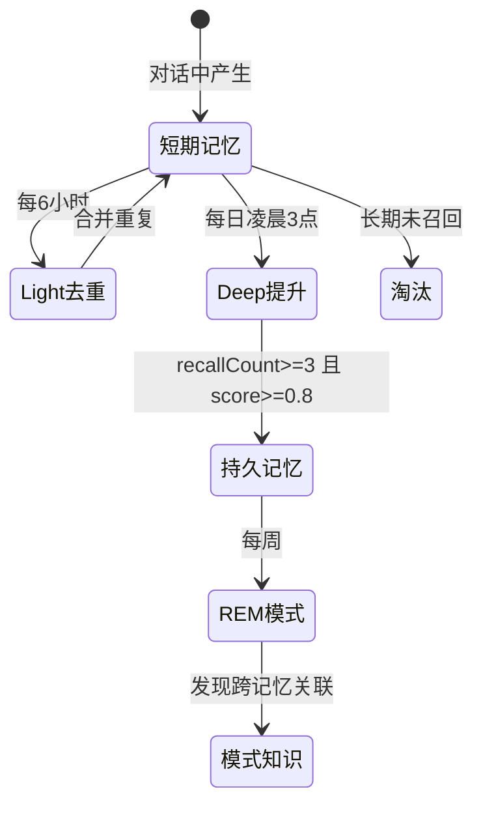
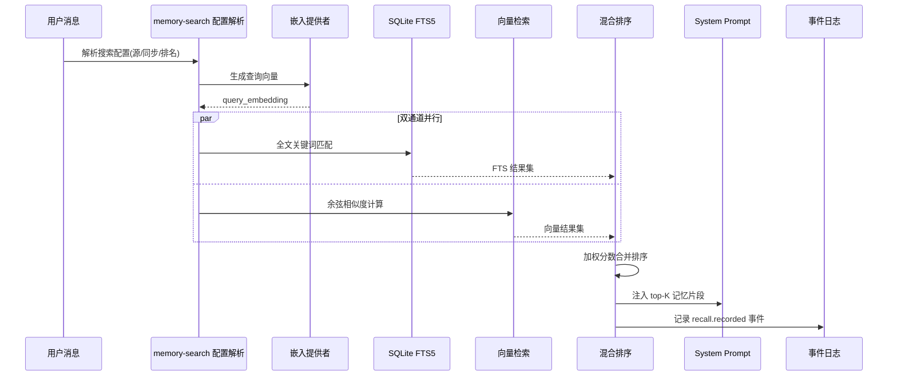

# 记忆系统

## 读前思考

- 会话历史（transcript）和记忆（memory）有什么区别？如果 Agent 已经保存了完整的对话历史，为什么还需要一个独立的记忆系统？
- 人类的记忆在睡眠中整合——短期记忆被筛选、去重、提升为长期记忆。如果让 Agent 也"做梦"，这个梦应该什么时候做、做什么、怎么判断梦的质量？

## 核心问题

记忆系统解决的核心问题是：**如何从大量对话历史中提取持久知识，并在未来的对话中精准检索，同时控制存储膨胀和检索延迟**。

| 维度 | Python 版 | TypeScript 版 |
|------|-----------|--------------|
| 会话持久化 | JSONL transcript + sessions.json | SQLite + JSONL |
| 记忆整合 | 无（只有上下文压缩） | 三阶段"做梦"机制 |
| 检索方式 | 无独立检索 | FTS5 全文 + 向量嵌入混合 |
| 存储后端 | 文件系统 | SQLite（builtin）/ QMD（外部） |
| 事件溯源 | 无 | JSONL 审计日志 |

Python 版的"记忆"停留在会话层：transcript.py 用 JSONL 追加写保存对话正文，compaction.py 做上下文压缩（结构化摘要），但没有跨会话的持久记忆。TS 版实现了完整的记忆生命周期。

## 方案展示

### 设计选择一：三阶段"做梦"——模拟人类睡眠记忆整合

TS 版的核心创新是 dreaming.ts 实现的三阶段记忆整合，通过 cron 定时调度：

- **Light Dreaming**（每 6 小时）：去重近期记忆。相似度阈值 0.9，把语义重复的记忆片段合并。类似人类浅睡眠中的记忆清洗——把白天重复经历的事情合并为一份。
- **Deep Dreaming**（每日凌晨 3 点）：提升高频召回的短期记忆为持久记忆。条件是 minRecallCount=3（被召回至少 3 次）且 minScore=0.8（相关度足够高）。类似人类深睡眠中的记忆固化——反复回忆的事情变成长期记忆。
- **REM Dreaming**（每周）：发现跨记忆的模式。minPatternStrength=0.75，从多条独立记忆中发现关联（如"用户每周一都问同样的问题"）。类似 REM 睡眠中的创造性联想。

为什么用"做梦"隐喻而不是简单的定时清理？因为记忆整合不是删除旧数据——它需要判断什么值得保留、什么应该合并、什么模式值得提取。这三个阶段的分离让每个阶段有独立的调度频率和质量标准。

代价是：做梦本身消耗 LLM token（需要调用模型做语义判断），且做梦期间可能影响正常服务性能。

### 设计选择二：混合检索——FTS5 全文 + 向量嵌入

下面是一次记忆检索的完整执行流：用户发送消息后，系统如何从记忆库中找到相关片段并注入 LLM 上下文。

每个阶段的设计考量：配置解析决定搜索哪些记忆源（builtin SQLite 还是外部 QMD）；嵌入提供者可以是远程 API 或本地模型；双通道并行执行减少延迟；混合排序后取 top-K 注入 prompt；最后记录 recall 事件用于后续 Deep Dreaming 的召回计数。

记忆检索面临一个经典矛盾：关键词匹配精确但缺乏语义理解，向量检索有语义理解但可能丢失精确关键词。

TS 版用 SQLite FTS5 全文搜索 + 向量嵌入相似度双通道混合排序：

- **FTS5 通道**：支持 trigram 和 unicode61 分词器，处理精确关键词匹配（如函数名、错误码）
- **向量通道**：嵌入提供者生成查询向量，计算余弦相似度，处理语义匹配（如"部署问题"匹配"上线失败"）

两路结果按加权分数合并排序。嵌入可以是远程 API（如 OpenAI text-embedding-3-small）或本地模型，通过配置切换。

Python 版没有独立检索——它的"检索"就是读 transcript 文件的全部历史，塞进上下文让 LLM 自己找。这在会话短（<20 轮）时够用，但会话长了之后既浪费 token 又降低准确率。

### 设计选择三：双后端——builtin SQLite vs 外部 QMD

TS 版支持两种记忆存储后端：

- **builtin**：SQLite 数据库，FTS5 索引 + 向量列。零依赖，适合单用户本地使用。
- **QMD**：外部记忆服务，通过 MCP 长连接访问。适合多实例共享记忆、需要更强向量检索能力的场景。

为什么需要双后端？因为 SQLite 的向量检索能力有限（没有 ANN 索引，全量扫描），当记忆片段超过几万条时检索延迟会显著增加。QMD 后端可以用专业的向量数据库（如 Qdrant、Pinecone）做 ANN 检索。但对于个人助理场景（几千条记忆），SQLite 完全够用且零运维。

### 设计选择四：事件溯源——JSONL 审计日志

所有记忆操作（recall、promotion、dream）都追加到 memory/.dreams/events.jsonl 日志。每条事件包含时间戳、操作类型、涉及的记忆片段 ID、质量分数。

为什么需要事件溯源？因为记忆整合是有损操作——合并两条记忆时可能丢失细节，提升短期记忆时可能选错片段。事件日志让整个过程可审计、可回滚。如果用户发现 Agent "忘了"某件事，可以从日志中追踪是哪次 dreaming 把它合并掉了。

### 设计选择五：Python 版的会话压缩——Agent 感知的结构化摘要

Python 版虽然没有跨会话记忆，但其 compaction.py（436 行）的上下文压缩设计值得关注。它明确声明"Not a chat summarizer"——不是把对话压缩成"用户问了什么，Agent 答了什么"的摘要，而是提取结构化信息：

- 工具调用及其结果（什么命令执行了，输出是什么）
- 代码片段（写了什么代码，修改了哪些文件）
- 决策记录（为什么选了方案 A 而不是 B）
- 待办事项（还有什么没做完）

压缩后有质量评分（0-1），低于 0.3 用 fallback 模板，低于 0.2 触发回滚（恢复压缩前的历史）。这个设计比 TS 版的 dreaming 简单得多，但解决的是同一个问题的不同层面：Python 版解决“单次会话内上下文不溢出”，TS 版解决“跨会话知识不丢失”。

## 记忆系统提示词结构

OpenClaw 的记忆相关提示词分布在两处：

**Python 版：** COMPACTION_SYSTEM_PROMPT 是压缩用的系统提示词，指导模型如何生成对话摘要。它不进入主对话的 system prompt，仅在压缩操作的独立 API 调用中使用。主对话的 system prompt 中没有专门的记忆段落（记忆通过 tool_instructions 中的工具说明间接影响）。

**TS 版：** Deep dreaming 机制在会话结束后触发“梦境”过程，将重要信息提取到长期记忆。梦境过程使用专用的 system prompt（指导模型从对话中提取值得保留的信息）。主对话中，记忆通过 plugin hook 注入到 system prompt 中（插件可向 system prompt 追加内容）。

## 工程优化

**TS 版：**
- Deep dreaming 恢复机制：记忆健康度 < 0.35 时自动触发恢复
- 嵌入批处理：batch.enabled/concurrency/pollIntervalMs 控制批量嵌入的并发
- 记忆片段 token 限制：maxPromotedSnippetTokens=160，防止单条记忆过大
- QMD 长连接：通过 mcporter MCP 访问，避免每次查询 spawn 进程

**Python 版：**
- 动态压缩阈值：每个 tool result 降低 1% 触发阈值（最低 50%）
- 压缩超时 15 分钟
- 元数据与正文分离：sessions.json 存状态，JSONL 存对话正文
- JSONL 追加写：避免全量重写，压缩时先 clear 再重写

## 面试要点

**问题一：三阶段做梦的调度频率（6 小时 / 每日 / 每周）是怎么确定的？如果频率设错了会怎样？**

参考答案方向：频率的确定基于记忆产生的速率和整合的成本。Light 去重频率高（6 小时）因为重复记忆产生快（用户一天可能多次问类似问题），且去重成本低（只需计算相似度）。Deep 提升频率低（每日）因为"是否值得长期保留"需要积累足够的召回数据（minRecallCount=3），一天内很难达到。REM 模式发现频率最低（每周）因为跨记忆模式需要足够的时间跨度才能显现。如果 Light 频率太低：重复记忆堆积，检索结果冗余。如果 Deep 频率太高：召回数据不足，可能把噪声提升为持久记忆。如果 REM 频率太高：模式样本不足，发现的模式不可靠。

**问题二：混合检索（FTS5 + 向量）的权重应该怎么调？什么场景下应该偏向哪一路？**

参考答案方向：权重取决于查询类型。精确查询（如"NullPointerException 怎么解决"）应该偏向 FTS5（关键词精确匹配）；模糊查询（如"上次那个部署的问题"）应该偏向向量（语义理解）。一种自适应方案是：检测查询中是否包含代码标识符（驼峰、下划线、点号分隔），如果有则提高 FTS5 权重；如果是自然语言描述则提高向量权重。OpenClaw 当前用固定权重，这是一个可以优化的方向。

**问题三：Python 版只有会话压缩没有跨会话记忆，这在什么场景下是够用的？什么场景下不够？**

参考答案方向：够用的场景：每次对话是独立任务（如"帮我翻译这段话"、"帮我写个函数"），不需要记住上次对话的内容。不够的场景：长期助手场景（如"继续昨天的项目"、"我上周告诉你的那个偏好"），需要跨会话记住用户偏好、项目上下文、历史决策。Python 版的定位是"本地 AI Gateway"——转发消息到模型，执行工具，返回结果——不需要长期记忆。但如果它要进化为个人助理，跨会话记忆是必须的。
