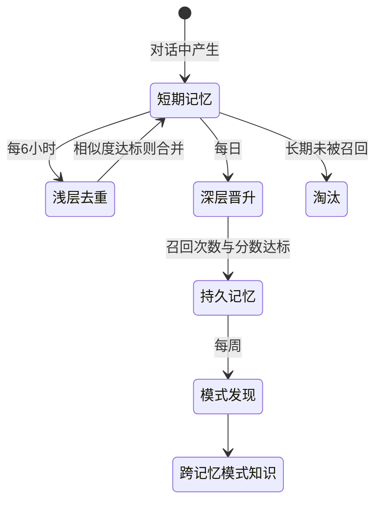
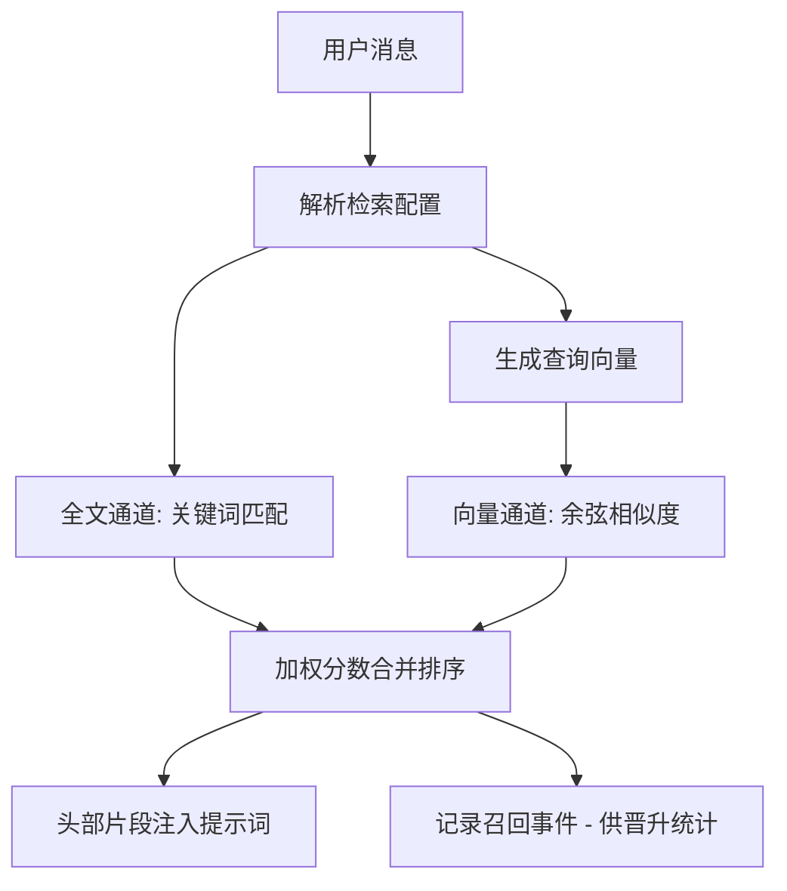
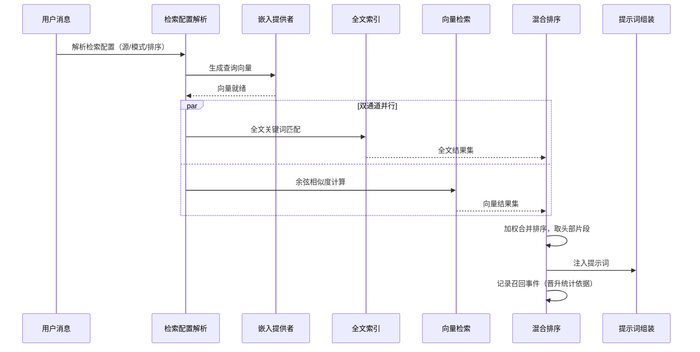

# 长期记忆

## 读前思考

- 会话历史和记忆是同一回事吗？如果 Agent 已经完整保存了对话记录，为什么还需要一个独立的记忆系统？两者的检索方式、生命周期会有什么不同？
- 假设你要给一个运行数年的个人助理设计记忆库：记忆只增不减，检索质量迟早被冗余拖垮。你会在什么时机、用什么标准决定"哪些记忆合并、哪些晋升、哪些淘汰"？

## 核心问题

记忆系统解决的核心问题是：**如何从大量对话历史中提取持久知识，并在未来的对话中精准检索，同时控制存储膨胀和检索质量退化。**

先划清短期与长期的边界：短期记忆是单会话内的上下文窗口管理——窗口装不下的消息怎么处置、何时触发压缩、压缩成什么形态，openclaw 的短期形态是溢出治理的三级降级（先截断超大工具结果、再整体压缩、最后硬截断）加模板化压缩，机制归 [05-context](05-context.md)；长期记忆是跨会话的持久化——对话结束后知识如何被提取、存储、检索并整合进未来的对话，openclaw 的长期形态是 TS 版的三阶段做梦整合，本篇主题。Python 版没有长期记忆，它的全部回答都落在短期侧；TS 版两态并存——短期靠压缩控制窗口，长期靠做梦整合让知识跨会话复用。

openclaw 的两种实现给出了截然不同的答案：TS 版实现了完整的记忆生命周期——对话中产生、定期整合、混合检索、双后端存储；Python 版没有跨会话记忆，只有会话记录持久化和单会话内的上下文压缩。边界说明：会话记录的持久化与恢复归会话存储，见 [04-state](04-state.md)；记忆操作的审计日志属回放/审计用途，见 [10-observability](10-observability.md)；压缩机制本体见 [05-context](05-context.md)。

| 维度 | Python 版 | TS 版 |
|------|-----------|-------|
| 跨会话记忆 | 无（只有会话内压缩） | 完整生命周期 |
| 记忆整合 | 无 | 三阶段"做梦"定时整合 |
| 检索方式 | 无独立检索 | 全文 + 向量混合排序 |
| 存储后端 | 文件 | 内建 SQLite / 外部 QMD 服务 |

## 方案展示

### 设计选择一：三阶段"做梦"整合

TS 版的核心创新是模拟人类睡眠记忆整合的三阶段"做梦"机制，由定时任务调度。浅层整合每 6 小时去重近期记忆，把语义重复的片段合并为一份；深层整合每日执行，把召回次数达到阈值且相关度足够高的短期记忆晋升为持久记忆；REM 整合每周执行，从多条独立记忆中发现跨记忆的关联模式。整合全程有质量门槛，不达标的片段不合并、不晋升。

**为什么这么选**：记忆整合不是删除旧数据——它需要判断什么值得保留、什么应该合并、什么模式值得提取。三阶段分离让每阶段有独立的调度频率和质量标准：去重便宜所以勤做，晋升需要召回数据积累所以每日，模式发现需要时间跨度所以每周。平台级服务以月、年为单位运行，不整合的记忆库必然变成检索噪声的来源。**牺牲了什么**：整合持续消耗模型 token，整合期间占用服务资源，且合并、晋升是有损操作，可能丢细节或选错片段。

### 设计选择二：混合检索——全文与向量双通道

从 RAG 视角看，记忆检索面临一个经典矛盾：关键词匹配精确但缺语义理解，向量检索有语义理解但丢精确关键词。TS 版的答案是双通道并行、加权合并：全文通道（FTS5，支持 n-gram 与通用两种分词器）处理精确标识符匹配，如函数名、错误码；向量通道由嵌入提供者生成查询向量、计算余弦相似度，处理语义匹配，如"部署问题"能命中"上线失败"。两路结果按加权分数合并排序后取头部注入提示词。

**为什么这么选**：个人助理的查询同时存在两种形态——"上次那个 NullPointerException 怎么解决的"需要精确命中，"之前聊过的上线问题"需要语义泛化，单通道无法同时覆盖。召回事件记录还有第二用途：每次命中计数，成为深层晋升的统计依据，检索与整合形成闭环。**牺牲了什么**：双通道的延迟与成本（向量通道依赖嵌入服务）；固定权重无法按查询类型自适应，是当前已知的优化空间。

### 设计选择三：双后端——内建库与外部记忆服务

TS 版支持两种记忆存储后端。内建后端是 SQLite 单库：全文索引与向量列同库，零依赖、零运维，适合单用户本地使用。外部后端（QMD）通过 MCP 长连接访问独立记忆服务，适合多实例共享记忆、需要专业向量检索能力的场景。

**为什么这么选**：SQLite 的向量检索没有近似索引，全量扫描在片段数超过几万条后延迟显著上升；个人助理场景（几千条）内建库完全够用，而多设备共享或大规模语义检索的需求出现时，切换到外部服务不必改上层逻辑。**牺牲了什么**：外部后端引入网络依赖与运维成本；两套后端的行为一致性需要持续验证。

### 设计选择四：Python 版用会话压缩代替长期记忆

Python 版对"记不住"问题的全部回答是单会话内的上下文压缩：它明确声明自己不是聊天摘要器——压缩时提取的是结构化信息（工具调用与结果、代码片段、决策记录、待办事项）而非对话复述。这与 TS 版的"做梦"解决的是同一问题的不同层面：Python 版保证单次会话内上下文不溢出（短期记忆），TS 版保证跨会话知识不丢失（长期记忆）。压缩的完整机制（触发阈值、保留策略、质量评分与兜底）见 [05-context](05-context.md)。

**为什么这么选**：Python 版定位是本地消息转发与工具执行的通道层，单次任务独立，跨会话记忆不在其职责范围内。**牺牲了什么**：任何需要"继续昨天的项目"的长期助手场景都无法支持。

## 核心机制执行流：一次记忆检索的全链路

以用户发来一条消息、系统从记忆库找出相关片段注入上下文为例：

**阶段一：配置解析。** 决定本次检索查哪个后端（内建库还是外部服务）、走什么排序模式。这一步把后端差异挡在检索逻辑之外。

**阶段二：向量准备。** 嵌入提供者生成查询向量，提供者可以是远程 API 或本地模型，通过配置切换。

**阶段三：双通道并行。** 全文与向量两路同时执行，减少串行等待。全文通道命中精确标识符，向量通道命中语义近似。

**阶段四：合并排序与注入。** 两路结果按加权分数合并，取头部片段注入提示词；同时为每个命中片段记录召回事件——这是深层晋升"召回次数达标"的数据来源。

**边界路径——单通道失效**：嵌入服务不可用时，向量通道返回空集，检索退化为纯全文通道，不阻断主流程；反之全文无命中时向量结果仍可兜底。双通道的容错价值正在于此：任一通道故障只是质量下降而非功能中断。

**边界路径——整合出错追责**：合并与晋升是有损操作，用户发现 Agent "忘了"某件事时，可经事件日志追踪是哪次整合把片段合并掉了（日志的回放与审计用途见 [10-observability](10-observability.md)）。

## 记忆系统提示词结构

| 实现 | 记忆相关提示词的位置 | 内容 |
|------|--------------------|------|
| Python 版 | 压缩专用系统提示词（独立调用，不进主对话） | 指导模型从对话中提取结构化摘要；主对话提示词无专门记忆段落 |
| TS 版 | 会话结束后的"梦境"提取用专用提示词 + 插件向主提示词追加记忆段 | 前者指导从对话中提取值得保留的信息，后者让记忆检索结果进入主对话 |

两个实现都把"记忆提取指令"与"主对话提示词"分离：提取是一次独立的模型调用，其指令不占用主对话的提示词预算。

## 工程优化

**健康度恢复机制**：记忆库健康度跌破阈值时自动触发深层恢复——这是"做梦"频率自适应的雏形：整合质量可度量、可触底反弹，而非只靠固定调度。

**嵌入批处理**：批量嵌入的并发数与轮询间隔可配置，避免逐条调用嵌入服务的往返开销。

**晋升片段 token 上限**：单条晋升进持久记忆的片段有 token 上限，防止某条超长记忆挤占注入预算。

**外部服务长连接**：访问外部记忆后端走持久连接而非每次查询拉起新进程，把检索延迟控制在可接受范围。

## 面试要点

**1. 三阶段"做梦"的调度频率是怎么确定的？如果频率设错了会怎样？**

参考答案方向：频率与记忆的产生速度和数据积累速度挂钩。去重阶段频率高，因为重复产生快、判断成本低；晋升阶段每日，因为"是否值得长期保留"需要召回数据积累，一天内很难达标；模式发现每周，因为跨记忆关联需要足够时间跨度才显现。设错的后果：去重太勤浪费 token、太疏则冗余堆积；晋升太快会把噪声固化为持久记忆、太慢则有价值记忆迟迟不生效；模式发现样本不足时结论不可靠。判断标准是"记忆产生速率 × 召回数据积累速度"：产生越快去重要越勤，召回越稀疏晋升评估要越缓。

**2. 混合检索（全文 + 向量）的权重应该怎么调？什么场景下偏向哪一路？**

参考答案方向：权重应随查询类型变化。精确查询（含函数名、错误码等标识符）偏向全文通道，模糊查询（自然语言描述）偏向向量通道。一种自适应思路是检测查询中的标识符特征（驼峰、分隔符），命中则提高全文权重。当前实现用固定权重，是明确的优化空间。判断标准是"查询中精确标识符的比例 × 记忆库的语义冗余度"：标识符越多全文越可靠，记忆措辞越多样越需要向量兜底。

**3. Python 版只有会话压缩、没有跨会话记忆，什么场景下够用，什么场景下不够？**

参考答案方向：够用的场景是每次对话都是独立任务——翻译一段话、写一个函数，不需要上次对话的任何信息；不够的场景是长期助手——"继续昨天的项目""我上周说过的偏好"，跨会话依赖是核心需求。Python 版的定位是消息通道与工具执行层，独立任务假设成立；但若演进为个人助理，跨会话记忆是绕不开的。判断标准是"任务独立性 × 用户对连续性的期望"：任务越独立、期望越低，纯压缩方案越成立。
