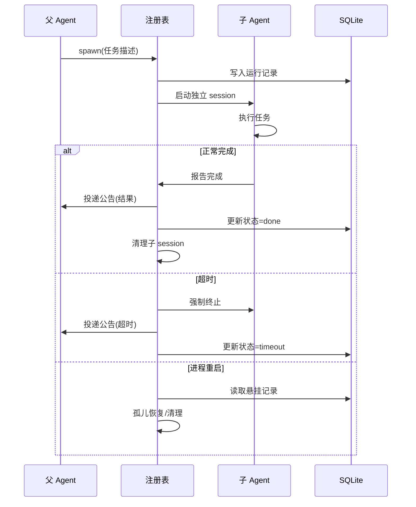

# 子代理/编排

## 读前思考

- 一个 Agent 遇到复杂任务时，是应该自己一步步做完，还是拆分成子任务委派给"子 Agent"并行执行？如果拆分，子 Agent 的结果怎么合并回父 Agent？如果子 Agent 失败了，父 Agent 应该重试还是放弃？
- 子 Agent 能不能再生成自己的子 Agent？如果能，嵌套深度应该限制在几层？如果不限制会发生什么？

## 核心问题

子代理/编排解决的核心问题是：**如何让一个 Agent 安全地生成和管理多个并行执行的子 Agent，同时保证结果可靠回传、资源不泄漏、嵌套不失控**。

| 维度 | Python 版 | TypeScript 版 |
|------|-----------|--------------|
| 子代理支持 | subagent/spawn.py（基础） | 完整编排引擎（12+ 文件） |
| 生命周期管理 | 简单 spawn + 等待 | 注册表 + SQLite 持久化 + 孤儿恢复 |
| 并发控制 | 无 | maxConcurrent + 深度限制 |
| 结果回传 | 直接返回 | 公告投递 + 重试 |
| 转向（steer） | 无 | 向运行中的子代理注入新指令 |

## 方案展示

### 设计选择一：注册表模式——集中式生命周期管理

Python 版的子代理很简单：subagent/spawn.py 生成一个新的 EmbeddedRuntime 实例，在独立 session 中执行，完成后结果直接返回父 Agent。没有注册表，没有持久化，进程重启后子代理就丢失了。

TS 版实现了 subagent-registry.ts（1905 行）作为集中式注册表协调器，管理子代理的完整生命周期：

1. **注册**：父代理调用 sessions_spawn 工具时，注册表创建运行记录（内存 + SQLite 双层）
2. **监控**：定期检查超时、存活状态
3. **完成**：子代理结束后触发公告投递
4. **清理**：删除子代理 session，释放资源
5. **孤儿恢复**：进程重启后，从 SQLite 中恢复悬挂的运行记录

为什么需要注册表而不是让父子直接通信？因为子代理可能比父代理活得更久（父代理超时退出，子代理还在执行），也可能在父代理不知情的情况下失败。注册表作为"第三方公证"，保证无论父子谁先退出，另一方的状态都能被正确追踪。

### 设计选择二：深度限制 + 并发控制——防止资源爆炸

子代理可以生成自己的子代理（嵌套），但必须限制深度和并发数。

TS 版的限制：
- **maxSpawnDepth**：默认嵌套深度限制（防止 A→B→C→D→... 无限嵌套）
- **maxChildrenPerAgent**：每个 Agent 最大子代理数（防止一个 Agent 同时 spawn 100 个子代理）
- **maxConcurrent**：全局最大并发子代理数（防止系统资源耗尽）

为什么不能无限嵌套？因为每层子代理都有独立的 session、transcript、context window，嵌套 N 层意味着 N 倍的资源消耗。更危险的是"递归炸弹"：子代理的任务描述中包含"如果任务复杂就拆分给子代理"，导致指数级膨胀。

深度检查通过 getSubagentDepthFromSessionStore 实现：从当前 session 向上追溯父 session 链，计算深度。

### 设计选择三：公告投递——可靠的结果回传

子代理完成后，结果不是直接返回父 Agent（父可能已经不在等待），而是通过"公告"机制投递：

1. subagent-announce.ts 读取子代理输出
2. 应用等待结果（applySubagentWaitOutcome）
3. 通过 deliverSubagentAnnouncement 投递到父会话
4. 投递失败时 runAnnounceDeliveryWithRetry 重试（指数退避）
5. 公告有过期时间（ANNOUNCE_EXPIRY_MS），避免陈旧通知

为什么用公告而不是直接返回？因为子代理和父代理是异步的——父代理 spawn 子代理后可能继续做其他事，甚至退出。公告机制保证：无论父代理在什么状态，子代理的结果都能被可靠送达。如果父代理已退出，公告存储在 SQLite 中，下次启动时恢复。

### 设计选择四：转向（Steer）——向运行中的子代理注入指令

TS 版支持向正在运行的子代理注入新指令（steer），而不需要终止重建：

- subagent-control.ts 实现 steer 操作
- 转向有速率限制（STEER_RATE_LIMIT_MS = 2000ms），防止指令风暴
- 转向通过 Gateway 路由到子代理的 session，注入为新的用户消息

使用场景：父代理发现子代理的方向偏了（比如"不要搜索了，直接读文件"），可以 steer 而不需要 kill + 重新 spawn（后者会丢失已有进度）。

### 设计选择五：Python 版的轻量实现

Python 版的 subagent/spawn.py 只有基础的 spawn 能力：

- 创建新的 EmbeddedRuntime 实例
- 在独立 session 中执行
- 通过 Gateway 的 sessions_spawn 工具触发
- 结果通过 transcript 回传

没有注册表、没有持久化、没有孤儿恢复、没有转向。这符合 Python 版“本地 Gateway”的定位——子代理是锦上添花而非核心能力。

## 子代理提示词结构

**Python 版：** 子代理使用极简的固定 system prompt："You are a helpful subagent. Complete the assigned task."（spawn.py 中硬编码）。没有继承父 agent 的身份声明或工具规范，也没有任务分解/汇报格式的指导。

**TS 版：** 子代理（sub-run）继承父运行的 system prompt 和插件配置，但工具集受限。TS 版的子代理通过 embedded-agent-runner 执行，共享父运行的 prompt 编译结果（包括指令文件、技能 prompt、插件 hook 注入），但排除部分高危工具。

两版对比：Python 版的子代理是“一次性执行器”（给个任务就跑，跑完就结束），TS 版的子代理是“受约束的克隆”（继承父的完整能力但工具受限）。

## 工程优化

**TS 版：**
- 孤儿运行定期调和（PROVISIONAL_KILL_RECONCILIATION_MS）：检测无父代理的子运行
- 附件暂存：子代理的附件暂存到独立目录，完成后安全删除
- 子代理运行超时精确控制：resolveSubagentRunTimerDelayMs
- 子代理能力解析：subagent-capabilities.ts 决定子代理的工具面（比父代理窄）
- SubagentLifecycleHookRunner：生命周期钩子，插件可以监听子代理事件

**Python 版：**
- 子代理共享父代理的 provider_registry 和 tool_registry，无需重新初始化
- 子代理的 tool_profile 可以比父代理更窄（如父用 full，子用 coding）

## 面试要点

**问题一：为什么子代理需要注册表而不是让父子直接通信？如果去掉注册表，系统会在什么场景下失败？**

参考答案方向：直接通信假设父子同时存活且通信链路稳定。失败场景：(1) 父代理超时退出，子代理还在执行——没有注册表就没人追踪子代理的状态，它可能永远运行下去（资源泄漏）。(2) 进程崩溃重启——没有持久化记录就不知道哪些子代理需要恢复或清理。(3) 父代理 spawn 了多个子代理后自己继续工作——没有注册表就无法汇总多个子代理的结果。注册表本质上是"分布式系统中的协调服务"，解决的是异步、故障、多对多的协调问题。

**问题二：转向（steer）和"终止 + 重新 spawn"相比，优势在哪？什么场景下应该选择后者？**

参考答案方向：steer 的优势是保留已有进度——子代理可能已经执行了 10 轮工具调用，积累了大量上下文，终止重来会浪费这些工作。steer 注入一条新消息，子代理在已有上下文基础上调整方向。应该选择终止+重来的场景：子代理的上下文已经被错误方向"污染"（比如搜索了 10 轮错误的关键词，上下文中全是无用信息），此时 steer 的效果有限（LLM 可能被已有上下文误导），不如清空重来。判断标准是：已有上下文是资产还是负债。

**问题三：嵌套深度限制应该设为多少？设太小和设太大分别有什么问题？**

参考答案方向：设太小（如 1-2 层）：限制了任务分解的粒度，复杂任务无法充分拆分。设太大（如 10+ 层）：资源消耗指数增长（每层有独立 session + context），且调试困难（追踪 10 层嵌套的调用链）。合理值取决于场景：对于"研究→写作→审校"这种线性流水线，2-3 层够用；对于"并行搜索 10 个方向，每个方向再细分"的扇出模式，可能需要 3-4 层。TS 版的默认值在 3-5 层之间，这是一个经验值——覆盖了绝大多数实际场景，同时防止递归炸弹。
