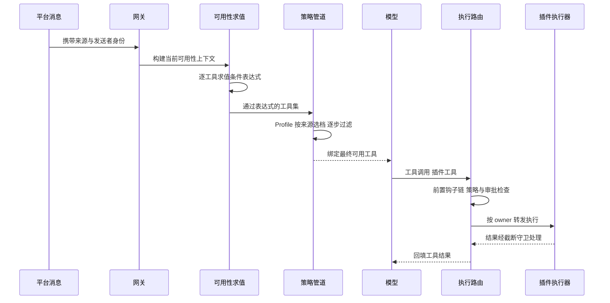

# 工具与扩展生态

## 读前思考

- 同一个"执行命令"的请求，来自本地终端时应该直接执行，来自远程 IM 平台时可能连写文件工具都不该出现。这个差异应该写死在代码里，还是做成策略？如果做成策略，策略的过滤点放在注册时一个够吗，还是要多个维度叠加？
- openclaw 有 Python 和 TS 两种实现，工具规模相差一个数量级（20+ 对 140+ 扩展）。同一套"静态分组"方案在两个规模下还成立吗？从静态分组到动态求值的那条分界线，由什么变量决定？

## 核心问题

**openclaw 的工具面以"可见性即可配置的策略"组织：注册阶段全量进入工具面，发现阶段由可用性表达式与多步策略管道在运行时求值决定每个工具对当前请求是否可见，执行阶段按 owner 路由，扩展阶段用 Manifest 加 SDK 承载 140+ 插件。** Python 版是其简化形态——工具少，静态分组即够用。

| 维度 | Python 版 | TS 版 |
|------|-----------|-------|
| 可见性控制 | Profile 静态分组，按消息来源选定 | 可用性表达式运行时求值 + 多步策略管道 |
| 工具发现 | 启动全量注册 | Tool Search 按需发现 |
| 结果控制 | 头尾感知智能截断 + 敏感信息替换 | 保持结构合法截断 + 截断提示注入 |
| MCP | 无 | 双向；服务器端 Bridge + 拉模式 |
| 技能 | 无独立系统 | 五来源 + frontmatter 条件激活 + 市场 |
| 插件 | 预留架构空壳 | Manifest + Entry 契约 + 严格核心隔离 |

## 方案展示

### 设计选择一：Profile 静态分组 vs 可用性表达式

Python 版用策略 Profile 做静态分组：只读、编码、消息、全量四档，Gateway 按消息来源一行选定工具面——远程 IM 来的消息用消息档（禁写入与执行类工具），本地界面用全量档（源码：ToolPolicy）。

TS 版每个工具声明一组可用性条件表达式（认证是否通过、配置开关、环境变量、插件启用状态），运行时由规划器依据当前上下文逐一求值决定可见性；执行前再过多步策略管道——Profile、Provider、Subagent 等步骤依次过滤，每步可独立放行或拒绝，最终可用集是所有步骤的交集；其中沙箱过滤步与执行环境的选择见 08-runtime.md，Sender/Group 准入中与审批重叠的部分见 09-guardrails.md（源码：applyToolPolicyPipeline）。工具"该出现却没出现"时要追踪整条求值链，TS 版因此专门实现了策略审计日志记录每步决策。

**为什么这么选**：Python 版工具少，静态分组一行代码决定工具面、调试直观。TS 版工具来源多样且可用条件动态（某工具只在对应认证通过或通道连接时才有意义），静态分组要为每种组合建一个 profile，组合爆炸。代价是表达式方案的调试成本——定位"工具为何不可见"需要逐步回放求值链。

### 设计选择二：Tool Search 按需发现

TS 版面对 140+ 扩展提供的工具不可能全量绑定 schema。它把一个特殊搜索工具暴露给模型：模型描述想做什么，系统从工具索引中匹配相关工具并动态加载进当前会话，之后才可调用。Python 版则启动全量注册——20 个工具的 schema 占比可忽略，多一轮往返反而是纯损失。

**为什么这么选**：权衡很明确——用一轮短往返换整个对话的上下文空间，工具越多越划算。代价是首次使用某工具多一次往返，且索引匹配质量决定命中率。

### 设计选择三：双向 MCP + Bridge 拉模式

TS 版同时做客户端与服务器。客户端侧管理外部服务器生命周期：按配置建连、发现工具、经包含/排除过滤后注册进统一工具面，模型看到的列表中远程与原生工具无差别，执行时由路由层按 owner 转发；部分服务器不支持并行调用，靠标记做串行化。远程服务器的 OAuth 与 mTLS 认证机制见 09-guardrails.md。

服务器侧通过一个 Bridge 类收敛全部复杂度：网关连接管理、事件队列加游标、审批状态、会话元数据缓存都封装在一个类里，MCP 工具层保持极薄只做转发（源码：OpenClawChannelBridge）。事件投递选拉模式——外部客户端通过轮询或长等待取事件，服务器只维护有界队列和游标，不做主动推送。Python 版无 MCP，符合其工具少、不需要外部协议的定位。

**为什么这么选**：openclaw 的定位是既调用外部工具、又被外部系统调用的平台。拉模式的假设是 MCP 客户端实现质量参差、处理不好推送，让客户端控制消费节奏最稳。代价是拉模式引入轮询延迟，不适合实时场景；对模型透明则换来执行路径不透明，调试时要先判断工具是本地还是远程。

### 设计选择四：技能五来源 + 条件激活 + 市场

技能来自五个位置按优先级合并：内置发行、工作区（随仓库走、团队共享）、插件附带、用户全局、市场安装——不同来源对应不同生命周期，思路与多级配置相同。frontmatter 声明激活条件：始终加载、依赖检查（如某命令可用才显示）、依赖自动安装、平台限制，让无关技能不占索引（技能索引注入提示词的组装面见 05-context.md）。

市场提供搜索、多种安装方式与版本追踪——版本字段让模型知道技能内容是否变化、避免重复读取；第三方技能的安装安全扫描见 09-guardrails.md。索引中每个技能一行的绝对路径会压缩为短路径，每个技能省几个 token 的免费优化。Python 版无技能系统，行为引导靠提示词构建硬编码。

**为什么这么选**：技能面向非程序员创作者，Markdown 载体加条件激活是低门槛与低噪声的平衡。代价是技能无法强制执行——模型可能该读没读，质量完全取决于编写者的提示词工程能力。

### 设计选择五：Manifest + Entry 契约与核心隔离

每个插件由两个文件定义：Manifest 声明静态元数据（激活条件、提供的能力目录），Entry 导出注册函数在运行时动态注册（源码：openclaw.plugin.json、register(api)）。分离的原因是激活决策要在不执行任何插件代码的前提下做出——140+ 插件全部导入的冷启动开销不可接受，规划器只读 Manifest 决定加载谁。注册用 API 调用而非继承基类，一个插件可以自由组合注册多种能力。

核心隔离是严格架构规则：插件不能导入核心内部与其他插件，只能通过 SDK 交互；核心也不深入插件内部。这让核心可以自由重构而不破坏生态。第三方插件的安装扫描见 09-guardrails.md。Python 版的插件目录是预留空壳——当前规模硬编码更简单可靠，生态需求出现时再激活。

**为什么这么选**：插件数量到了三位数，编译期依赖隔离与稳定的 SDK 契约是生态存续的前提。代价是 SDK 必须覆盖插件的一切需求、设计成为最关键的 API 决策，且 Manifest 与 Entry 两处定义需契约测试保证同步。

## 完整执行流：一条远程平台消息如何决定工具面

以一条来自远程 IM 平台的消息进入网关、模型最终调用一个插件工具为例：

**阶段一：上下文构建。** 消息到达时确定来源平台、发送者身份、群组上下文，组装成本次请求的可用性上下文——认证状态、配置、环境变量、插件启用状态。

**阶段二：两级过滤。** 先对每个工具求值可用性表达式，得到候选集；再过多步策略管道，Profile 步骤按消息来源选定档位（远程平台消息被剥夺写入与执行类工具），后续步骤按提供方兼容性、子代理身份等继续收窄，取交集。

**阶段三：绑定与调用。** 最终工具集绑定给模型。模型发起调用后先过前置钩子链（执行时过滤与审批拦截的细节分别见 08-runtime.md 与 09-guardrails.md），放行后按 owner 分发到注册它的执行器——核心工具走核心执行器、插件工具转发到插件、MCP 工具经客户端转发，调度表上的分发归本篇；按消息来源选择执行环境（CLI 直跑、网关审批、沙箱进容器）的执行路由机制见 08-runtime.md。

**阶段四：结果守卫。** 结果经截断处理：Python 版检测尾部是否有关键词决定保留头加尾还是只留头；TS 版额外保证 JSON 截断后仍合法、并注入截断提示让模型知道信息不完整。

**边界路径——工具该出现却没出现。** 表达式或管道某步拒绝都会让工具缺席，TS 版的策略审计日志记录每步决策用于回放定位；这是动态可见性方案必须配套的可观测投入。

**边界路径——模型调用不可用工具。** 管道之外的工具不在绑定列表中，模型若幻觉出该名称，调用会被路由层拒绝并转为错误结果回填，循环不中断。

## 工程优化

**循环检测**：检测模型重复调用同一工具，超阈值注入提示或强制终止，防止工具调用死循环耗尽轮次。

**schema 隔离**：不合法的工具 schema 被隔离，防止一个坏 schema 让整次请求被后端拒绝。

**结果流式返回**：大结果可分块流式传回，不必等全部完成再处理。

**激活规划缓存**：插件模块加载结果缓存，避免重复导入；SDK 别名映射支持构建期裁剪，只打包实际用到的 SDK 模块。

**技能解析容错**：frontmatter 解析失败时跳过该技能而不阻塞启动；符号链接解析受白名单约束，防止越界读取。

## 面试要点

**1. Python 版的静态 Profile 在什么信号出现时该升级为 TS 版的表达式方案？**

当工具来源多样化（出现插件工具、MCP 工具）且可用条件开始依赖运行时状态（认证、配置开关、平台差异）时，静态分组要为每种组合建一个 profile，数量爆炸且语义重复——这就是升级信号。升级的代价是调试成本：静态方案看 profile 名就知道工具面，表达式方案必须配审计日志回放求值链。判断标准是"工具来源数 × 可用条件的动态维度数"：两者都小用静态，任一变大用表达式。

**2. MCP 工具注册进统一工具面而不是让模型显式区分来源，得失是什么？**

得是模型不需要学习两套调用协议，提示词不需要解释来源差异，工具选择逻辑统一。失是执行路径不透明：远程调用延迟不可预测、错误语义不同（协议级错误混入业务错误），调试时要先判断来源。让模型显式区分可以按延迟预期规划（优先本地工具），但增加提示词复杂度与模型认知负担。判断标准是"工具总数与来源种类数"——来源越多，透明融合越值，因为把来源管理推给模型的成本增长更快。

**3. 插件不能导入核心内部这条规则，放松了会怎样？**

短期开发速度快——不用为每个新能力设计 SDK 接口。长期后果是核心无法重构：任何内部变更都可能破坏上百个插件，核心演进被生态拖累。严格隔离把成本前置到 SDK 设计上（必须完整、稳定、有契约测试），换来核心的自由演进。判断标准是"插件生态规模 × 核心迭代频率"——生态小、迭代慢可以宽松，生态大、迭代快必须严格。
