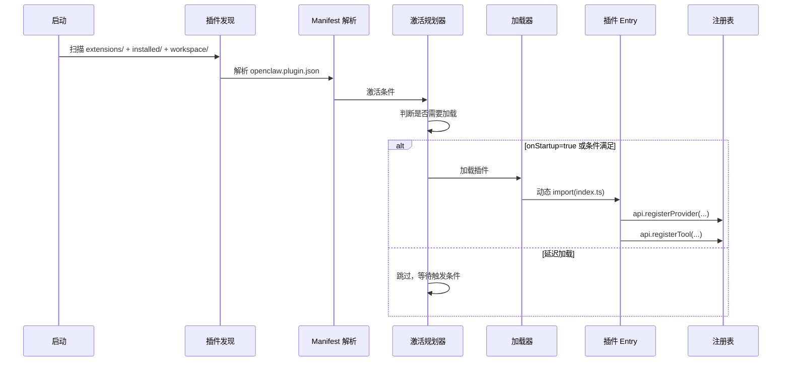

# 插件/扩展系统

## 读前思考

- 一个系统有 140 多个扩展（provider、channel、tool、service），如果每次启动都全部加载，冷启动时间会怎样？你会怎么设计加载策略——全部预加载、按需加载、还是某种中间方案？
- 插件和核心代码的边界应该画在哪里？如果插件需要调用核心的内部 API，你应该开放接口还是让插件"绕路"？开放接口的代价是什么？

## 核心问题

插件/扩展系统解决的核心问题是：**如何让第三方在不修改核心代码的前提下扩展系统的全部能力（模型、通道、工具、服务），同时保证核心保持 plugin-agnostic**。

| 维度 | Python 版 | TypeScript 版 |
|------|-----------|--------------|
| 插件规模 | 预留架构，实际内置 | 140+ extensions |
| 加载方式 | 扫描 extensions/ 目录 | manifest 激活 + 动态 import |
| SDK 规模 | 无独立 SDK | plugin-sdk/ 300+ 模块 |
| 核心隔离 | Protocol 接口 | 严格禁止插件引用核心 src/ |
| 注册方式 | registry.register | api.registerProvider/Tool/Channel/... |

## 方案展示

### 设计选择一：Manifest + Entry 双文件契约——静态声明与动态注册分离

TS 版每个插件由两个文件定义：

- **openclaw.plugin.json**（manifest）：声明静态元数据——插件 ID、激活条件（onStartup: true/false）、提供的 provider 列表、模型目录、hook 声明。Manifest 是纯数据，不需要执行代码就能解析。
- **index.ts**（entry）：导出 register(api) 函数，在运行时调用 api.registerProvider()、api.registerTool() 等方法完成动态注册。

为什么分两个文件？因为激活决策需要在不加载代码的情况下做出。140 多个插件如果全部 import，冷启动要加载几百个模块。Manifest 的 activation.onStartup: false 让加载器跳过不需要的插件——只有当用户配置了对应 provider 或通道时，才动态 import 该插件的 entry。

代价是两处定义需要同步：manifest 声明了"我提供 OpenAI provider"，entry 必须真的调用 registerProvider。如果不同步，运行时会报错。TS 版通过 provider-contract-api.ts 契约测试来检测这种不一致。

### 设计选择二：API 注册式而非继承式

插件通过 api.registerProvider()、api.registerTool()、api.registerCommand()、api.registerService()、api.registerChannel() 等方法注册能力，而非继承基类。

为什么不用继承？因为一个插件可能注册多种能力——OpenAI 扩展同时注册了 text provider、image provider、speech provider、realtime provider、video provider。继承式要求一个插件只能是一个"东西"（要么是 Provider，要么是 Tool），注册式让一个插件自由组合多种能力。

代价是类型安全依赖 OpenClawPluginApi 接口（types.ts 102.6KB），运行时才能发现注册错误（比如 registerProvider 时传了不合法的 model catalog）。

### 设计选择三：核心隔离——插件不能碰核心内部

TS 版有严格的架构规则：

- 插件生产代码不能 import 核心 src/**、不能 import 其他插件的 src/**、不能用相对路径引用包外文件
- 插件只能通过 openclaw/plugin-sdk/* 暴露的接口与核心交互
- 核心代码不能深入插件内部（extensions/*/src/**），只能用公共 barrel 和 SDK facade

为什么这么严格？因为 140 多个插件如果都能访问核心内部，任何核心重构都可能破坏插件。SDK 是稳定的公共契约，核心内部可以自由演进。这和操作系统内核与驱动程序的关系一样——驱动通过系统调用接口工作，不能直接操作内核数据结构。

代价是 SDK 必须足够丰富（300+ 模块），覆盖插件可能需要的所有能力。SDK 的设计成为项目最关键的 API 设计决策。

### 设计选择四：Bundled vs External——两种插件分发模式

TS 版区分两种插件：

- **Bundled**（内置）：随核心发行，在核心 dist 中。如 OpenAI、Anthropic、Telegram 等核心 provider 和通道。
- **External**（外部）：独立 npm 包，用户按需安装。核心通过 registry-aware facade-runtime 或通用契约访问。

为什么不全做外部？因为核心体验依赖的插件（如 OpenAI provider）如果缺失，系统无法工作。Bundled 保证开箱即用。为什么不全做内置？因为 140 个插件全内置会让核心包体积爆炸，且第三方插件不应该在核心仓库中。

Externalizing 一个 bundled 插件有严格流程：更新 package excludes、official catalogs、docs、tests，并证明核心运行时路径在移除根依赖前能解析已安装插件根。

### 设计选择五：Python 版的预留架构

Python 版的 plugins/ 目录有 registry.py、installer.py、marketplace.py，但实际功能是空壳——所有工具都在 tools/builtin 中硬编码，所有 provider 都在 extensions/ 中直接实现。

这个预留架构的设计意图是：当 Python 版的工具数量增长到需要第三方扩展时，可以平滑过渡到插件化。当前阶段（4 个 provider + 20 个工具）不需要插件系统的复杂度。

## 工程优化

**TS 版：**
- Activation Planner：根据 manifest 的 activation 条件决定加载时机，避免启动时加载全部 140+ 插件
- Loader Cache：plugin-module-loader-cache.ts 缓存已加载模块，避免重复 import
- SDK Alias：sdk-alias.ts（64.4KB）将 openclaw/plugin-sdk/* 映射到实际模块路径，支持 tree-shaking
- Security Scan：install-security-scan.ts（42.5KB）对第三方插件进行安全扫描
- Manifest Registry Installed：维护已安装插件索引，支持增量更新

**Python 版：**
- 插件发现：扫描 extensions/*/openclaw.plugin.json，用 PluginManifest Pydantic 模型校验
- 前向兼容：manifest 模型 extra="allow"，允许未知字段

## 面试要点

**问题一：为什么 TS 版选择 manifest + entry 双文件而不是单文件（如 package.json 的 main 字段）？这个设计在什么规模下开始体现价值？**

参考答案方向：单文件方案（如 Node.js 的 package.json main）要求加载器 import 入口模块才能知道插件提供什么能力。当插件数量少（<10）时这没问题，但 140+ 插件时，启动时 import 全部入口模块的开销不可接受（每个模块可能有几十 KB 的依赖链）。Manifest 让加载器在不执行任何插件代码的情况下做激活决策——只有真正需要的插件才被 import。这个设计在插件数量超过 20-30 个时开始体现价值（冷启动时间从秒级降到百毫秒级）。

**问题二：核心隔离规则（插件不能 import 核心 src/）的代价是什么？如果放松这个限制会怎样？**

参考答案方向：代价是 SDK 必须非常完整——插件能做的每件事都需要 SDK 暴露对应接口。SDK 的设计成为瓶颈：新增一个核心能力时，必须同时设计 SDK 接口、写文档、维护兼容性。如果放松限制（允许插件直接 import 核心内部），短期开发速度快（不需要设计 SDK），但长期核心无法重构（任何内部变更都可能破坏 140 个插件）。这是"API 稳定性 vs 开发灵活性"的经典权衡。OpenClaw 选择严格隔离是因为它的插件生态已经足够大，核心稳定性比开发速度更重要。

**问题三：Python 版的插件系统是空壳，这是技术债还是合理决策？什么信号出现时应该激活它？**

参考答案方向：当前是合理决策——4 个 provider + 20 个工具的规模不需要插件系统的复杂度，硬编码更简单、更可靠、调试更容易。应该激活的信号：(1) 第三方开发者要求添加新 provider/工具但不想 fork 仓库；(2) 工具数量超过 50 个，硬编码的 factory.py 变得难以维护；(3) 需要支持用户自定义工具（如企业内部工具）。在这些信号出现之前，保持空壳是正确的——过早的抽象比没有抽象更危险。
