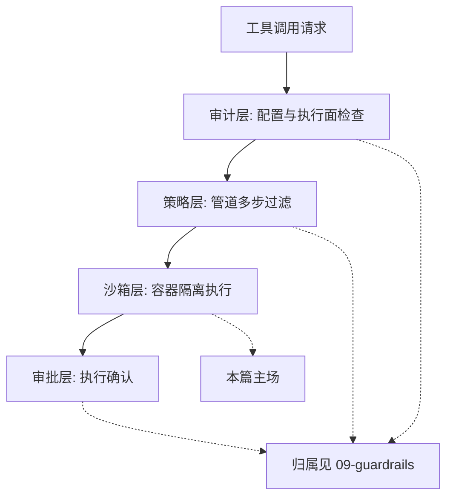
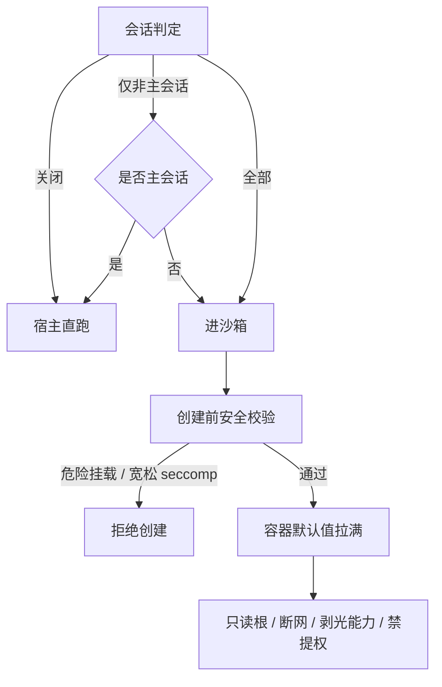
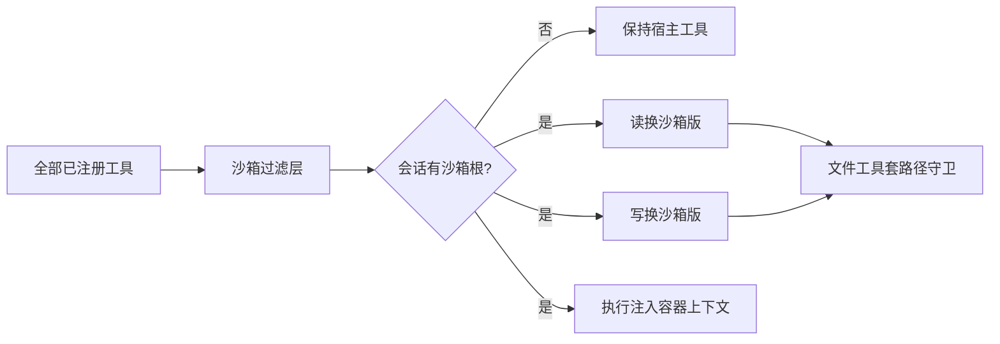
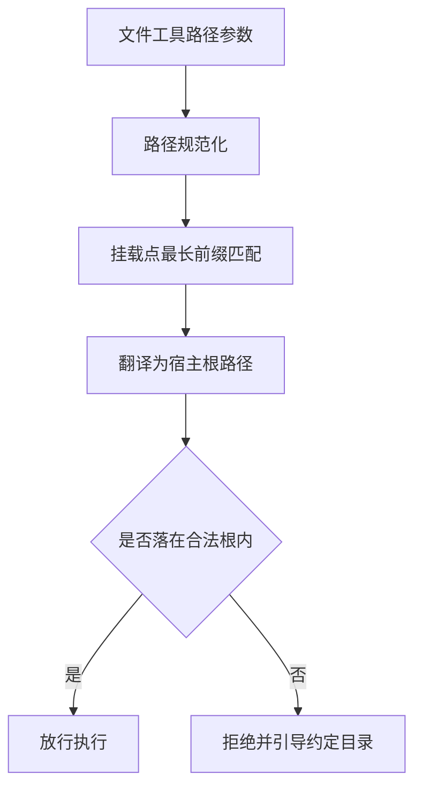
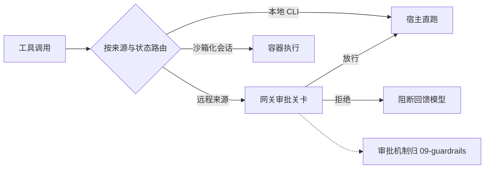
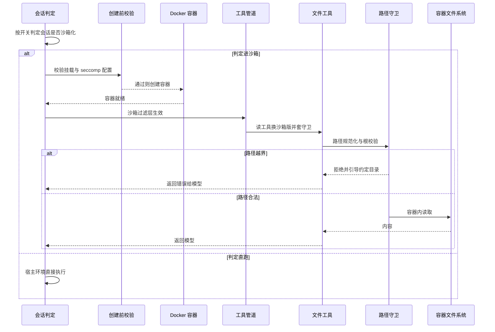

# 执行运行时与隔离

## 读前思考

- 沙箱默认关闭和默认开启，哪个更安全？默认开启意味着每一条命令都付隔离的摩擦成本；默认关闭意味着多数时候裸跑。两条路都有明显代价——还有没有第三条路？
- 模型在沙箱里想读一个文件，它写出的路径越界了。系统应该悄悄把路径重写进合法区域，还是直接拒绝并告诉它怎么写？重写保体验但可能产生歧义，拒绝保语义但打断流程——你选哪个？

## 核心问题

**执行时隔离要解决的是：让需要隔离的会话（第三方消息、子代理、不可信内容）在 Docker 容器里执行工具，路径边界用拒绝式守卫保证，且隔离配置默认关闭、开启即激进硬化。**

openclaw 有两种实现，正好一实一虚。TS 版（openclaw-2026.7.1）是生产实现：配置驱动的 Docker 沙箱体系完整接入，开关分三档决定哪些会话进沙箱，一旦进沙箱默认值直接拉满，工具在装配阶段整体换成容器版本，文件路径走拒绝式越界守卫。Python 版是轻量参考实现：沙箱组件（Docker 沙箱、路径策略）写了但未接入默认工具注册表，实际执行落在宿主上，靠输出脱敏加失败关闭的审批做补偿。工具策略管道整体见 07-tools，本篇只讲其中的沙箱过滤层与执行环境选择；准入与审批面见 09-guardrails。

TS 版的安全体系是四层纵深，本篇主写其中的沙箱层，其余各层只在图中标注归属：配置审计与策略层见 09-guardrails，诊断审计工具见 10-observability。

| 维度 | TS 版 | Python 版 |
|------|-------|-----------|
| 隔离形态 | Docker 容器（开关 / 复用粒度 / 挂载权限三级配置） | Docker 沙箱组件已写未接线 |
| 默认姿态 | 默认关闭，开启即激进硬化 | 宿主直跑 |
| 硬化默认值 | 只读根 + 断网 + 剥光能力 + 禁提权 | 无（未启用） |
| 路径守卫 | 拒绝式越界校验，错误引导约定目录 | 路径策略组件未接线 |
| 工具接入 | 注册期管道整体替换 | 无 |

## 方案展示

### 设计选择一：默认关闭，开启即激进硬化

沙箱化由三级开关控制：关闭（默认）、仅非主会话（子会话与群会话进沙箱，主会话直跑）、全部会话。一旦会话被判定进沙箱，容器默认值直接拉满：根文件系统只读，可写区只靠临时目录与工作区挂载显式开洞；默认断网；剥光全部 Linux 能力；禁止提权。创建容器前还有一道安全校验：危险的主机路径挂载（系统目录、密钥目录、Docker 套接字）与宽松 seccomp 配置直接拒绝创建——危险配置永不落地为容器。

**为什么这么选**：沙箱有实打实的摩擦成本——容器启动延迟、挂载配置、路径约束，默认开启会让日常会话变慢；但一旦需要隔离（第三方消息、不可信内容），就默认拉满，不做"半隔离"的中间档，避免给人虚假安全感。创建前校验把危险的配置挡在容器落地之前，而不是创建后再补救。**牺牲了什么**：可写区必须显式开洞，配置兼容性成本高；"仅非主会话"模式把信任边界押在主会话的拥有者身上——主会话直跑宿主，一旦主会话被注入，隔离防线并不存在。

### 设计选择二：注册期整体替换——沙箱过滤层

工具策略管道在装配阶段逐层过滤工具，其中的沙箱过滤层负责执行环境选择：当会话有沙箱根目录时，读工具换成走容器文件系统的沙箱版，写与编辑工具换成沙箱版（只读挂载时直接剥夺写能力），执行工具注入容器上下文（容器名、工作目录、执行规格），文件工具套上工作区根守卫。替换发生在注册期而非执行期：沙箱化会话拿到的工具集从装配完成那一刻起就是干净的沙箱版本。

**为什么这么选**：执行期包装要每步判断"当前环境是什么、该用哪个版本"，有运行时开销也容易漏；注册期替换把环境差异一次性固化进工具集，沙箱会话的工具天然不会碰宿主。**牺牲了什么**：工具装配逻辑与沙箱状态强耦合——装配时要知道会话是否沙箱化、挂载权限如何，注册流程复杂；工具集的组成依赖运行时的会话状态，调试"为什么这个工具是这个版本"需要追踪装配链路。

### 设计选择三：拒绝式路径守卫——越界不重写，直接拒绝

文件工具的路径参数先做规范化，再与所有挂载点做最长前缀匹配翻译为容器内路径对应的宿主根，然后逐一校验路径是否落在任一合法根之内；全部失败即拒绝，错误信息引导模型改用约定的临时目录。这是拒绝派而非重写派：路径不合法就明确失败，绝不静默改写。

**为什么这么选**：透明重写会让模型以为路径合法，写出去又回不来，语义不清；拒绝式守卫失败关闭——不知道合不合法就不执行，行为可预期。错误提示附带修正方向，模型能学会改用约定目录。**牺牲了什么**：模型必须写出合法路径，越界就得靠错误信息纠正，多一轮往返；挂载点多时最长前缀匹配逻辑复杂，路径翻译的歧义要靠匹配顺序消除。

### 设计选择四：双实现分化——生产实现与参考实现

Python 版的沙箱组件与 TS 版同名同构：Docker 沙箱类组装容器参数（断网、内存与 CPU 配额、工作区读写挂载），路径策略定义路径边界，但两者都没有被默认工具注册表引用——注册表只装配内置工具，bash 实际宿主直跑。参考实现的安全兜底是输出脱敏与失败关闭的审批，隔离能力停留在组件层面，未成为默认行为。

**为什么这么选**：Python 版定位轻量参考实现——本地消息转发与工具执行通道，单任务独立，不需要容器级隔离的部署复杂度；组件先写好，给需要隔离的部署留出接入路径。**牺牲了什么**：参考实现无法兑现 TS 版的隔离承诺，部署方若按 TS 版的安全预期使用 Python 版会落空；组件未接线也意味着测试覆盖不到，真实可靠性存疑。

### 设计选择五：执行路由——按来源定执行环境

**设计选择**：同一个工具调用请求最终落在哪个环境，由消息来源与会话状态决定，TS 版分三档：本地 CLI 发起的调用直跑宿主执行器；来自远程通道的调用先过网关审批关卡再执行；被判定沙箱化的会话，工具在装配期已换成容器版本（见设计选择二），调用自然进入容器。分发按工具属主进行：核心工具走核心执行器（shell 执行内含沙箱策略、审批流与输出截断），插件工具转发到注册它的插件，MCP 工具经客户端转发到外部服务器，通道工具路由到对应通道实现。Python 版没有这层路由，全部工具走统一入口，在注册表查处理器、执行、返回。

**为什么这么选**：执行环境与信任度绑定——本地来源是拥有者本人，直跑省掉一切摩擦；远程来源身份未经充分验证，审批关卡前置；需要隔离的会话（第三方消息、子代理）必须进容器。按属主分发是工具注册表结构自然推导：注册时登记属主，执行时按属主查执行器，新增一类工具来源只扩展一个分发分支。执行前的权限、审批、Hooks 拦截归 09-guardrails，本篇只管放行之后在哪个环境执行——审批放行后，路由按来源把调用送进对应环境。

**牺牲了什么**：同一工具的体验随来源漂移——CLI 直跑与远程审批是两条路径，调试"为什么这个调用要等审批"需要追溯来源；路由档位与装配期的沙箱判定耦合，来源标记缺失时只能按最保守档处理；Python 版的统一入口简单，但表达不了"远程来源降权"这类路由语义。

## 核心机制执行流：一次沙箱化会话的工具调用

以一条飞书消息触发会话、会话被判定沙箱化、模型调用文件读工具为例：

**阶段一：会话判定。** 按开关配置判定：关闭则全部直跑；仅非主会话时主会话直跑、子会话与群会话进沙箱；全部则所有会话进沙箱。判定结果决定后续全部路径。

**阶段二：创建前校验与容器拉起。** 进沙箱的会话先过安全校验——宿主路径命中危险挂载清单（系统目录、密钥目录、Docker 套接字）或 seccomp 配置为宽松模式，直接拒绝创建；通过后组装容器参数（只读根、临时目录、断网、剥光能力），带元数据标签创建容器。标签内含会话键与配置哈希：复用容器时比对哈希，配置漂移即重建，保证容器与配置始终一致。

**阶段三：工具管道替换。** 沙箱过滤层在装配期替换工具：读走容器文件系统桥接，写与编辑走沙箱版（只读挂载时剥夺写能力），执行工具注入容器上下文。非拥有者会话再叠加核心工具限制列表（该准入判定与审批重叠的部分归 09-guardrails）。

**阶段四：路径守卫。** 文件工具收到路径参数后规范化，与所有额外挂载做最长前缀匹配翻译为宿主根路径，逐一校验是否落在合法根内。越界即拒绝并附修正引导；合法则经文件系统桥接在容器内完成操作。

**阶段五：结果与复用。** 结果返回模型。容器按复用粒度保留（会话级、代理级、全局共享三档），配置哈希变更触发重建。

**边界路径——非拥有者调用特权工具**：直接拒绝并生成阻断消息，开启审计时才记录（审计降噪策略见 10-observability）。**边界路径——工具被策略禁用**：生成阻断消息回喂模型，不进入执行。**边界路径——Python 版**：无沙箱过滤层，全部工具宿主直跑，脱敏与失败关闭审批兜底。

## 工程优化

**配置哈希漂移重建**：容器标签内嵌配置哈希与挂载格式版本，复用时检测漂移，变更即重建，杜绝"配置改了容器没换"的过期隔离。

**三档复用粒度**：会话级、代理级、全局共享按多租户场景权衡隔离与资源——隔离要求高用会话级，资源紧张用共享。

**最长前缀匹配消歧义**：多个挂载点重叠时按最长前缀匹配，路径翻译无歧义。

**创建前校验前置**：危险配置在 docker create 之前拦截，永不落地为容器，避免"先创建后补查"的窗口。

**审计降噪**：阻断事件仅在开启审计时记录，默认静默，减少日志噪声。

## 面试要点

**1. 沙箱默认关闭，是不是说明安全优先级低？"默认关闭 + 开启即满配"和"默认开启"怎么选？**

参考答案方向：默认关闭是摩擦成本与威胁模型的权衡——多数日常会话是可信的拥有者本人，强制隔离只会拖慢流程；但"开启即满配"保证了真正需要隔离的场景（外部消息、子代理）拿到的是完整硬化，而不是打了折扣的半隔离。默认开启适合威胁等级高、隔离摩擦可接受的部署（多租户网关）；默认关闭适合单用户为主、偶发外部输入的部署。判断标准是"可信会话占比 × 隔离的摩擦成本"：可信占比越高、摩擦越大，越该默认关闭。

**2. 注册期整体替换和执行期包装，各有什么代价？**

参考答案方向：执行期包装把"当前环境是什么、该用哪个版本"的判断留到每次调用，有运行时开销且容易漏判；注册期替换一次性固化，沙箱会话的工具集天然干净，但装配逻辑与沙箱状态强耦合——装配时要感知会话的沙箱化与挂载权限，工具组成依赖运行时状态，调试复杂。判断标准是"工具集与沙箱状态的耦合度 × 运行时判断开销"：环境切换频繁、判断路径多时注册期替换更优。

**3. TS 版与 Python 版的沙箱实现分化，怎么看待"写了没接线"的组件？**

参考答案方向：分化反映定位差异——TS 版是生产实现，隔离是承诺的能力；Python 版是轻量参考实现，组件先写是预留接入路径，未接线意味着隔离不是它的默认承诺。风险在于部署方可能误以为两版能力等价，按 TS 版的安全预期使用 Python 版。判断标准是"实现的定位声明 × 部署方的安全预期"：参考实现必须明确声明能力边界，否则分化就成了安全隐患。
