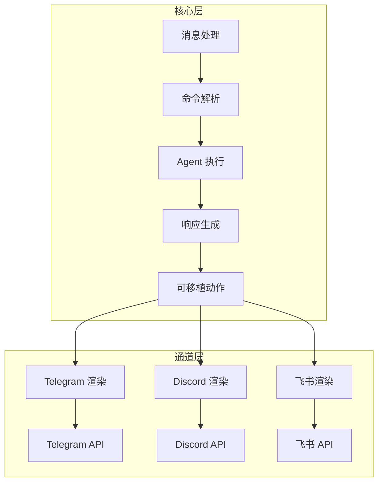
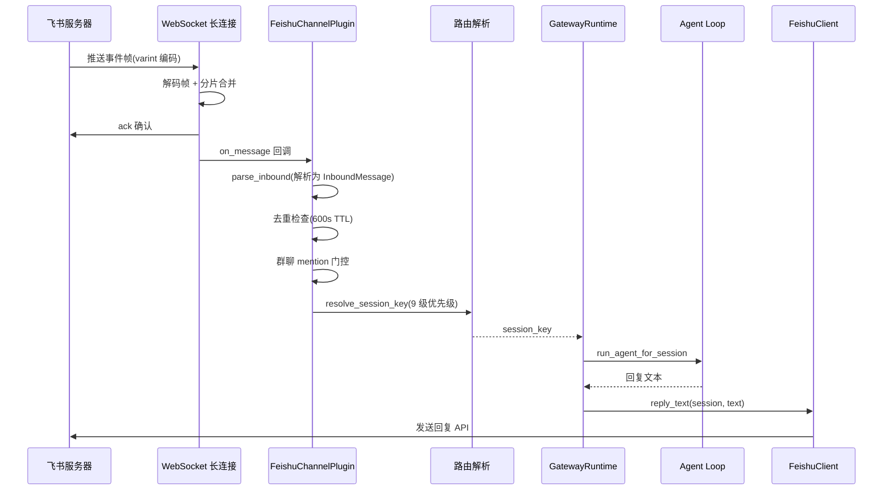
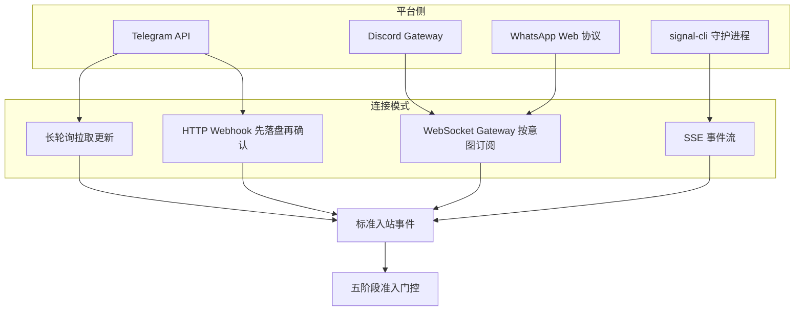
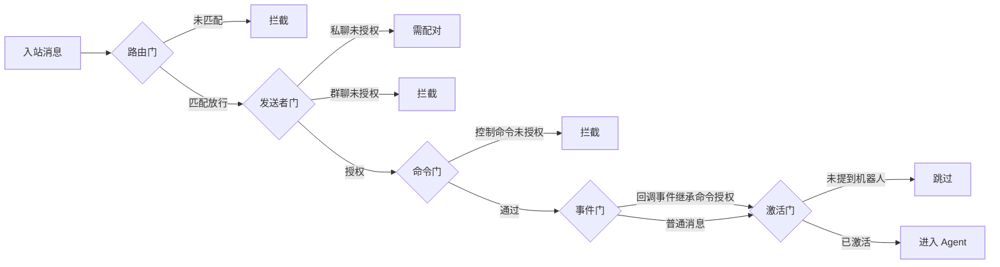

# 消息通道/IM 集成

## 读前思考

- 一个 Agent 需要同时接入飞书、Telegram、Discord、Slack、WebChat 五个平台。每个平台的消息格式、认证方式、发送限制都不同。你会为每个平台写一个完整的适配器，还是抽象出一个统一的通道接口让它们实现？如果抽象，接口应该有多"厚"？
- 通道层应该拥有产品逻辑吗？比如"用户在 Telegram 里输入 /help 显示帮助菜单"——这个逻辑应该写在 Telegram 适配器里，还是写在核心层？

## 核心问题

消息通道解决的核心问题是：**如何让 Agent 通过统一的消息模型与多个 IM 平台交互，同时把平台差异完全封装在适配器中，核心不感知任何平台特有逻辑**。

| 维度 | Python 版 | TypeScript 版 |
|------|-----------|--------------|
| 支持平台 | 飞书 + WebChat | Telegram/Discord/Slack/WhatsApp/iMessage/IRC/Teams/Google Chat/Signal 等 30+ |
| 通道架构 | ChannelPlugin Protocol | 插件化 ChannelPlugin（15+ 适配器接口） |
| 连接方式 | 飞书长连接完整闭环，其余通道仅出站 | 轮询 / Webhook / Gateway WS / 本地守护进程桥接 |
| 权限控制 | 策略模块已实现但未接线 | 五阶段准入门控 + 配对机制 |
| 分组 | 飞书内联 mention 门控 | mention 门控 + 群策略 + 话题/线程绑定 |
| 消息模型 | InboundMessage / OutboundMessage | 统一消息 + 平台渲染 |
| 路由 | 9 级优先级 | 多级配置匹配 + 绑定路由 |
| 产品逻辑归属 | Gateway 层 | 核心层（通道只做传输） |

## 方案展示

### 设计选择一：Transport-only 通道——通道不拥有产品逻辑

TS 版有一条严格的架构规则：**通道是 transport-only 的**。通道插件只负责三件事：

1. 渲染可移植的展示/动作（把核心的消息格式转为平台特有格式）
2. 执行传输限制（如 Telegram 消息最大 4096 字符）
3. 映射原生回调信封（把平台的 webhook 事件转为标准入站消息）

通道不拥有产品命令树、插件/供应商策略、功能特定菜单。"用户输入 /help 显示帮助"这种逻辑在核心层实现，通道只负责把 /help 这个动作映射为平台支持的交互形式（Telegram 的 inline keyboard、Discord 的 slash command）。

为什么这么设计？因为如果每个通道都拥有自己的命令逻辑，新增一个功能就要改 N 个通道适配器。Transport-only 让核心只需实现一次，所有通道自动获得新能力。

代价是通道适配器的"薄"——它不能利用平台特有能力（如 Telegram 的 Mini App、Discord 的 Embed）做深度集成。TS 版通过"typed presentation actions"缓解：核心声明动作类型，通道在支持时映射为原生交互，不支持时降级为纯文本。

### 设计选择二：飞书长连接 vs Webhook——Python 版的传输选择

下面是一条飞书消息从入站到回复的完整执行流：

每个阶段的设计考量：先 ack 再处理是为了避免飞书重发（飞书在未收到 ack 时会重试推送）；去重检查用内存 dict 而非 Redis，因为单实例部署不需要分布式去重；mention 门控确保群聊中只响应 @机器人 的消息；9 级路由决定消息归属哪个 session（私聊每用户一个，群聊每群一个）。

Python 版的飞书通道使用 WebSocket 长连接模式（feishu/events.py，335 行），而非 HTTP Webhook 回调。

为什么选长连接？因为 Python 版定位是"本地 AI Gateway"——运行在开发者笔记本或内网服务器上，没有公网 IP，无法接收 Webhook 回调。长连接让飞书服务器主动推送事件到客户端，不需要公网暴露。

帧编码使用类 protobuf 的 varint 二进制协议：
- 每帧以 varint 长度前缀开头
- 大事件可能分片发送，按 message_id 分桶合并
- 收到事件后先 ack 确认，再处理（避免飞书重发）
- 独立 asyncio.Task 做 ping 保活，间隔由服务端 ClientConfig 指定

断线重连用指数退避（1s → 60s），连接成功重置。

### 设计选择三：9 级路由优先级——消息归属决策

一条入站消息需要决定归属哪个 session。两个版本遵循同一个 9 级优先级契约（Python 版对齐 TS 版），从最具体到最宽泛逐级尝试，命中即停：

1. **精确 peer 匹配**（binding.peer）：消息的发送对象（私聊者或群）与绑定规则完全一致 → 指定 session。私聊中"每个用户一个 session"就是这一级产生的。
2. **父 peer 继承**（binding.peer.parent）：消息位于某个群的话题里，话题本身没有绑定 → 继承话题所属群的绑定。管理员只需绑定群一次，所有话题自动跟随。
3. **peer 通配**（binding.peer.wildcard）：按"类型 + 通配符"匹配整类 peer（如所有私聊、所有群）→ 这类 peer 统一路由，不必逐个点名。
4. **群 + 角色**（binding.guild+roles）：某个群中具有指定角色的成员 → 特定 agent。典型场景是 Discord 里的 VIP 用户，需要独立 session 不受群聊干扰。
5. **仅群匹配**（binding.guild）：整个群 → 一个 session。比角色级宽泛，适合整个群统一对待。
6. **团队/工作区**（binding.team）：按 workspace/team 归组 → 多个群共享一个 agent。
7. **账号级**（binding.account）：按通道 + 账号匹配 → 同一通道挂多个账号时区分归属。
8. **通道级**（binding.channel）：整个通道（如全部 Telegram 消息）→ 一个 agent。最宽泛的显式绑定。
9. **全局默认**（default）：所有绑定都落空 → 按消息类型自动生成 session key：私聊按发送者、群聊按会话、有话题按话题。

为什么需要这么多级？因为不同场景需要不同的 session 粒度：私聊中每个用户一个 session；群聊中整个群一个 session（或每个话题一个 session）；某些 VIP 用户需要独立 session 不受群聊干扰。粒度越细的规则优先级越高，保证"为某个人定制"总能覆盖"为整个群定制"，反过来则会被粗粒度的规则吞掉。

工程上的落地程度两版并不对称：TS 版完整实现了全部 8 级绑定 + 默认级，且为每级建了预编译索引（按 peer、群、团队、账号、通道分桶），一次路由只查命中桶，不需要线性扫描全部绑定规则；Python 版代码实际只落了精确 peer、账号、通道、默认四级，docstring 完整声明了 9 级契约，但群/角色、团队各级尚未实现——它的典型部署只有飞书和 WebChat，没有 Discord 的角色体系，只实现够用的子集。代价是未来若接入 Discord，Python 版需要补齐中间各级。

### 设计选择四：WebChat 的"反通道"设计

Python 版的 WebChatPlugin 是一个有趣的设计：它的 start/stop/send 方法全部为空。

为什么？因为 WebChat 用户直接通过 Gateway WebSocket 连接，消息投递由 Gateway 的 EventFrame 推送完成。WebChat 不需要独立的通道生命周期——Gateway 本身就是投递机制。这是一个刻意的"反模式"：为了满足 ChannelPlugin 接口而创建一个空实现，但实际的消息流完全走 Gateway 内部路径。Gateway 服务本体的连接接入与事件扇出见 14-gateway.md。

TS 版没有这种设计——它的每个通道（包括 Web/Desktop）都是完整的插件实现。

### 设计选择五：消息防抖与去重

IM 平台的消息可能重复发送（网络抖动、用户快速连发）。两个版本都有防护：

**Python 版：**
- 消息去重：内存 dict + 惰性清理（600 秒 TTL），按 message_id 去重
- 消息防抖：MessageQueue 用 500ms 窗口合并同一 session 的连续消息（用户快速发"你好""帮我""查一下"会合并为一条）

**TS 版：**
- inbound-debounce-policy.ts：入站防抖策略
- 会话键规范化：normalizeSessionKeyPreservingOpaquePeerIds，大小写不敏感

防抖的设计权衡：窗口太短（100ms）合并效果差，窗口太长（2s）用户感觉延迟。500ms 是经验值——覆盖了大多数"快速连发"场景，同时不引入明显延迟。

### 设计选择六：通信——按平台 API 形态选型的四类连接

前面讲了飞书为什么选长连接。TS 版接入 30+ 平台，连接方式归纳为四类，选哪类不是偏好问题，而是平台 API 形态决定的：

1. **长轮询**（Telegram 默认）：平台提供拉取接口，客户端循环调用拿增量更新。启动时先清理残留的 webhook 配置，用租约机制防止多实例抢同一个 bot token。
2. **HTTP Webhook**（Telegram 可选）：平台主动推送，需要公网 URL。核心机制是先落盘再 ack：收到更新先写磁盘暂存区，落盘成功才返回 200，处理完成用墓碑标记而非删除——Telegram 不保证更新幂等，崩溃后平台重投不会重复执行副作用。
3. **WebSocket Gateway**（Discord / WhatsApp）：平台提供长连接协议。Discord 用 intents 位掩码声明订阅的事件类型（默认不订阅成员/在线等特权意图），缺特权意图的 4014 错误被分类为"用户可行动的致命错误"，直接提示去开发者后台开通；WhatsApp 没有官方机器人 API，用第三方库直连其 Web 协议，靠二维码登录 + 凭据持久化。
4. **本地守护进程桥接**（Signal）：平台连协议都不开放，只能跑一个本地 signal-cli 守护进程，OpenClaw 通过 SSE 订阅事件，断线要自己重连。

为什么这么选？因为连接方式不是通道层能决定的——平台给什么接口就用什么：Telegram 两种都给（无公网 IP 用轮询，有公网用 webhook 低延迟），Discord 只有 Gateway，WhatsApp 只有逆向协议，Signal 只有本地进程。通道抽象能统一的只是"事件 → 标准消息"的转换和发送 API，连接生命周期本身每平台一套，无法复用。

代价：每种连接都要单独做可靠性工程（轮询偏移量推进、webhook 落盘与重投、Gateway 重连分类、SSE 断线重连），这部分代码量往往超过消息转换本身。Python 版则走到另一个极端：只有飞书走通了长连接闭环，telegram/discord/slack/wecom 四个通道只有发送没有接收（出站桩）——架构骨架完整但闭环只有一条，这些通道无法被用户消息唤醒。

### 设计选择七：权限——五阶段准入门控

TS 版把"这条消息能不能进 Agent、以什么身份进"做成一张与通道无关的五阶段决策图。每道门有独立的判定依据和审计理由，终态五个：放行 / 拦截 / 跳过 / 观察 / 需配对。

1. **路由门**：先看消息有没有匹配到路由绑定。匹配到的路由可以放行或拦截；绑定列表为空且不允许空表放行时直接拦截。
2. **发送者门**：按私聊/群聊分叉。私聊走 DM 策略四态（禁用 / 开放 / 允许列表 / 配对），群聊走群策略。注意允许列表永远有收窄效力——即使 DM 策略是"开放"，发送者仍需匹配允许列表的通配或显式条目。
3. **命令门**：若消息是控制命令（/help 之类），检查发送者是否为 owner 或授权组成员。授权失败且是控制命令 → 拦截。
4. **事件门**：按钮点击、slash 命令回调这类事件型入站，继承命令门的授权结果，不重复查发送者。
5. **激活门**：群聊中要求 mention 才激活（见设计选择八），未 mention 且未授权 → 跳过。

配对是这套体系里最有特色的一环：DM 策略的"配对"态让陌生人可以发起首次交互——未授权发送者收到"需配对"响应，通道发出配对挑战，配对成功后发送者 id 写入持久化存储，此后按允许列表成员对待。为什么需要它？个人助理既要低摩擦（陌生人可建立关系）又要防滥用（未配对不执行命令）。代价是配对存储与配置允许列表的合并规则随策略变化，语义不直观。

工程侧配套：所有平台凭据统一放在凭据目录，配置里用环境变量引用；webhook 用 secret header 做常量时间比较，且只对认证失败的请求限流（不节流平台正常投递）；Signal 端到端加密消息在解密前先做形状/大小/频率检查——解密开销高，先用便宜检查过滤滥用流量。

Python 版是反面教材式的对照：允许列表、配对、群策略、mention 四个策略模块全部实现但未接线（唯一被实际调用的公共模块是路由解析），真正生效的只有飞书内联的 mention 门控和 sidecar 的 HMAC 签名。这暴露了"架构骨架先行、接线按迭代节奏"的移植策略——配置面与行为面脱节，用户配置了发送者允许列表，实际并不会走允许列表模块。

### 设计选择八：分组——群聊、话题与 mention 门控

入站消息的分组决策分成三层：要不要响应（mention 门控）、归到哪个会话（群/话题粒度）、群内上下文怎么维护。

**mention 门控**：群聊中默认只响应 @机器人 的消息。判定链是：策略要求 mention 且平台能检测 mention 且消息确实没提到 → 跳过。隐式 mention 可配置放行：回复机器人的消息、引用机器人的消息、机器人参与过的线程内的消息，都算"隐式提到"。已授权的控制命令免 mention 直通——命令是明确指令，不需要 @ 激活。

**群策略**：开放 / 允许列表 / 禁用三态，且 fail-closed——配置缺失时默认按允许列表处理（宁可拒绝不可放错），并告警一次提示补配置。

**会话粒度**：Telegram 的话题会话键是"聊天ID:话题ID"形态，论坛话题与私聊话题严格区分；Discord 是 guild → channel → thread 三级；WhatsApp 用 JID 后缀区分群/私聊，群消息把群名、参与者、mention 列表都带进上下文（启动时全量拉取群元数据 + 内存缓存 + 增量更新，拉取失败回退缓存）。

**线程绑定**：TS 版特有的线程绑定策略——线程可以绑定到子会话（绑定位置决定当前会话还是子会话），空闲超过默认 24 小时自动解绑，绑定激活时发 intro 消息、结束时发 farewell，子会话支持独立上下文。这让"群里的某个话题领走一个独立 Agent 会话"成为配置级能力，与 9 级路由的父 peer 继承（第 2 级）呼应。

Python 版的分组现状：飞书群聊门控内联实现（groupPolicy 默认 mention 模式，open 模式关闭门控），有自消息过滤（配置机器人自身 id 后丢弃自己的消息），但群成员列表不查询、角色不解析——9 级路由里 guild+roles 那一级在 Python 侧没有数据来源，只能等默认兜底。

## 工程优化

**Python 版：**
- 飞书 tenant_access_token 自动刷新（过期前主动续期）
- 飞书内部事件接口用 HMAC-SHA256 签名验证（防止伪造事件）
- 群聊 mention 门控：默认只处理 @机器人 消息，避免响应所有群消息
- 首次配对验证：pairing.py 实现新用户首次交互的确认流程

**TS 版：**
- 入站先落盘再 ack + 墓碑标记：更新落盘成功才返回 200，处理完成用墓碑标记而非删除（平台重投不重复执行副作用）；死信按"超龄"而非"重试次数"清理，避免健康长任务被杀
- 跨进程租约：轮询租约防止多实例抢同一 bot token，spool claim 租约（5 分钟刷新）保证崩溃窗口不丢消息
- 发送漏斗降级链：富文本被拒 → 纯文本、caption 被拒 → 纯 caption、引用消息找不到 → 旧式回复，共用同一降级判定
- 传输错误分类：5xx/429 本地重试（尊重平台给的 retry_after，有上限），401/404 致命不重试，409 冲突上抛给父会话处理
- 看门狗：轮询更新停滞超过阈值（默认 120s）强制重建连接并标记连接脏重建
- webhook 请求防护：body 体积上限、超时上限、只对认证失败请求限流（不节流平台正常投递）
- 回复 fence：正常消息永不打断进行中的回复，只有授权的 abort 文本/命令可打断
- 群聊历史窗口始终开启且滚动推进（水印式），不把群内每条消息都持久化进会话
- 流式投递 4 种模式（off/partial/block/progress），按通道能力自动降级
- 惰性运行时加载：确保通道 SDK 类型路径不加载磁盘写入器

## 面试要点

**问题一：为什么 TS 版坚持"通道不拥有产品逻辑"？如果某个平台有独特的交互能力（如 Telegram Mini App），这个规则会不会限制体验？**

参考答案方向：不拥有产品逻辑的好处是：新增功能只需在核心实现一次，N 个通道自动获得。如果通道拥有逻辑，每个新功能要改 N 个适配器，且各通道的行为可能不一致。限制确实存在：Telegram Mini App 可以提供丰富的 Web UI，但 transport-only 规则下通道只能把它映射为"打开一个 URL"的动作，不能在 Mini App 内做产品逻辑。缓解方案是"typed presentation actions"：核心声明动作的语义类型（如"确认对话框"），通道在支持时映射为原生交互（Telegram 的 inline keyboard），不支持时降级为纯文本。这在大多数场景下够用，但确实牺牲了深度平台集成。

**问题二：飞书长连接 vs Webhook，各自的适用场景是什么？如果 Python 版要部署到公网服务器，应该切换到 Webhook 吗？**

参考答案方向：长连接适合：无公网 IP（本地开发、内网部署）、需要穿透防火墙、不想管理 HTTPS 证书。Webhook 适合：有公网域名、需要水平扩展（多实例接收回调）、平台不支持长连接。如果部署到公网服务器，Webhook 更合适——长连接在多实例部署时需要额外的消息分发（哪个实例持有连接？），Webhook 天然支持负载均衡。但切换成本不高：只需要新增一个 HTTP endpoint 接收飞书回调，parse_inbound 逻辑可以复用。

**问题三：消息防抖的 500ms 窗口是怎么确定的？如果用户真的想在 500ms 内发两条独立消息怎么办？**

参考答案方向：500ms 是经验值，基于"人类打字速度"的假设——正常用户在 500ms 内发出的多条消息大概率是同一意图的拆分（"帮我" + "查一下" + "天气"）。如果用户真的在 500ms 内发了两条独立消息（如通过脚本或快捷短语），防抖会把它们合并为一条，Agent 可能只回复合并后的内容。缓解方案：(1) 窗口可配置（高级用户可以调低到 200ms）；(2) 合并时保留原始消息边界（Agent 能看到"这是两条消息被合并了"）；(3) 如果两条消息的意图明显不同（如一条是问题一条是命令），Agent 可以分别处理。

**问题四：TS 版把准入决策做成五阶段门控图，而不是一个简单的 allowlist 函数——这个复杂度的代价在哪？**

参考答案方向：门控图的价值在于"哪道门拦的、为什么"可观测可排障，且策略可以组合（DM 策略 × 群策略 × 命令授权 × 事件继承 × mention 激活），这是单一 allowlist 表达不了的——比如"群里的控制命令免 mention、普通命令要 mention、陌生人的 DM 要配对"这类组合语义。代价是插件必须正确填充事实（能不能检测 mention、事件来源类型、路由是否匹配），填错就是静默放行或拦截；对只需要 allowlist 的简单通道（如只接入一个群），这套机制是过重的抽象。判断标准取决于通道数量 × 策略种类：一个只服务自家群的机器人用 allowlist 函数就够，面向陌生用户的公开机器人值得付出门控图的复杂度。
