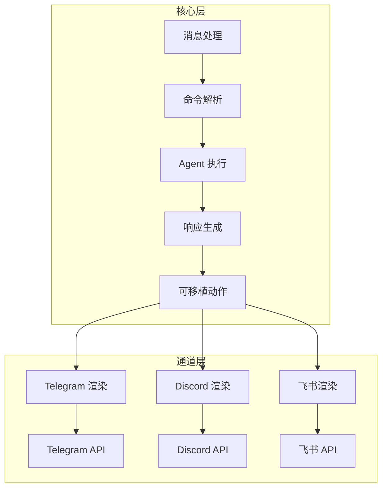
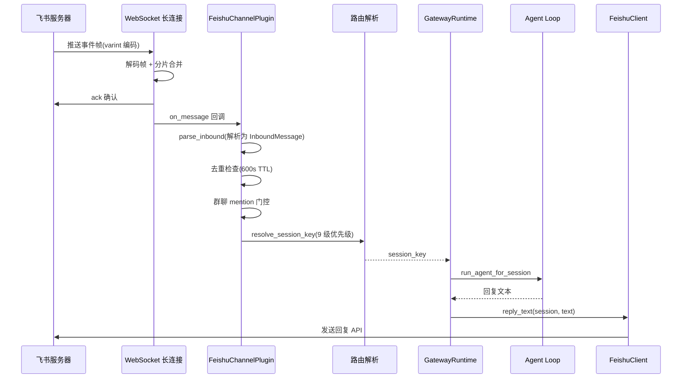

# 消息通道/IM 集成

## 读前思考

- 一个 Agent 需要同时接入飞书、Telegram、Discord、Slack、WebChat 五个平台。每个平台的消息格式、认证方式、发送限制都不同。你会为每个平台写一个完整的适配器，还是抽象出一个统一的通道接口让它们实现？如果抽象，接口应该有多"厚"？
- 通道层应该拥有产品逻辑吗？比如"用户在 Telegram 里输入 /help 显示帮助菜单"——这个逻辑应该写在 Telegram 适配器里，还是写在核心层？

## 核心问题

消息通道解决的核心问题是：**如何让 Agent 通过统一的消息模型与多个 IM 平台交互，同时把平台差异完全封装在适配器中，核心不感知任何平台特有逻辑**。

| 维度 | Python 版 | TypeScript 版 |
|------|-----------|--------------|
| 支持平台 | 飞书 + WebChat | Telegram/Discord/Slack/WhatsApp/iMessage/IRC/Teams/Google Chat/Signal 等 |
| 通道架构 | ChannelPlugin Protocol | 插件化 ChannelPlugin（15+ 适配器接口） |
| 消息模型 | InboundMessage / OutboundMessage | 统一消息 + 平台渲染 |
| 路由 | 9 级优先级 | 多级配置匹配 + 绑定路由 |
| 产品逻辑归属 | Gateway 层 | 核心层（通道只做传输） |

## 方案展示

### 设计选择一：Transport-only 通道——通道不拥有产品逻辑

TS 版有一条严格的架构规则：**通道是 transport-only 的**。通道插件只负责三件事：

1. 渲染可移植的展示/动作（把核心的消息格式转为平台特有格式）
2. 执行传输限制（如 Telegram 消息最大 4096 字符）
3. 映射原生回调信封（把平台的 webhook 事件转为标准入站消息）

通道不拥有产品命令树、插件/供应商策略、功能特定菜单。"用户输入 /help 显示帮助"这种逻辑在核心层实现，通道只负责把 /help 这个动作映射为平台支持的交互形式（Telegram 的 inline keyboard、Discord 的 slash command）。

为什么这么设计？因为如果每个通道都拥有自己的命令逻辑，新增一个功能就要改 N 个通道适配器。Transport-only 让核心只需实现一次，所有通道自动获得新能力。

代价是通道适配器的"薄"——它不能利用平台特有能力（如 Telegram 的 Mini App、Discord 的 Embed）做深度集成。TS 版通过"typed presentation actions"缓解：核心声明动作类型，通道在支持时映射为原生交互，不支持时降级为纯文本。

### 设计选择二：飞书长连接 vs Webhook——Python 版的传输选择

下面是一条飞书消息从入站到回复的完整执行流：

每个阶段的设计考量：先 ack 再处理是为了避免飞书重发（飞书在未收到 ack 时会重试推送）；去重检查用内存 dict 而非 Redis，因为单实例部署不需要分布式去重；mention 门控确保群聊中只响应 @机器人 的消息；9 级路由决定消息归属哪个 session（私聊每用户一个，群聊每群一个）。

Python 版的飞书通道使用 WebSocket 长连接模式（feishu/events.py，335 行），而非 HTTP Webhook 回调。

为什么选长连接？因为 Python 版定位是"本地 AI Gateway"——运行在开发者笔记本或内网服务器上，没有公网 IP，无法接收 Webhook 回调。长连接让飞书服务器主动推送事件到客户端，不需要公网暴露。

帧编码使用类 protobuf 的 varint 二进制协议：
- 每帧以 varint 长度前缀开头
- 大事件可能分片发送，按 message_id 分桶合并
- 收到事件后先 ack 确认，再处理（避免飞书重发）
- 独立 asyncio.Task 做 ping 保活，间隔由服务端 ClientConfig 指定

断线重连用指数退避（1s → 60s），连接成功重置。

### 设计选择三：9 级路由优先级——消息归属决策

一条入站消息需要决定归属哪个 session。Python 版的 routing.py 实现了 9 级优先级匹配（对齐 TS 版 resolve-route.ts）：

1. 精确 peer ID 匹配（特定用户 → 特定 session）
2. 线程/话题匹配（群聊中的特定话题）
3. 群组匹配（整个群 → 一个 session）
4. 通道默认路由
5. ...（逐级降级）
6. 全局默认

为什么需要这么多级？因为不同场景需要不同的 session 粒度：私聊中每个用户一个 session；群聊中整个群一个 session（或每个话题一个 session）；某些 VIP 用户需要独立 session 不受群聊干扰。

### 设计选择四：WebChat 的"反通道"设计

Python 版的 WebChatPlugin 是一个有趣的设计：它的 start/stop/send 方法全部为空。

为什么？因为 WebChat 用户直接通过 Gateway WebSocket 连接，消息投递由 Gateway 的 EventFrame 推送完成。WebChat 不需要独立的通道生命周期——Gateway 本身就是投递机制。这是一个刻意的"反模式"：为了满足 ChannelPlugin 接口而创建一个空实现，但实际的消息流完全走 Gateway 内部路径。

TS 版没有这种设计——它的每个通道（包括 Web/Desktop）都是完整的插件实现。

### 设计选择五：消息防抖与去重

IM 平台的消息可能重复发送（网络抖动、用户快速连发）。两个版本都有防护：

**Python 版：**
- 消息去重：内存 dict + 惰性清理（600 秒 TTL），按 message_id 去重
- 消息防抖：MessageQueue 用 500ms 窗口合并同一 session 的连续消息（用户快速发"你好""帮我""查一下"会合并为一条）

**TS 版：**
- inbound-debounce-policy.ts：入站防抖策略
- 会话键规范化：normalizeSessionKeyPreservingOpaquePeerIds，大小写不敏感

防抖的设计权衡：窗口太短（100ms）合并效果差，窗口太长（2s）用户感觉延迟。500ms 是经验值——覆盖了大多数"快速连发"场景，同时不引入明显延迟。

## 工程优化

**Python 版：**
- 飞书 tenant_access_token 自动刷新（过期前主动续期）
- 飞书内部事件接口用 HMAC-SHA256 签名验证（防止伪造事件）
- 群聊 mention 门控：默认只处理 @机器人 消息，避免响应所有群消息
- 首次配对验证：pairing.py 实现新用户首次交互的确认流程

**TS 版：**
- 流式投递 4 种模式（off/partial/block/progress），按通道能力自动降级
- 通道 ID 规范化使用 @openclaw/normalization-core 共享包
- 惰性运行时加载：createLazyRuntimeModule 确保通道 SDK 类型路径不加载磁盘写入器
- 多级配置匹配：direct → normalized → parent → wildcard 四级优先级

## 面试要点

**问题一：为什么 TS 版坚持"通道不拥有产品逻辑"？如果某个平台有独特的交互能力（如 Telegram Mini App），这个规则会不会限制体验？**

参考答案方向：不拥有产品逻辑的好处是：新增功能只需在核心实现一次，N 个通道自动获得。如果通道拥有逻辑，每个新功能要改 N 个适配器，且各通道的行为可能不一致。限制确实存在：Telegram Mini App 可以提供丰富的 Web UI，但 transport-only 规则下通道只能把它映射为"打开一个 URL"的动作，不能在 Mini App 内做产品逻辑。缓解方案是"typed presentation actions"：核心声明动作的语义类型（如"确认对话框"），通道在支持时映射为原生交互（Telegram 的 inline keyboard），不支持时降级为纯文本。这在大多数场景下够用，但确实牺牲了深度平台集成。

**问题二：飞书长连接 vs Webhook，各自的适用场景是什么？如果 Python 版要部署到公网服务器，应该切换到 Webhook 吗？**

参考答案方向：长连接适合：无公网 IP（本地开发、内网部署）、需要穿透防火墙、不想管理 HTTPS 证书。Webhook 适合：有公网域名、需要水平扩展（多实例接收回调）、平台不支持长连接。如果部署到公网服务器，Webhook 更合适——长连接在多实例部署时需要额外的消息分发（哪个实例持有连接？），Webhook 天然支持负载均衡。但切换成本不高：只需要新增一个 HTTP endpoint 接收飞书回调，parse_inbound 逻辑可以复用。

**问题三：消息防抖的 500ms 窗口是怎么确定的？如果用户真的想在 500ms 内发两条独立消息怎么办？**

参考答案方向：500ms 是经验值，基于"人类打字速度"的假设——正常用户在 500ms 内发出的多条消息大概率是同一意图的拆分（"帮我" + "查一下" + "天气"）。如果用户真的在 500ms 内发了两条独立消息（如通过脚本或快捷短语），防抖会把它们合并为一条，Agent 可能只回复合并后的内容。缓解方案：(1) 窗口可配置（高级用户可以调低到 200ms）；(2) 合并时保留原始消息边界（Agent 能看到"这是两条消息被合并了"）；(3) 如果两条消息的意图明显不同（如一条是问题一条是命令），Agent 可以分别处理。
