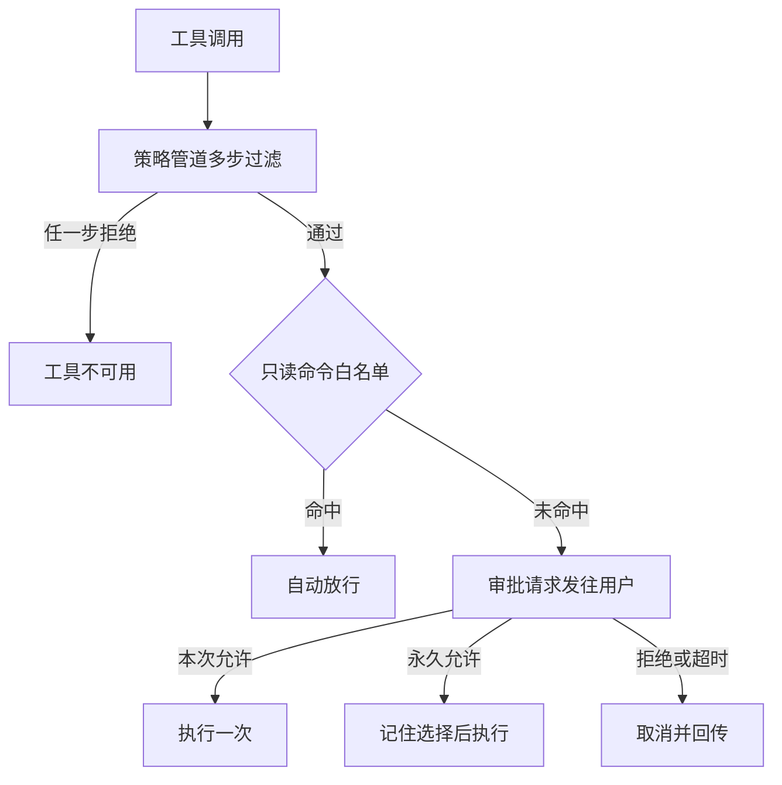
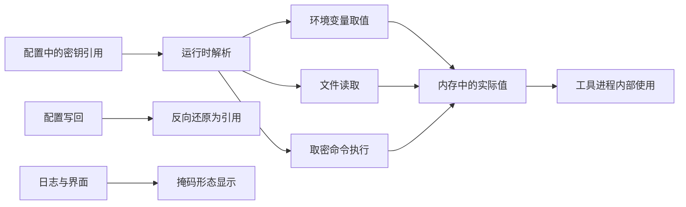
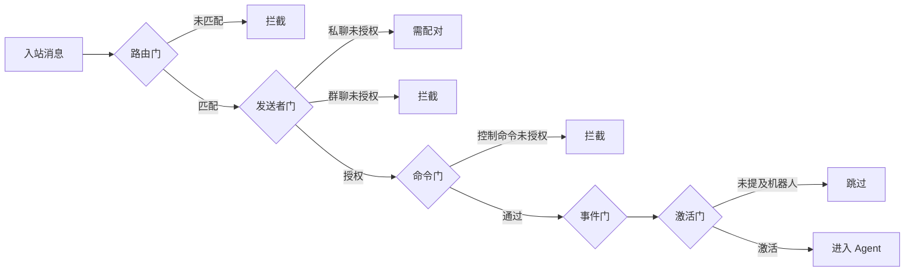
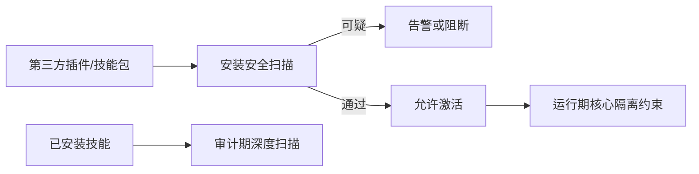
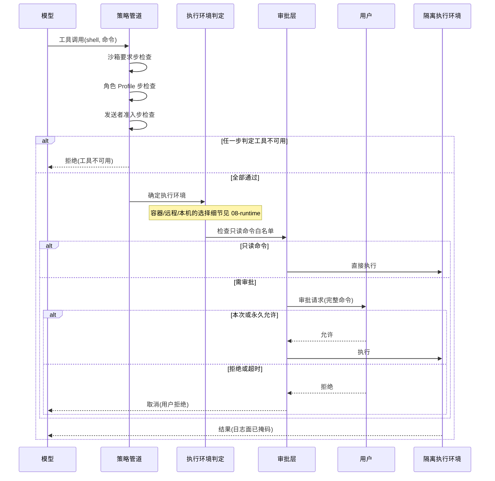

# 执行前拦截与信任治理

## 读前思考

- 一个 Agent 能执行命令、读写文件、发送网络请求，还接入了一百多个第三方插件和几十个消息平台。如果 LLM 被 prompt injection 诱导执行一条删除命令，从消息进门到命令落地，你的系统里到底有几道独立的闸门？任何一道被绕过时，下一道还在吗？
- 配置文件可能被模型通过读文件工具看到。密钥如果写在配置里就等于摆在模型面前——怎么让系统"用得着"密钥而模型"看不到"密钥？

## 核心问题

执行前拦截与信任治理解决的核心问题是：**在开放平台上，面对不可信的第三方插件、不可信的外部消息来源和可能被注入的模型输出，用多层独立判定把每一类威胁挡在执行之前，并让密钥在全生命周期不以明文出现在模型可见的任何表面。**

openclaw 的定位是四层纵深防御：审计（配置面体检）、策略（工具面过滤）、沙箱（执行时隔离）、审批（动作级确认）。本篇主写审计、策略、审批、密钥四个执行前层面；沙箱层的容器级隔离（只读根文件系统、能力裁剪、系统调用过滤、网络隔离）机制见 08-runtime，"保留哪一层"的纵深权衡两篇互引；审计诊断工具的产品形态归 10-observability，本篇只讲审计层作为拦截前置的角色。

| 维度 | openclaw 的选择 |
|------|----------------|
| 权限模型 | 多步策略管道过滤 + 五阶段消息准入门控 |
| 人工介入 | allow-once / allow-always / deny 三级审批，只读命令豁免 |
| 密钥管理 | SecretRef 引用制 + 恒定时间比较 + 掩码显示 + 存储分离 |
| 敏感配置 | 环境变量引用写回保留，明文不落盘 |
| 安装时扫描 | 第三方插件与技能安装安全扫描 |
| Python 版对照 | 工具策略 Profile + 输出正则脱敏，审批预留未启用 |

## 方案展示

### 设计选择一：策略管道 + 只读豁免 + 三级审批

动作级拦截分两段。第一段是策略管道：一次工具调用要经过多步过滤（沙箱要求、角色 Profile、提供方限制、发送者、群组、子代理身份），任何一步判定不可用就直接拒绝，不进入后续环节。管道中与发送者/群组准入相关的判定本质是"这个消息来源配不配用这个工具"，与审批共同构成动作级权限面。

第二段是审批：命令通过策略后，先比对只读命令白名单（safe-bins），只读命令自动放行；其余命令向用户发送审批请求，用户在界面看到完整命令，选择本次允许、永久允许或拒绝，请求带超时避免 Agent 无限等待。Python 版的审批模块预留了同样的超时语义但当前未接入主流程——本地 Gateway 场景用户就是操作者；它的防护重心在输出侧，用正则检测工具结果中的密钥形态（API key、Bearer 令牌、密码模式）并替换为占位符。

**为什么这么选**：策略管道处理"结构性权限"（这个身份、这个来源本来就没有这类工具），审批处理"情境性权限"（工具合法但这条具体命令需要人看一眼）。只读豁免是摩擦与安全的折中：高频无害命令不打断自主性，写入与解释器类命令永远要过人。

**牺牲了什么**：每次确认都打断 Agent 的自主节奏；白名单的宽窄直接决定体验与安全的平衡点（见面试要点 3）。Python 版审批未接线也说明：机制存在不等于防护存在，未接线的策略等于没有。

### 设计选择二：SecretRef 引用制密钥——能用但看不到

TS 版的密钥管理是一套引用系统：配置中不写密钥明文，只写引用——指向某个环境变量名、某个文件路径，或一条取密命令（如从密钥保管库读取），实际值在运行时解析进内存。工具输入参数里出现的只是引用标识，模型能看到的始终只有"这里存在一个某某名字的引用"。

配套三件事：密钥比较用恒定时间算法，防止通过响应耗时差异逐字节猜解；日志与界面显示掩码形态（保留头尾若干字符）；存储物理分离——通道凭据、模型认证档案各自放在独立目录，与主配置文件分开。配置写回时还有一道反向保护：加载时记录每个环境变量引用被替换成什么值，UI 修改配置后写回文件时按映射反向还原为引用形态，明文永远不进配置文件。

**为什么这么选**：配置文件是模型可读的表面——读文件工具一旦扫到明文密钥，就可能出现在回复里被外传。引用制把"声明"与"值"分离，静态表面只剩声明。恒定时间比较、掩码、写回还原则分别守住比较、观测、持久化三个次级泄露面。

**牺牲了什么**：引用增加配置的心智成本（调试时要先想"这个引用解析成了什么"）。写回还原依赖替换映射，运行时环境变量被外部改动时映射可能失配。而且引用制挡不住动态泄露——模型仍可能通过执行命令间接拿到值，这要靠执行面配套（见面试要点 1）。

### 设计选择三：五阶段准入门控——消息进门前的权限判定

TS 版把"这条消息能不能进 Agent、以什么身份进"做成一张与通道无关的五阶段决策图：路由门（消息是否匹配到路由绑定，空绑定表可配置为拒绝放行）、发送者门（私聊走 DM 策略四态——禁用/开放/允许列表/配对，群聊走群策略；允许列表永远有收窄效力）、命令门（控制命令要求发送者是属主或授权组成员）、事件门（按钮点击等回调继承命令门结果，不重复查）、激活门（群聊要求被提及才激活）。终态五种：放行、拦截、跳过、观察、需配对。

最有特色的是配对态：陌生人可以发起首次私聊，收到配对挑战，配对成功后身份写入持久化存储，此后按允许列表成员对待。个人助理既要低摩擦地建立新关系，又不能让未配对者执行任何命令。

**为什么这么选**：消息级准入是动作审批的前置——不可信来源的消息连进入模型上下文的机会都不该有。五道门各自独立判定、各自留下审计理由，"哪道门拦的、为什么"可观测可排障。配对机制在低摩擦与防滥用之间给了陌生人一条受控的上升通道。

**牺牲了什么**：策略组合语义（DM 策略 × 群策略 × 命令授权 × 事件继承 × 提及激活）不直观，插件必须正确填充判定事实，填错就是静默放行或静默拦截。对只服务自家群的简单机器人，这套机制过重。Python 版是反面参照：四个策略模块全部实现但未接线，真正生效的只有内联的提及门控——配置面与行为面脱节。

### 设计选择四：供应链安装扫描

第三方插件与社区技能在激活前各有一道安装安全扫描：插件安装时对包内容做安全检查，技能从市场安装时同样过扫描器。扫描与"核心隔离"（插件不能引用核心内部代码，机制归 07-tools）互补——隔离限制插件运行时能碰什么，扫描在安装时拦截已知的可疑模式。审计层还有一项可选的深度代码扫描，检查已安装技能文件中的可疑指令，作为安装扫描的时间后置补充。

**为什么这么选**：开放平台的扩展生态越大，供应链攻击面越大。安装时是唯一的"代码还未生效"窗口，此时拦截成本最低；运行期再发现问题，插件已经加载了。

**牺牲了什么**：安装延迟与误报风险；扫描器本身依赖已知模式库，对全新攻击手法有滞后。

## 核心机制执行流：一次 shell 命令从策略到审批的完整链路

以模型调用 shell 工具执行一条带删除语义的命令为例：

**阶段一：策略先行。** 管道按步过滤，顺序是刻意的——如果工具本身被禁（比如某角色 Profile 禁用了 shell），根本不需要进入后续环节。发送者准入步体现裁定边界：它回答的不是"你是谁"（连接认证在 01-gateway 已完成），而是"这个来源配不配用这个动作"。

**阶段二：环境判定。** 策略通过后确定命令在哪个执行环境里跑，容器级隔离细节归 08-runtime，本篇不展开。

**阶段三：白名单分流。** 只读命令白名单区分"自动通过"与"需要确认"。判定标准不是"这个命令通常安全"，而是"这个命令能否被参数化成任意操作"——解释器类命令即使常用来做小事也必须审批。

**阶段四：人在回路。** 审批请求带超时，超时按拒绝处理，Agent 不会挂死在等待上。永久允许会被记住，后续同类命令不再询问。

**边界路径——工具被策略禁用。** 模型收到"工具不可用"的拒绝，可以改用其他途径；策略拒绝发生在任何资源消耗之前。

**边界路径——审批超时。** 用户不在场时请求超时自动取消，方向与安全拒绝一致：无人确认时宁可不做。

## 工程优化

**恒定时间比较防时序攻击**：密钥比对与 webhook 签名验证都用恒定时间算法，响应耗时不随匹配进度变化，攻击者无法通过计时逐字节猜解。

**安全正则防拒绝服务**：对外部输入做模式匹配时使用受控的正则构造，防止恶意输入构造灾难性回溯拖垮进程。

**Python 版的输出面脱敏**：工具结果在广播前递归脱敏，API key、Bearer 令牌、密码模式被替换为占位符；内部事件接口用 HMAC 签名验证防伪造。这说明审批缺位时，输出面脱敏成为主要防线。

**审计发现可抑制可排序**：审计层的每项发现带严重级别与修复建议，用户确认为误报后可标记抑制，避免告警疲劳让真正的风险被忽略。

## 面试要点

**1. 四层纵深里如果只能保留一层，保留哪层？为什么？**

参考答案方向：保留沙箱层。审计只发现配置错误（攻击者不需要配置错误就能注入），策略只限制工具面（shell 一旦被允许策略就失效），审批依赖人的判断（用户可能看不懂命令就点了允许）；沙箱是最后的物理边界，即使模型被完全控制，损害也被限制在容器内。但单层不够：沙箱防不住数据外泄——命令可以在容器内读到密钥再经网络发出去，需要策略断网与密钥引用制配合。本篇各层与沙箱层如何组合见 08-runtime。判断标准是"该层对'模型已被完全控制'这一最坏假设的存活能力"。

**2. 消息准入做成五阶段门控图，而不是一个简单的允许列表函数——这个复杂度值吗？**

参考答案方向：价值在两点：每道门独立留下"为什么拦"的审计理由，可观测可排障；策略可以表达组合语义——"群里的控制命令免提及、普通消息要提及、陌生人的私聊要配对"这类规则单一允许列表根本写不出。代价是插件必须正确填充判定事实（能否检测提及、事件类型、路由结果），填错就是静默放行或拦截。判断标准是"通道数量 × 策略种类"：只服务自家群的机器人用允许列表就够，面向陌生用户的公开机器人才值得门控图。

**3. 只读命令白名单应该怎么维护？太严格和太宽松分别有什么问题？**

参考答案方向：太严格（只放行极少数命令），Agent 几乎每步等确认，自主性归零；太宽松（放行解释器类命令），恶意提示词可以借参数执行任意操作，审批形同虚设。维护原则：白名单只收无法被参数化为任意操作的只读命令；写入类永远审批；解释器类永远审批；定期复审新增条目。判断标准不是"这个命令通常安全"，而是"这个命令能否被参数化为任意操作"——前者是经验，后者是可判定的性质。
