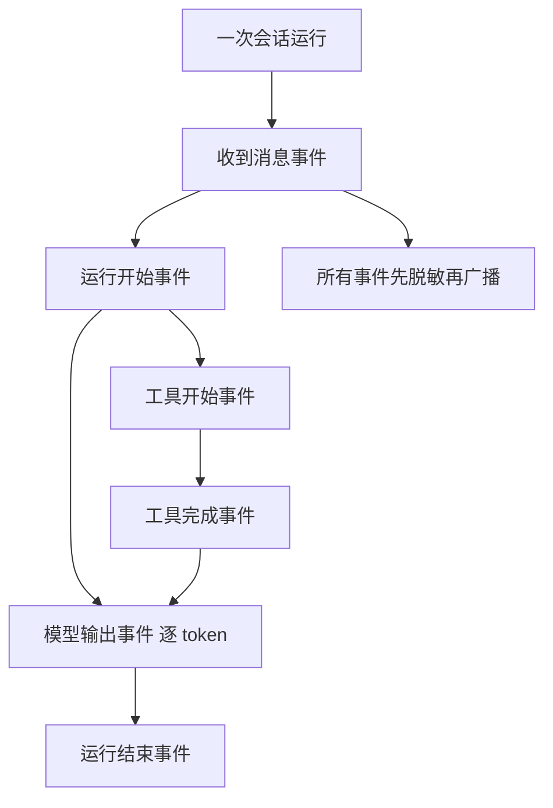
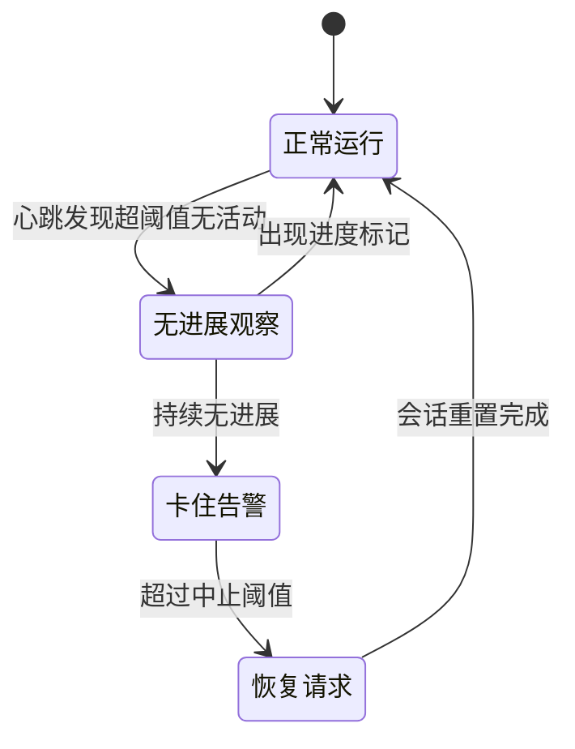
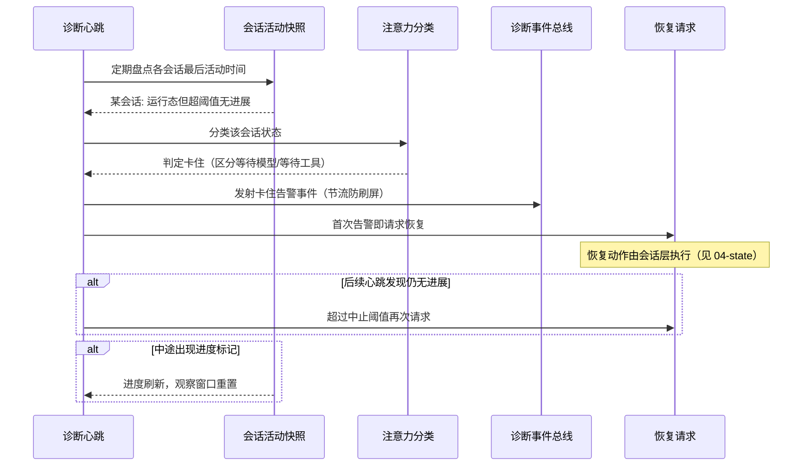

# 可观测性

## 读前思考

- 用户报告"Agent 没有回复我"，问题可能出在消息接入、会话调度、模型流式、工具执行任何一层。你会设计什么样的观测结构，让这种跨层排查在几分钟内完成？更进一步：如果系统自己就能发现"某个会话卡住了"并处理，还需要人来排查吗？
- 系统同时使用多家 LLM 供应商，每家的用量字段名和计费口径都不同。不做统一处理，成本报表会出什么错？

## 核心问题

可观测性解决的核心问题是：**让开发者和用户不读源码就能理解系统运行状态、定位故障、追踪资源消耗，并且观测本身不泄露敏感信息**。

openclaw 有两个实现，可观测性投入差异很大：Python 版面向本地工作台，做到实时可视化与结构化诊断；TS 版面向生产多用户，额外做了日志脱敏、卡住会话自愈与支持包导出。

| 维度 | openclaw Python 版 | openclaw TS 版 |
|------|-------------------|----------------|
| 实时观测 | 全链路事件广播到工作台 | 诊断遥测 + 事件总线（带 trace 上下文） |
| token 追踪 | 用量事件累加（无计费） | 多供应商规范化 + 成本计算 |
| 审计 | 无 | 事件溯源 JSONL 审计日志（多处） |
| 故障自愈 | 无（被动取消） | 卡住会话检测与恢复请求 |
| 诊断导出 | 诊断报告 HTTP 端点 | 脱敏支持包一键导出 |

## 方案展示

### 设计选择一：全链路事件广播

Python 版在执行会话任务的每个阶段都向前端工作台推送事件帧：收到消息、会话加载、运行开始、模型逐 token 输出、工具开始/完成、运行结束。工作台实时展示"Agent 正在想什么、调了什么工具、工具返回了什么"。TS 版的诊断遥测做同样的事但更系统：运行时事件、阶段计时、会话状态、稳定性指标都经事件总线发射，并带 trace 上下文（traceId + spanId）支持关联（源码：diagnostic.ts）。

**为什么这么选**：Agent 的故障是跨层的，把每个阶段的边界事件广播出来，排查就变成"看事件流在哪一步断掉"。对本地工作台场景，用户能直接看着 Agent 干活，信任感和调试效率都来自这条实时链路。

**牺牲了什么**：逐 token 事件的序列化与推送在高并发下开销显著（一次长回复产生上千个事件），生产高并发或纯 API 场景应降级为只广播关键节点。

### 设计选择二：多供应商 token 用量规范化

TS 版面对二十多家供应商的用量格式差异（OpenAI 的 prompt_tokens、Anthropic 的 input_tokens、Gemini 的 promptTokenCount、有的根本不返回用量），用规范化函数把各家字段统一成同一结构（输入、输出、缓存读、缓存写、推理 token），再按定价算出成本桶、累加到会话用量快照（源码：usage.ts）。Python 版简单得多：供应商都走兼容格式，用量事件直接累加，不做规范化也不计费。

**为什么这么选**：多供应商平台不做规范化就没有统一会计——成本代码要为每家写一套解析，新增供应商要改所有消费方。规范化后上层只读标准字段，新增供应商只加一个映射分支。

**牺牲了什么**：规范化可能丢失供应商特有维度（如某家独有的计费项）；映射表随供应商增长持续膨胀，规模再大应改成各供应商插件自带规范化器。

### 设计选择三：事件溯源 JSONL 审计日志

TS 版在多个子系统做追加式 JSONL 审计：记忆操作（recall、promotion、dream）逐条写入工作区下的事件日志，每条含时间戳、操作类型、涉及的记忆片段 ID、质量分数（源码：memory-host-sdk 的事件模块）；配置变更写入配置审计日志；持久化运维操作写入独立审计文件。

**为什么这么选**：记忆整合是有损操作——合并可能丢细节、晋升可能选错片段。事件日志让"Agent 忘了某件事"可以追责到是哪次整合把它合并掉的，整个链路可审计、可回滚。选 JSONL 追加而非数据库，是因为审计场景只追加不修改，一行一条天然可用文本工具检索。

**牺牲了什么**：日志无上限增长需要外部清理；跨文件查询要自己聚合，没有 SQL 能力。

### 设计选择四：日志脱敏——观测不以安全为代价

Agent 日志天然含敏感信息：用户消息、工具结果、API 请求。TS 版做双重脱敏（密钥模式 + 邮箱电话等敏感文本），诊断日志有字符与属性数上限，支持包导出前再次脱敏；Python 版对广播数据递归脱敏（密钥替换、长文本截断）（源码：redact.ts）。具体脱敏手段与规则见 openclaw/09-guardrails.md。

从本篇视角看这是**权衡**而非功能：脱敏会损失观测信息（被掩码的值无法用于排查），多用户生产环境必须接受这个损失，因为运维人员可能查看日志；而本地单用户项目（claudecode、hermes-agent）不脱敏，是默认"用户即运维"的信任假设。判断标准是"日志的可见人群有多大"。

### 设计选择五：卡住会话检测与诊断

TS 版诊断系统会主动"行动"：诊断心跳定期盘点各会话的最后活动时间与进度标记；某会话处于运行态但超过告警阈值无进展，被分类为"卡住"并发出告警事件；继续无进展到中止阈值，系统发出恢复请求——终止当前运行并重置会话（源码：diagnostic.ts 的会话注意力分类与恢复请求）。事件循环延迟监控与内存采样则负责发现进程级阻塞。Python 版没有自愈，只有被动取消信号。

**为什么这么选**：Agent 有大量静默失败模式——流式连接断开未触发错误事件、工具死锁、队列任务被遗忘。没有主动检测，这些会话永远停在运行态，用户只能重启。检测与诊断归本篇；恢复动作涉及会话状态的重置语义，见 openclaw/04-state.md。

**牺牲了什么**：固定阈值有误判风险——推理模型的长思考或大型工具执行可能被误判（缓解手段是区分"等待模型"和"等待工具"的分类逻辑与可配置阈值）。

### 设计选择六：诊断报告与支持包

Python 版生成诊断报告（网关状态、已注册组件清单、会话统计），经 HTTP 端点暴露，命令行另有 doctor 检查。TS 版更进一步：支持包导出把脱敏后的近期日志、掩码配置快照、会话状态摘要、稳定性指标（事件循环延迟、内存趋势）、插件清单打包，一键发给技术支持。

**为什么这么选**：多用户产品的故障报告如果靠用户手动收集，要么信息不全要么泄露隐私。打包 + 导出前脱敏让"发日志给支持团队"变成安全动作。

**牺牲了什么**：支持包体积与导出耗时随日志量增长；脱敏后的日志可能恰好丢掉排查所需的关键值。

## 核心机制执行流：一次卡住会话从检测到恢复请求

**阶段一：心跳盘点。** 诊断心跳按固定间隔检查所有会话的活动快照——最后活动时间、最后进度时间、当前工作类型（模型流式还是嵌入式运行）。

**阶段二：分类判定。** 超过告警阈值仍无进展的会话进入分类：要区分"等模型响应"与"等工具执行"，因为两者的正常耗时分布不同；嵌入式运行还有独立的更长中止阈值（按告警阈值的倍数计算），避免把正常的长运行误杀。

**阶段三：告警与恢复请求。** 首次判定卡住即发射告警事件并请求恢复；后续心跳上告警按节流策略少发，但恢复请求照发，保证恢复不因告警节流而丢失。

**边界路径——误判保护**：运行中任何进度标记（工具输出、流式 chunk）都会刷新活动时间，观察窗口重置；已启动嵌入式运行的会话适用更长的中止阈值。

**边界路径——真正卡死**：恢复请求被会话层执行后（终止运行、重置状态），心跳在下一轮看到会话回到空闲，闭环完成。

## 工程优化

**Python 版**：结构化 JSON 日志按子系统命名绑定；错误基类带错误码与可重试标记；网关状态定期广播；WebSocket 载荷与缓冲设上限防内存失控。

**TS 版**：子系统日志器按模块隔离；诊断事件带 trace 上下文；致命错误时稳定性记录器生成稳定性包；日志级别可用环境变量覆盖；可选的模型请求载荷日志用于深度调试（完整请求/响应记录，默认关闭）。

## 评估机制

openclaw 的评估是四项目中最"在线"的——评估结果直接驱动系统行为，分两处。**输出质量**：TS 版有压缩质量守卫——摘要生成后由质量审计检查三件事：必需章节是否齐全（决策、未完成事项、约束、待回复请求、精确标识符）、原文中的关键标识符（URL、路径、哈希）是否被保留、用户最新请求是否被覆盖；不达标则携带失败原因重新生成，重试次数可配，仍失败则保留上一次合格摘要（源码：compaction-safeguard 的审计与重试逻辑，默认关闭需配置开启）。Python 版则给压缩摘要打质量分：分数低于生成阈值时降级到确定性兜底摘要，低于回滚阈值时整个压缩结果回滚（事件留痕）。**系统健康**：卡住会话检测（见设计选择五）本质上是对"会话还活着吗"的持续评估；任务注册表也有审计逻辑发现"运行中任务疑似卡住"之类的异常并生成发现项。

**代价**：质量审计用规则（章节、标识符、词重叠）近似质量，无法判断摘要的语义正确性；重试增加一次压缩的耗时与 token 成本。

## 面试要点

**1. 全链路事件广播（逐 token 推前端）的性能开销在哪？什么场景应该关掉？**

参考答案方向：开销在序列化与脱敏（每个事件都要做，token 级事件频率最高）和网络推送（广播给所有连接客户端）。单用户本地场景可忽略；高并发生产、无前端连接的纯 API 模式、带宽受限环境应降级为只广播关键节点。判断标准是"事件频率 × 消费方数量是否超过推送通道承载"。

**2. 卡住会话检测的阈值设太短和设太长各有什么问题？更好的方案是什么？**

参考答案方向：太短会把正常的长工具执行和推理模型长思考误判为卡住，触发不必要的中止；太长则真正卡住的会话迟迟不被发现，用户体验是"Agent 死了没人管"。经验阈值要覆盖大多数正常操作的完成时间，同时不让真卡住等太久；更好的方案是自适应——按当前工作类型给不同宽限（流式调用有心跳可以短阈值，无心跳的工具执行给长宽限）。判断标准是"误判代价（中止正常工作）× 漏判代价（用户等待时长）"。

**3. 压缩摘要质量用规则审计（章节齐全、标识符保留）够用吗？为什么不上 LLM 裁判？**

参考答案方向：规则审计的优点是零额外调用、确定性强、失败原因可解释（能写进重试指令），适合每次压缩都要跑的高频路径；LLM 裁判能判断语义正确性但每次压缩多花一次调用和延迟，还可能误杀合格摘要。openclaw 的做法是规则审计兜底重试，语义质量靠结构化摘要契约（固定章节模板）在生成侧约束。判断标准是"评估频率 × 单次评估成本 × 失败的代价"。
