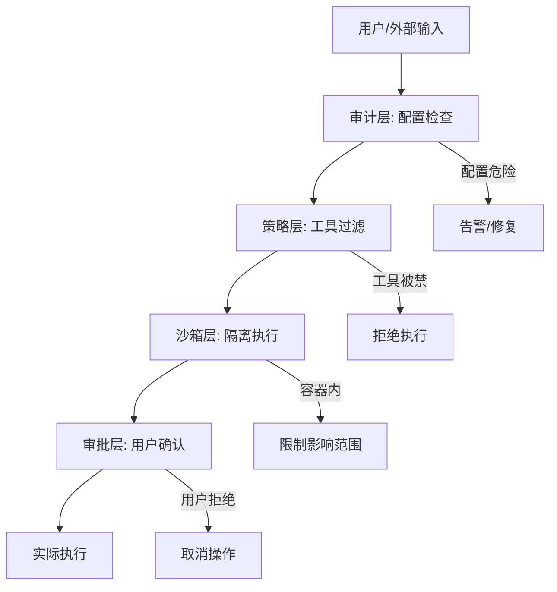
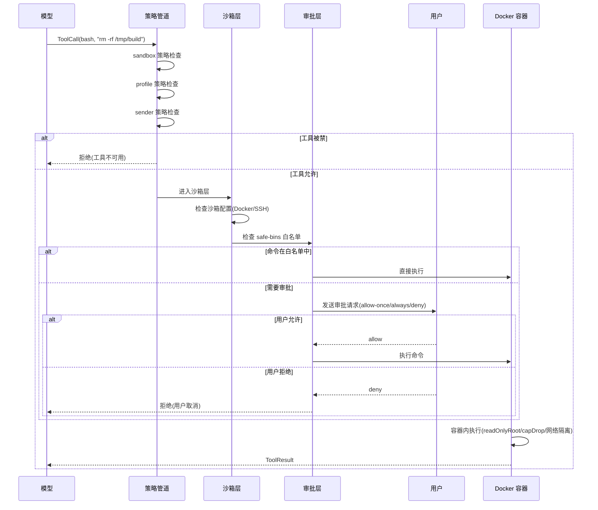

# 安全与沙箱

## 读前思考

- 一个 Agent 能执行 bash 命令、读写文件、发送网络请求。如果 LLM 被 prompt injection 攻击（恶意网页内容诱导 Agent 执行 rm -rf /），你的系统有几层防线能阻止它？
- 密钥管理面临一个矛盾：Agent 需要 API key 才能调用模型，但把 key 放在配置文件里就可能被 LLM "读到"并泄露。你怎么让 Agent "能用但看不到"密钥？

## 核心问题

安全与沙箱解决的核心问题是：**如何在赋予 Agent 强大执行能力的同时，防止恶意输入、误操作、密钥泄露造成不可逆损害**。

| 维度 | Python 版 | TypeScript 版 |
|------|-----------|--------------|
| 安全模型 | ToolPolicy Profile + 脱敏 | 审计→策略→沙箱→审批四层纵深 |
| 代码执行 | messaging profile 禁 bash | Docker 容器隔离 + SSH 远程沙箱 |
| 密钥管理 | 环境变量 + guard 脱敏 | SecretRef 引用 + 时间安全比较 |
| 审批流 | 预留（未启用） | allow-once/allow-always/deny 三级 |
| 安全审计 | 无 | 50+ 检查项结构化报告 |

## 方案展示

### 设计选择一：纵深防御——四层安全模型

TS 版的安全不是单点防护，而是四层纵深：

1. **审计层**（audit.ts，1549 行）：50+ 检查项，检测配置错误、危险标志、插件信任、通道安全、Gateway 认证。输出结构化 SecurityAuditReport。Gateway 认证机制的细节见 14-gateway.md。
2. **策略层**（tool-policy-pipeline.ts）：多步过滤决定哪些工具可用（sandbox → profile → provider → sender → group → subagent）。
3. **沙箱层**（sandbox/，77 个文件）：Docker 容器隔离 + SSH 远程沙箱 + 浏览器沙箱，代码执行在隔离环境中进行。
4. **审批层**（exec-approval-request.ts）：高风险操作（bash 执行、文件写入）需要用户实时确认。

为什么需要四层而不是"一个沙箱解决所有问题"？因为不同威胁需要不同层级的响应：配置错误（如 Gateway 无认证）在审计层发现；工具越权（如子代理调用 bash）在策略层拦截；恶意代码执行在沙箱层隔离；合法但危险的操作（如用户自己要求 rm）在审批层确认。单层防护一旦被绕过就全面失守。

### 设计选择二：Docker 沙箱——容器级隔离

下面是一次 bash 工具调用从发起到执行的完整安全链路：

每个阶段的设计考量：策略管道先于沙箱执行，因为如果工具本身被禁（如 messaging profile 禁 bash），不需要进入沙箱层；沙箱层检查配置决定在哪个环境执行（Docker/SSH/本地）；审批层用 safe-bins 白名单区分“只读命令自动通过”和“危险命令需要确认”；Docker 容器提供最后一道物理隔离——即使命令是恶意的，损害也限制在容器内。

TS 版的沙箱实现（sandbox/，77 个文件）支持 Docker 容器隔离：

- **readOnlyRoot**：容器文件系统只读，防止恶意写入
- **capDrop**：移除 Linux capabilities（如 NET_RAW、SYS_ADMIN）
- **seccompProfile / apparmorProfile**：系统调用白名单
- **资源限制**：pidsLimit、memory、cpus、ulimits
- **网络隔离**：network: "none" 完全断网
- **三个 dangerously* 标志**：显式覆盖安全限制（需要用户明确配置）

为什么用 Docker 而不是简单的 chroot 或 namespace？因为 Docker 提供了完整的隔离栈（文件系统 + 网络 + 进程 + 资源），且生态成熟（镜像管理、日志、监控）。chroot 只隔离文件系统，进程仍能看到宿主机进程列表；namespace 更底层但需要大量手动配置。

代价是：Docker 本身有资源开销（每个容器几十 MB 内存），且 Windows/macOS 上 Docker Desktop 的性能不如 Linux 原生。

### 设计选择三：密钥引用系统——能用但看不到

Python 版的密钥管理比较直接：API key 存在环境变量中，Provider 启动时读取。guard.py 用正则检测工具结果中的密钥模式（sk-xxx、Bearer xxx），自动替换为 [REDACTED]。

TS 版的密钥管理更系统化（secrets/，129 个文件）：

- **SecretRef 引用**：配置中不写密钥明文，而是写引用（{"env": "OPENAI_API_KEY"}、{"file": "/path/to/key"}、{"exec": "vault read secret/openai"}）。运行时解析引用获取实际值。
- **时间安全比较**：secret-equal.ts 用恒定时间比较防止 timing attack。
- **密钥掩码**：secret-mask.ts 在日志和 UI 中显示 sk-***...***abc 而非完整密钥。
- **存储隔离**：通道凭据在 ~/.openclaw/credentials/，模型 auth profile 在 agents/<id>/agent/auth-profiles.json，与配置文件分离。

为什么用引用而不是直接存值？因为配置文件可能被 LLM 读取（通过 read_file 工具），如果密钥在配置文件中，LLM 可能在回复中泄露。引用让配置文件只包含"去哪里找密钥"，实际值在运行时内存中，LLM 看不到。

### 设计选择四：执行审批——人在回路

TS 版的审批流（bash-tools.exec-approval-request.ts）：

- Agent 调用 bash 工具时，如果命令不在 safe-bins 白名单中（或配置了 ask=always），发送审批请求到 Gateway
- 用户在 UI 中看到命令内容，选择 allow-once（本次允许）/ allow-always（记住选择）/ deny（拒绝）
- 审批有超时（避免 Agent 永远等待）

Python 版的 approval.py 预留了审批机制（60 秒超时），但当前未在主流程中启用——本地 Gateway 场景下用户就是操作者，不需要额外确认。

审批的设计权衡：每次确认都打断 Agent 的自主性（用户等 30 秒 Agent 才继续），但不确认就可能执行危险操作。safe-bins 白名单是折中：ls、cat、grep 等只读命令自动通过，rm、curl、chmod 等需要确认。

### 设计选择五：安全审计——openclaw doctor

TS 版的 audit.ts 编排 50+ 检查项：

- 配置基础检查（Gateway 是否有认证、端口是否暴露）
- 执行表面检查（bash 工具是否启用、沙箱是否配置）
- 插件信任审计（第三方插件是否有可疑权限）
- 通道安全审计（token 是否过期、webhook 是否验证签名）
- 危险配置标志检测（dangerously* 标志是否启用）
- 深度代码安全扫描（可选，检查技能文件中的可疑指令）

审计结果输出为结构化报告（findings + summary），每个 finding 有严重级别、描述、修复建议。支持抑制（SecurityAuditSuppression）——用户确认某个 finding 是误报后可以标记忽略。

## 工程优化

**Python 版：**
- guard.py 正则检测：API key、Bearer token、密码模式自动脱敏
- 飞书内部事件 HMAC-SHA256 签名验证
- 工具结果广播前递归脱敏（_redact_trace_value）
- 长文本截断到 6000 字符（防止前端溢出）

**TS 版：**
- 密钥比较使用恒定时间算法（防 timing attack）
- 沙箱容器自动清理（idleHours、maxAgeDays）
- Windows ACL 检查（windows-acl.ts）
- 安全正则表达式（safe-regex.ts）防止 ReDoS
- 审计发现支持抑制和优先级排序

## 面试要点

**问题一：四层纵深防御中，如果只能保留一层，你会保留哪层？为什么？**

参考答案方向：保留沙箱层。原因：审计层只能发现配置错误（攻击者不需要配置错误就能注入恶意 prompt）；策略层只能限制工具面（bash 工具如果被允许，策略层就失效了）；审批层依赖用户判断（用户可能不理解命令含义就点了允许）。沙箱层是最后一道物理隔离——即使 LLM 被完全控制、执行了 rm -rf /，损害也限制在容器内，宿主机不受影响。但实际中四层都需要，因为沙箱不能防止数据泄露（Agent 可以在容器内读取密钥然后通过网络发出去），需要策略层断网 + 密钥引用系统配合。

**问题二：密钥引用系统（SecretRef）能完全防止 LLM 泄露密钥吗？有什么绕过路径？**

参考答案方向：不能完全防止。SecretRef 防止的是"LLM 通过读配置文件看到密钥"，但绕过路径存在：(1) LLM 执行 env 或 printenv 命令看到环境变量中的密钥（需要沙箱层限制 env 命令）；(2) LLM 执行 curl 时把密钥作为参数传入（密钥在进程命令行中可见）；(3) LLM 通过 exec 引用执行 vault read 后，结果在工具输出中（需要 guard 脱敏）。完整防护需要：SecretRef + 沙箱（限制 env 命令）+ guard（脱敏工具输出）+ 网络隔离（防止外传）。

**问题三：审批流的 safe-bins 白名单应该怎么维护？白名单太严格和太宽松分别有什么问题？**

参考答案方向：太严格（只允许 ls、cat）：Agent 几乎每步都要等用户确认，失去自主性，用户体验极差。太宽松（允许 bash、python、node）：恶意 prompt 可以执行任意代码，审批形同虚设。维护策略：(1) 白名单只包含只读命令（ls、cat、grep、find、head、tail）；(2) 写入命令（rm、mv、chmod）永远需要审批；(3) 解释器命令（bash、python、node）需要审批因为可以执行任意代码；(4) 定期审计白名单（新增的命令是否真的只读）。核心原则：白名单的判断标准不是"这个命令通常安全"，而是"这个命令能否被参数化为任意操作"。
