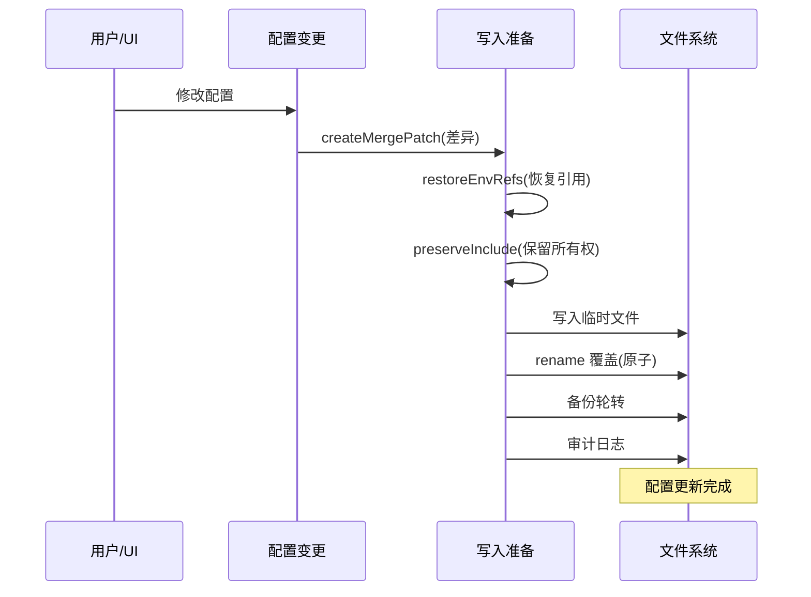

# 配置与环境管理

## 读前思考

- 一个系统的配置文件有 30 多个可选字段，支持环境变量替换、多文件包含、多代理实例。当配置出问题时，你怎么知道是用户写错了、环境变量没设、还是 include 文件冲突了？你会设计什么样的诊断和恢复机制？
- 配置中写了 ${OPENAI_API_KEY}，运行时替换为实际值。但如果系统需要把配置写回文件（如用户通过 UI 修改了某个设置），写回时应该保存实际值还是保留 ${OPENAI_API_KEY} 引用？

## 核心问题

配置与环境管理解决的核心问题是：**如何在保证配置灵活表达（环境变量、模块化、多实例）的同时，确保配置的正确性可验证、变更可追溯、损坏可恢复**。

| 维度 | Python 版 | TypeScript 版 |
|------|-----------|--------------|
| 配置格式 | JSON（JSON5 fallback） | JSON5 |
| 环境变量 | ${VAR} 递归替换 | ${VAR} + 写回时引用保留 |
| 模块化 | 无 | $include 指令（最大深度 10） |
| 多实例 | 单代理 | 多代理独立目录 |
| 写入安全 | 备份 | 原子写入 + 备份轮转 + clobber 快照 |
| 代码规模 | loader.py ~200 行 | io.ts 3082 行 |

## 方案展示

### 设计选择一：$include 模块化——配置的"组件化"

Python 版的配置是单文件：~/.openclaw/openclaw.json，所有设置在一个 JSON 中。简单但不可组合。

TS 版支持 $include 指令：

```json
{
  "models": { "$include": "./models.json" },
  "channels": { "$include": ["./telegram.json", "./discord.json"] }
}
```

include 支持单文件和多文件，最大嵌套深度 10，总大小限制 2MB，有路径遍历防护（CWE-22）。更关键的是 **include 所有权追踪**：系统记录每个配置字段来自哪个 include 文件，写回时只修改主文件中"拥有"的字段，不碰 include 文件的内容。

为什么需要所有权追踪？因为如果用户通过 UI 修改了模型设置，而模型设置来自 include 文件，直接写回主文件会丢失 include 的模块化结构。所有权追踪让写回操作"知道"应该修改哪个文件。

代价是配置解析复杂度大幅增加：需要递归解析 include、检测循环引用、合并冲突字段、追踪所有权。io.ts 3082 行中相当一部分在处理这些边界情况。

### 设计选择二：环境变量引用保留——写回时不泄露

两个版本都支持 ${VAR} 环境变量替换，但 TS 版多了一个关键特性：**写回时恢复引用**。

场景：配置中写了 "apiKey": "${OPENAI_API_KEY}"，运行时替换为 "sk-abc123"。用户通过 UI 修改了模型名称，系统需要写回配置文件。如果直接写回，apiKey 字段会变成 "sk-abc123"（明文密钥泄露到文件）。

env-preserve.ts 解决这个问题：写回时把实际值还原为 ${OPENAI_API_KEY} 引用。实现方式是维护一个"替换映射"（加载时记录每个 ${VAR} 被替换为什么值），写回时反向查找。

Python 版没有这个机制——它的配置是只读的（启动时加载，运行时不写回），所以不需要。但如果 Python 版未来支持 UI 配置修改，就需要类似设计。

### 设计选择三：多代理目录——实例隔离

Python 版只有一个代理实例，所有状态在 ~/.openclaw/agents/main/ 下。

TS 版支持多代理（agent-dirs.ts）：每个代理有独立的工作目录（~/.openclaw/agents/<agentId>/），包含独立的配置、session、transcript、auth profile。DEFAULT_AGENT_ID 是默认代理，用户可以创建自定义代理（如"工作助手"和"个人助手"用不同的模型和工具面）。

配置验证会检测重复目录（两个代理不能指向同一目录），防止状态互相覆盖。

### 设计选择四：原子写入 + 备份轮转——配置不损坏

TS 版的配置写入流程：

1. **createMergePatch**：计算当前配置与目标配置的差异（只改需要改的字段）
2. **restoreEnvRefsFromMap**：恢复环境变量引用
3. **preserveIncludeOwnedConfigForWrite**：保留 include 所有权
4. **replaceFileAtomic**：写入临时文件 → rename 覆盖（原子操作，不会出现写一半的损坏文件）
5. **maintainConfigBackups**：备份轮转（保留历史版本）
6. **appendConfigAuditRecord**：审计日志（谁在什么时候改了什么）

还有 **clobber 快照**（io.clobber-snapshot.ts）：在覆盖前保存完整快照，如果新配置导致启动失败，可以用 last-known-good 恢复。

Python 版的 io.py 也有备份机制（写入前保存 .bak），但没有原子写入和审计日志。



### 设计选择五：Python 版的实用主义

Python 版的配置系统（loader.py ~200 行）体现了实用主义：

- **JSON5 兼容**：先尝试标准 JSON（快），失败后 fallback 到 pyjson5（支持注释、尾逗号）
- **extra="allow" 前向兼容**：所有 Pydantic 模型允许未知字段，TS 端新增字段不会破坏 Python 端
- **环境变量转义**：$${VAR} 转义为字面量 ${VAR}，避免模板中误替换
- **Legacy 迁移**：自动检测 .clawdbot 旧目录和 clawdbot.json 旧配置文件

没有 $include、没有多代理、没有原子写入——因为当前规模不需要。

## 工程优化

**TS 版：**
- 配置健康状态追踪（io.health-state.ts）：记录配置指纹，检测异常变更
- Nix 模式检测（OPENCLAW_NIX_MODE=1）：只读配置，禁止自动安装
- 状态目录支持 OPENCLAW_STATE_DIR 环境变量覆盖
- Zod 运行时验证（zod-schema.ts 49.2KB）：配置加载时全量校验
- 配置写入审计：每次变更记录 who/when/what

**Python 版：**
- 路径解析优先级：环境变量 → 默认路径 → Legacy 路径 → 创建默认
- .env 搜索：当前目录、父目录、openclaw-py/ 子目录
- Gateway 端口校验：validation.py 检测端口冲突

## 面试要点

**问题一：$include 的所有权追踪是怎么实现的？如果两个 include 文件定义了同一个字段会怎样？**

参考答案方向：所有权追踪通过在解析时记录每个字段的"来源文件"实现——加载 include 文件时，把文件路径附加到每个解析出的字段上。写回时检查字段来源：如果来自主文件，直接修改；如果来自 include 文件，修改对应 include 文件。如果两个 include 文件定义了同一字段，后加载的覆盖先加载的（last-wins），但所有权记录保留最后一个来源。这种冲突应该在加载时警告（"字段 X 在 a.json 和 b.json 中都有定义，使用 b.json 的值"），让用户主动解决歧义。

**问题二：环境变量引用保留（写回时恢复 ${VAR}）在什么场景下会失败？**

参考答案方向：失败场景：(1) 用户在运行时通过其他途径修改了环境变量值（如 export OPENAI_API_KEY=new-key），写回时映射表中记录的旧值与当前值不匹配，无法正确恢复引用。(2) 配置中同一个值出现多次但只有部分是环境变量替换（如 "url": "https://${HOST}/api" 和 "backup": "https://example.com/api"），反向查找可能误匹配。(3) 环境变量被删除（unset），映射表中的引用无法恢复为有效值。缓解方案：写回时验证恢复后的引用是否仍能解析为当前值，如果不能则保留实际值并警告用户。

**问题三：Python 版用 extra="allow" 做前向兼容，这个选择的代价是什么？什么情况下应该改为 extra="forbid"？**

参考答案方向：代价是：用户拼写错误（如 "modle" 而非 "model"）不会被检测到，配置静默忽略错误字段，导致行为不符合预期但没有任何报错。应该改为 forbid 的场景：当配置 schema 已经稳定（不再频繁新增字段），且用户配置错误的概率高于 TS 端新增字段的概率时。当前阶段（Python 版快速迭代，TS 端经常新增字段）allow 是正确的——前向兼容比拼写检查更重要。稳定后应该切换到 forbid + 明确的错误提示。
