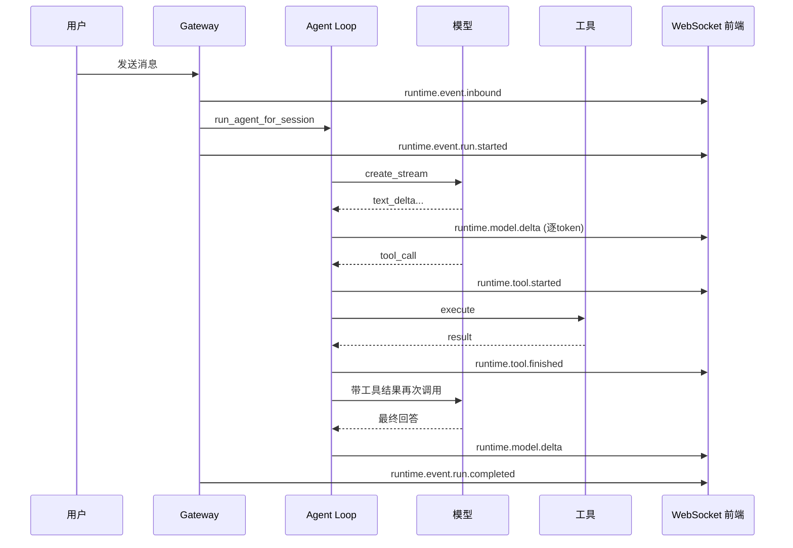

# 可观测性

## 读前思考

- 一个 Agent 系统同时涉及 LLM 调用、工具执行、通道消息、会话管理多个子系统。当用户报告"Agent 没有回复我"时，你怎么从日志中定位问题出在哪一层？你会设计什么样的日志结构让这种排查在 5 分钟内完成？
- Token 用量追踪看起来简单（记录每次调用的 input/output token），但当系统同时使用 OpenAI、Anthropic、Ollama 三个供应商，每个供应商的用量字段名和计费方式都不同时，你怎么做统一会计？

## 核心问题

可观测性解决的核心问题是：**如何让开发者和用户在不阅读源码的情况下，理解系统当前的运行状态、定位故障原因、追踪资源消耗**。

| 维度 | Python 版 | TypeScript 版 |
|------|-----------|--------------|
| 日志框架 | structlog（JSON 结构化） | tslog + 文件轮转 + 脱敏 |
| 实时可观测 | runtime.event WebSocket 广播 | 诊断遥测 + 事件总线 |
| Token 追踪 | usage 事件累加 | 多供应商规范化 + 成本计算 |
| 故障自愈 | 无 | 卡住会话检测 + 自动恢复 |
| 诊断导出 | diagnostics 报告 | 支持包（脱敏日志+配置+状态） |

## 方案展示

### 设计选择一：全链路事件广播——实时执行可视化

Python 版的 Gateway 在 run_agent_for_session 中实现了全链路事件广播：每个执行阶段都通过 WebSocket 推送 EventFrame 到前端工作台：

- runtime.event.inbound → 收到消息
- runtime.event.session.loaded → 会话加载完成
- runtime.event.run.started → Agent 运行开始
- runtime.model.delta → 模型流式输出（逐 token）
- runtime.tool.started → 工具调用开始
- runtime.tool.finished → 工具调用完成
- runtime.event.run.completed → 运行结束

前端工作台（Vue 三列布局）实时展示：左侧会话列表、中间执行链路、右侧输出详情。用户可以看到 Agent "正在思考什么、调用了什么工具、工具返回了什么"。

所有广播数据经过 _redact_trace_value 递归处理：密钥类字段替换为 [redacted]，长文本截断到 6000 字符。这保证了可观测性不以安全为代价。

TS 版的诊断遥测（diagnostic.ts，1381 行）做同样的事但更系统：运行时事件、阶段计时、会话状态、稳定性指标全部通过事件总线发射，支持 trace context（traceId + spanId）做分布式追踪。



### 设计选择二：多供应商 Token 用量规范化

不同供应商的用量字段完全不同：

- OpenAI：prompt_tokens / completion_tokens / cached_tokens
- Anthropic：input_tokens / output_tokens / cache_read_input_tokens
- Moonshot：cached_tokens
- llama.cpp：prompt_n / predicted_n

TS 版的 usage.ts（375 行）定义了 UsageLike 类型接受 20+ 种格式，normalizeUsage 统一为：

```
{ input, output, cacheRead, cacheWrite, reasoningTokens, total }
```

然后计算成本桶（cost.input / cost.output / cost.cacheRead / cost.cacheWrite / cost.total），累积到会话用量快照。

Python 版的用量追踪更简单：Provider 在流式输出中 yield {"type": "usage", "input_tokens": N, "output_tokens": N}，Gateway 累加到 session 的 token 计数。没有成本计算，没有多供应商规范化（因为只有 4 个供应商且都走 OpenAI 兼容格式）。

### 设计选择三：日志脱敏——可观测性不以安全为代价

两个版本都有日志脱敏，但 TS 版更系统：

**Python 版：**
- guard.py 正则检测 API key、Bearer token 模式
- _redact_trace_value 递归处理广播数据
- 长文本截断到 6000 字符

**TS 版：**
- redact.ts（45.4KB）：双重脱敏——redactSecrets（密钥模式）+ redactSensitiveText（敏感文本如邮箱、电话）
- 诊断日志有字符限制：消息 4KB、属性值 2KB、属性数 32
- 日志文件 24h 轮转、100MB 大小限制、5 个轮转文件
- 支持包导出时再次脱敏（确保发给技术支持的日志不含密钥）

为什么脱敏这么重要？因为 Agent 系统的日志中天然包含敏感信息——用户的消息内容、工具执行结果（可能包含数据库查询结果）、模型 API 请求。如果日志不脱敏，一次日志分享就可能泄露用户数据。

### 设计选择四：自愈诊断——卡住会话检测与恢复

TS 版的诊断系统不只是"记录"，还能"行动"：

- **事件循环延迟监控**：monitorEventLoopDelay 检测 Node.js 事件循环是否被阻塞
- **内存采样**：emitDiagnosticMemorySample 定期记录内存使用
- **会话活动追踪**：getDiagnosticSessionActivitySnapshot 记录每个会话的最后活动时间
- **卡住检测**：classifySessionAttention 分类会话状态，如果某会话 >120s 无活动但标记为 running，判定为"卡住"
- **自动恢复**：requestStuckSessionRecovery 触发恢复流程（abort 当前 run，重置会话状态）

为什么需要自愈？因为 Agent 系统有很多"静默失败"模式：LLM 流式连接断开但没有触发 error 事件、工具执行死锁、队列中的任务被遗忘。没有主动检测，这些会话会永远卡在 running 状态，用户只能重启系统。

Python 版没有自愈机制——它的 abort_signal 是被动取消（需要外部触发），不会主动检测卡住。

### 设计选择五：诊断报告与支持包

Python 版的 diagnostics.py 生成诊断报告：Gateway 状态、已注册 provider/channel/tool 列表、session 统计。通过 /api/diagnostics HTTP 端点暴露。

TS 版的 diagnostic-support-export.ts（23.2KB）生成完整支持包：
- 脱敏后的最近日志
- 配置快照（密钥已掩码）
- 会话状态摘要
- 稳定性指标（事件循环延迟、内存趋势）
- 插件列表和版本

支持包可以一键发送给技术支持，不需要用户手动收集信息。

## 工程优化

**Python 版：**
- structlog JSON 日志：所有子系统用 get_logger("subsystem.name") 获取绑定 logger
- 错误层级：OpenClawError 基类带 code/retryable 字段，5 个子类
- Tick 间隔 30 秒：定期广播 Gateway 状态
- WS 最大 payload 64KB，最大缓冲 1MB

**TS 版：**
- 子系统日志器（createSubsystemLogger）按模块隔离
- 诊断事件有 trace context（traceId + spanId + flags）
- 稳定性记录器在致命错误时生成稳定性包
- 环境变量 OPENCLAW_LOG_LEVEL 覆盖日志级别
- Anthropic 请求载荷日志（anthropic-payload-log.ts）：可选记录完整请求/响应用于调试

## 面试要点

**问题一：全链路事件广播（每个阶段都推 WebSocket）的性能开销有多大？什么场景下应该关闭它？**

参考答案方向：开销主要在两处：(1) 序列化：每个事件需要 JSON 序列化 + 脱敏处理，model.delta 事件频率最高（每个 token 一次），一次 2000 token 的回复产生 2000 个事件；(2) 网络：WebSocket 推送给所有连接的前端客户端。对于单用户本地场景（Python 版的定位），开销可忽略。应该关闭的场景：(1) 高并发生产环境（100+ 并发会话，每秒几千个 delta 事件）；(2) 没有前端连接的纯 API 模式；(3) 带宽受限环境。TS 版通过日志级别控制：生产环境只记录 warn/error，不广播 delta。

**问题二：多供应商 Token 用量规范化中，如果新增一个供应商的用量字段和现有所有供应商都不同，需要改什么？**

参考答案方向：需要改 usage.ts 的 normalizeUsage 函数：新增一个分支识别该供应商的字段名（如 "custom_input_tokens"），映射到统一的 { input, output, ... } 结构。如果该供应商有独特的用量维度（如 "search_tokens" 表示搜索增强生成的额外消耗），需要在 NormalizedUsage 中新增字段，并更新成本计算逻辑。这个设计的扩展性是 O(1)——每个新供应商只加一个分支，不影响现有逻辑。但如果供应商数量继续增长（20+），应该考虑注册式规范化（每个 provider 插件自带 usage normalizer），而非在核心代码中维护一个巨大的 switch。

**问题三：卡住会话检测的 120 秒阈值是怎么确定的？设太短和设太长分别有什么问题？**

参考答案方向：设太短（如 30 秒）：正常的长时间工具执行（如 bash 编译一个大项目、LLM 生成一篇长文）会被误判为卡住，触发不必要的 abort。设太长（如 10 分钟）：真正卡住的会话要等很久才被检测到，用户体验差（Agent "死了"10 分钟才恢复）。120 秒是经验值——覆盖了大多数正常操作的完成时间（一次 LLM 调用通常 <60s，一次工具执行通常 <30s），同时不会让真正卡住的会话等太久。更好的方案是自适应阈值：根据当前操作类型动态调整（LLM 流式调用有心跳，超过 30s 无心跳就判定卡住；bash 执行没有心跳，给 5 分钟宽限）。
