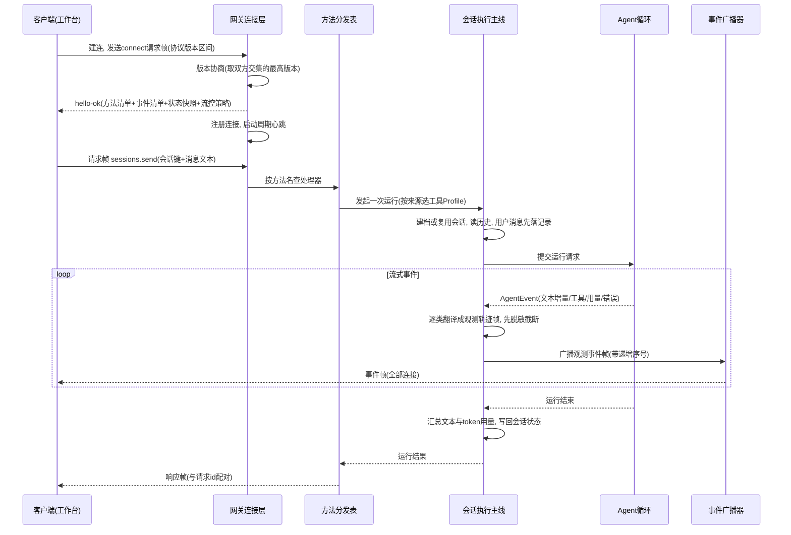
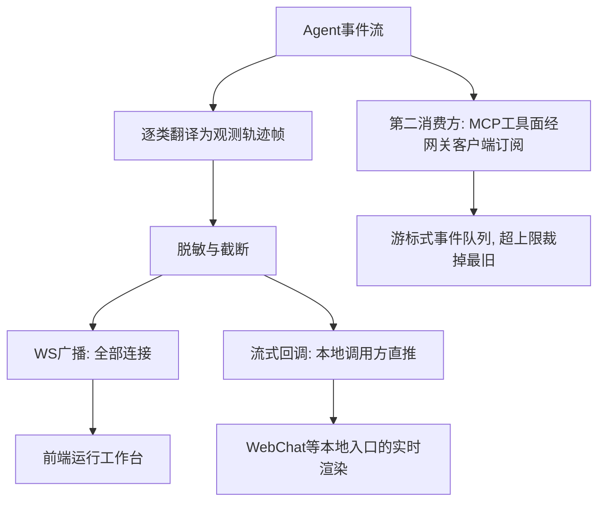

# Gateway/对外服务层

## 读前思考

- 两个客户端同时连上同一个网关：一个是正在走配对流程的新设备，只该收到配对握手事件；另一个是操作者的运行工作台，要看到会话流、模型输出和工具轨迹。服务端的事件广播凭什么决定谁收到什么？如果其中一个客户端网络极慢、发送队列一直排空不了，广播应该等它，还是丢弃，还是直接断开？
- openclaw 有 TypeScript 和 Python 两套实现，前端却只有一套。两套语言、两套类型系统，怎么保证两边在网线上说的是同一种帧协议，而不是"看起来一样、字段悄悄漂移"的两种协议？

## 核心问题

Gateway 解决的核心问题是：**把 Agent 运行时唯一对外暴露的服务面收敛成一个长连接服务——连接接入、身份认证、RPC 方法面、事件广播全部从这一个门进出**，让前端工作台、IM 通道、外部工具进程用同一种帧协议操作同一个运行时。

| 维度 | Python 版 | TypeScript 版 |
|------|-----------|--------------|
| 服务框架 | FastAPI 工厂 + WebSocket 端点 | 自装配的 HTTP 与 WebSocket 双面服务 |
| 协议定义 | Pydantic 模型即 schema，运行时导出 JSON Schema | 独立协议包，TypeBox schema 单一协议源 |
| 方法面 | 约 20 个 WS 方法注册表 | 核心方法 + 插件贡献方法，按 scope 分级 |
| 认证 | 握手直接信任（本地部署假设） | none/token/password/trusted-proxy 四模式 + Tailscale |
| 事件广播 | 全量 fan-out，无过滤 | 按事件声明的 scope 守卫 + 慢消费者背压 |
| 部署假设 | 本地单工作台 | 多客户端、多角色、多设备 |

边界声明：入站消息按什么规则解析出会话归属，是通道层的 9 级路由职责，见 09-消息通道；AgentEvent 事件流在 Agent 主循环内部的产生与消费位置，见 02-Agent 主循环。本篇只写 gateway 服务本体：连接怎么建立、认证怎么裁决、方法面怎么注册、帧协议长什么样、事件广播怎么治理。

## 方案展示

### 设计选择一：单一协议源——帧形状只在一处定义

两个版本都没有让服务端和客户端各自维护一份帧结构，而是把协议收敛到单一来源，只是落地形态不同。

TS 版把协议抽成独立的协议包：请求帧（RequestFrame）、响应帧（ResponseFrame）、事件帧（EventFrame）三种帧用 type 字段做判别联合，每个 RPC 方法的参数和返回值都有对应的 TypeBox schema，服务端校验、客户端类型、JSON Schema 导出全部从同一份声明推导。三种帧的字段分工很清晰：请求帧带请求 id、方法名和参数；响应帧带回请求 id、成功标记、载荷或结构化错误（错误本身也是 schema 定义的形状，带错误码、消息、可选的重试提示）；事件帧带事件名、载荷、按连接递增的序号和状态版本。判别联合的设计还有一个附带好处：下游做代码生成时能产出紧凑的类型而不是"所有字段皆可空"的松散结构。连接建立时下发的握手确认帧（hello-ok）里带着协议版本、方法清单、事件清单、状态快照和流控策略（单帧上限、发送缓冲上限、心跳间隔），客户端一次握手就拿到全部契约。

Python 版走的是"模型即契约"的路线：帧和方法参数用 Pydantic 模型定义，解析入站帧就是把原始字典校验进判别联合类型，校验失败转成协议错误回给客户端。更进一步，网关在运行时开放一个 schema 端点（/api/schema），把会话条目、入站/出站消息和三种帧的 JSON Schema 直接从 Pydantic 模型导出——前端拿到的契约就是服务端当前实际校验的那一份，不存在"文档过时"的可能。握手流程与 TS 版同构：客户端声明可接受的协议版本区间，服务端校验交集后取最高版本，把方法清单、事件清单、状态快照和流控策略一并装进确认帧返回。

为什么这么选？长连接 RPC 最常见的隐性故障是两端类型漂移：服务端改了字段，客户端旧版本还在发旧形状，错误要到运行时才暴露，而且往往暴露在最难排查的位置（反序列化深处的某个字段为空）。单一协议源把这类漂移挡在编译期（TS）或校验期（Python）——帧进不来就是协议错误，而不是悄悄变成残缺对象。

牺牲了什么：TS 版的协议包随主项目演进膨胀成了上千行的大桶，每加一个方法都要在协议包补 schema，协议演进与主项目强耦合，这个包成了所有客户端（CLI、控制台、节点、MCP 桥接）的公共依赖；Python 版的契约导出是运行时产物，没有跨语言编译期检查，前端只能信任运行时 schema 的稳定性，且两实现之间的协议一致性靠人工对齐（比如 Python 版主动对齐 TS 版的会话路由契约），没有机器强制——TS 版改了帧字段，Python 版要靠人发现并跟上。

### 设计选择二：事件广播治理的不对称——scope 守卫 vs 全量 fan-out

这是两版分岔最明显的一处，需要先说清楚：分岔的原因是部署假设不同，不是实现水平差异。

TS 版假设网关会同时挂多种角色的客户端：操作者工作台、配对中的新设备、受控的计算节点。所以广播层为每种事件声明了所需的访问级别，形成一张事件-作用域守卫表：会话与聊天类事件要求读级，执行审批类事件要求审批级，终端字节流要求管理级，设备配对类事件要求配对接入级，心跳、在线状态这类无敏感信息的事件不设门槛。三条关键规则值得注意：配对作用域只服务于配对握手本身，配对接入的客户端不会被动收到任何聊天类广播——配对流程还没完成，设备不该看到任何会话内容；未声明的事件默认拒绝，新增事件忘写声明的结果是"没人收到"而不是"所有人都收到"，泄露方向的错误被转成了静默失联方向的错误，后者更容易被发现也更安全；管理级蕴含一切，写级蕴含读级事件的接收权，高级别不需要逐项声明。节点角色（非操作者的计算设备）另有白名单：即使事件的作用域本来拒绝非操作者角色，白名单内的少数事件（如唤醒词变更）仍会送达，因为节点需要据此重新配置自己。

同一层还做了慢消费者治理：每个连接发送前检查待发送缓冲量，超过上限时按事件性质二选一——声明了可丢的事件（典型是高频心跳类）直接跳过并推进该连接的序列号，不可丢的事件则直接以慢消费者为由断开连接，让客户端重连后靠状态快照追齐。首次触发会记一条诊断日志（缓冲量、上限、处置原因），之后不重复报警。帧体本身也做了优化：payload 的 JSON 序列化每个事件只做一次，按客户端拼接序列号片段，避免为每个连接重复序列化大对象——Agent 流式事件频率高、载荷大，这个优化直接决定广播的吞吐上限。

Python 版假设的是本地单用户工作台：连上来的都是自己人。所以握手阶段校验协议版本区间后直接置为已认证，不做凭据核验；广播就是遍历全部连接逐个发送，发送失败记日志，没有 scope 过滤也没有缓冲背压。这是诚实标注的有意简化，不是缺陷——它的部署形态（开发者笔记本、内网单实例）里，scope 过滤解决的那个问题根本不存在。值得注意的是它的握手协议本身是完整的：确认帧里同样带方法清单、事件清单、流控策略，协议形状与 TS 版对齐——简化的是信任裁决，不是协议结构，将来要补认证和过滤，协议层不用动。

牺牲了什么：TS 版每加一种事件都要回答"它属于哪个作用域"，守卫表本身成了需要维护的安全资产，声明错误的代价是信息泄露或静默失联；Python 版一旦离开本地部署假设（比如把端口暴露到公网），全量 fan-out 加无凭据握手意味着任何连上的人都能看到所有会话内容，这是它的假设边界，不是可以忽略的细节。

### 设计选择三：按消息来源选能力——工具策略 Profile 与 metadata-only 审计

网关是同一条执行主线的入口，但不同来源的消息不该拿到同样的能力。这条思路在两版里各有落点。

Python 版的共享执行入口（run_agent_for_session，同时服务通道入站和本地工作台的消息发送）在发起运行前做了一次能力裁决：消息来自远程通道（如飞书）就用受限工具集（messaging），来自本地入口才用全量工具集（full）。裁决只有一行，但它是一条明确的安全边界——远程聊天入口默认不拥有 shell、文件写入这类高风险本地能力。Profile 的作用点有两处：一是过滤可用工具表，二是过滤注入系统提示词的工具使用说明——被禁的工具连"存在"都不告诉模型，从提示词层面就堵住了诱导调用的可能。

TS 版把同样的"按来源收敛信息"思路放在了审计面上：网关的审计记录只覆盖运行与工具两类生命周期事件（开始/结束、成功/失败/取消/超时/阻塞），每条记录带执行者、会话、运行标识、工具名，但明确不含任何内容，脱敏标记被 schema 锁死为"仅元数据"的字面量——不是"默认不存内容"，而是 schema 结构上就没有内容字段的位置。审计查询也限制为带上限、按序列游标翻页，防止无界导出。

为什么这么选：网关是信息汇聚点，最容易变成"什么都看得见"的特权面。工具 Profile 管住了"远程来源能做什么"，metadata-only 审计管住了"审计系统自己能留什么"——两者方向相反（一个限能力、一个限留存），但都是同一个原则：默认最小化，显式扩大。

牺牲了什么：受限 Profile 让远程入口的 Agent 能力明显弱于本地（不能动文件系统），跨入口的体验不一致；metadata-only 审计意味着事后排查"那次运行到底处理了什么内容"必须去查另一条带内容的轨迹记录，审计系统自身给不出答案。

## 核心机制执行流

选一次完整的 WebSocket 会话消息发送，走一遍从连接到收到完成帧的全链路（以 Python 版为主线，TS 版结构同构、治理更重）：

逐步讲解：

**握手阶段。** 连接建立后第一帧必须是 connect 请求帧，否则网关直接回错误响应并结束连接——这是协议层的第一道形状检查，把"连上就乱发"的客户端挡在门外。握手逻辑校验客户端声明的协议版本区间与服务端版本是否有交集，取交集内最高版本作为协商结果——区间协商而不是单值比对，让新旧版本客户端都能连上同一台服务端。然后把方法清单、事件清单、当前状态快照和流控策略一次性装进 hello-ok 返回：方法清单让客户端知道自己能调什么，事件清单让它知道该监听什么，状态快照让它不必再发一轮查询就能渲染初始界面。之后连接注册进连接池并启动周期心跳帧维持连接活性。TS 版在此处多一步认证裁决：认证解析器把运行时覆盖、配置文件、环境凭据三级来源按优先级合并（覆盖是稀疏字段叠加，只替换显式给出的字段），裁决出 none/token/password/trusted-proxy 中的一种模式——显式声明的模式优先，没声明时按提供了哪种凭据推断，什么都没提供时默认落在 token 模式上，让配置检查给出"缺令牌"的明确诊断而不是静默关闭认证；另有独立的滑动窗口限流器按"作用域×客户端地址"统计失败次数，超限进入锁定窗口，环回地址默认豁免以免本机命令行被锁在外面。

**方法分发阶段。** 主循环收到的每一帧都先过帧解析（校验进判别联合），只有请求帧进入分发：按方法名查注册表，查不到回"方法未找到"错误帧。Python 版注册表约 20 个方法，覆盖配置读写、会话增删改查与发送、Agent 执行与等待、工具目录、通道状态、模型列表；分发走统一错误处理，处理器抛出的任何异常都转成结构化错误帧而不是断开连接。TS 版的方法面除了核心方法还接受插件贡献的方法，每个方法声明自己的访问级别，分发前先按连接持有的 scope 裁决——方法级的权限检查和事件级的广播守卫是同一套作用域体系的两面。

**执行阶段。** sessions.send 进入共享执行主线后：按会话键建档或复用会话，读取历史（只把模型能理解的角色放回上下文，历史里的工具消息不重新喂给模型，避免旧工具结果污染新一轮对话），用户消息无论后续成败都先落记录——即使模型调用失败，这条用户输入也保留下来方便排查失败现场。然后按消息来源选工具 Profile、组装系统提示词，提交给 Agent 循环。循环内部的工具调度、重试与压缩属于 02 篇的主场，这里只关注它的产出——一条 AgentEvent 事件流。

**事件翻译与广播阶段。** 执行主线逐类消费事件流并翻译成面向人的观测轨迹帧：文本增量翻译成模型输出帧（runtime.model.delta），工具调用起止翻译成工具帧（runtime.tool.started / runtime.tool.finished），用量与错误各有对应帧，统一挂在 runtime.event 事件名下。翻译不是透传：执行主线同时维护一份"运行中视角"的上下文快照，把模型增量拼回 assistant 消息、把工具调用对补进消息序列，随工具完成帧一起广播——前端工作台因此能看到完整的消息序列演化，而不只是孤立事件。每个载荷在广播前先过递归脱敏（键名含密钥类词汇的值替换为占位符）与截断（超长文本与超长列表都截），因为这条流直接渲染在前端工作台，不脱敏会泄密、不截断会卡浏览器。TS 版对应的位置是聊天运行时：把 Agent 事件投影进按会话组织的订阅者流，处理生命周期持久化和实时界面更新，再交给带 scope 守卫的广播器。

**收尾阶段。** 运行结束后汇总最终文本与 token 用量写回会话状态（token 是多次上报累加而非覆盖），发出完成或失败帧，最后给发起请求的连接回一个与请求 id 配对的响应帧。响应帧只在运行彻底结束后发一次，运行期间的进度全靠事件帧——这是"请求-响应"与"事件流"在同一条连接上并存的典型形态：请求 id 负责闭环，事件序号负责顺序。

事件的消费方不止前端工作台一路。翻译后的观测流是双路分发的：

一路是 WebSocket 全量广播给所有连接；另一路是流式回调——本地调用方（如 WebChat 的消息发送路径）在发起执行时传入回调，文本增量直接推给发起者，不必绕广播。两路并存的原因是消费者性质不同：工作台是旁观者，要看所有会话的全景；发起者只要自己那次运行的增量，回调比订阅过滤更直接。此外还有一个容易忽略的第二消费方：MCP 工具面通过网关客户端订阅通道事件，在桥接层维护一个带上限的游标式事件队列（超限时裁掉最旧条目），供外部 MCP 客户端按游标轮询——轮询不消费事件，游标保证断点续读，这部分细节归 04-MCP 集成，此处不展开。

## 工程优化

**懒加载门面降低启动依赖。** TS 版的网关入口文件只有四十余行：对外暴露启动函数（startGatewayServer）与类型，实现模块通过动态导入延迟加载，还可选地打印每段导入耗时用于启动诊断。只依赖网关类型和辅助函数的轻量调用方（命令行子命令、测试工具）因此不必为引入一个类型付出整张启动依赖图的解析成本。服务器实现内部同样贯彻这一点：模型目录、启动早期/后置模块都用惰性模块包装，用到才加载——网关服务启动时要组装的东西太多（配置、凭据、插件、通道、定时任务），任何一块能延后的都应该延后。

**通道账号运行时的监管与重启退避。** TS 版把每个通道账号当成被监管的任务：启动并发限制为 4，账号退出后按指数退避自动重启（5 秒起步、5 分钟封顶、带抖动、最多 10 次），只有持续稳定运行超过封顶时长才清零重试计数——短暂崩溃不会被时间冲淡成"看起来稳定"。三个防误报细节值得记住：被中止的旧任务可能延迟发出"已连接"心跳，状态写回前会校验任务是否仍是当前任务，过期补丁中的连接态字段直接丢弃，防止已停的账号被旧心跳伪装成在线；通道停止给了 5 秒宽限，超时后不阻塞重启流程而是标记恢复中，下一次恢复请求到来时清掉卡死的旧任务真正重启；连续崩溃触发断路器后会抑制该通道的全部自动启动（包括配置重载引发的启动），只允许人工显式拉起——配置重载不能把正在排查的崩溃循环重新激活。Python 版的通道启动则简单得多：逐账号启动、单个失败不阻塞其他账号。

**HTTP 热路径的轻量解析器守护。** TS 版在网关目录内置了一份守护规则：HTTP 与服务器热路径禁止为了回答静态问题（比如某个路径是否免认证）去加载完整的通道插件注册表，必须优先用插件提供的轻量静态产物解析器，且轻量产物与完整契约由同一份插件自有逻辑支撑以防行为分叉。这条规则针对的是真实发生过的性能退化：插件注册表的实例化成本会污染每一个 HTTP 请求。规则还要求新增此类描述符时，核心解析器、插件静态产物、完整插件导出三者必须在同一次变更里落齐——防止三者随时间漂移。

**慢消费者诊断与缓冲上限。** TS 版广播器对缓冲超限的连接区分"可丢就丢"与"不可丢就断"，并且每个连接只报一次诊断（记录当前缓冲量、上限与处置原因），避免慢连接在日志里刷屏；连接恢复正常后诊断标记复位，下次再超限会重新报警。Python 版在握手时下发的流控策略（单帧上限、缓冲上限、心跳间隔）与 TS 版形状一致，为将来补齐背压留好了协议位置。

**认证限流只针对失败。** 限流器只在认证失败时计数，成功请求不被节流——正常客户端的体验不受任何影响；条目总量有上限并周期清理，表被灌满时进入全局溢出锁定且优先保留攻击者自己的锁定记录——防止用海量新来源把"正在被封锁的记录"挤出表从而绕过封锁。不同凭据类别（共享密钥、设备令牌、配对请求等）用独立作用域计数，互不干扰。

## 面试要点

**问题一：Python 版的全量 fan-out 在什么条件下必须升级为 scope 过滤？判断标准是什么？**

参考答案方向：全量 fan-out 的隐含假设是"所有连接的信任级相同"。升级条件取决于两个变量的乘积：客户端角色多样性 × 网络暴露面。只要出现第二类信任级的客户端（例如配对中的陌生设备、只读观察者与可操作者并存），或者端口离开环回进入不可信网络，任何一条都足以让"所有人都看到所有事件"变成信息泄露。反过来，单用户本地工作台加环回绑定，scope 过滤只是纯成本——它要求为每种事件声明访问级别、维护守卫表、承担声明错误的泄露风险。所以答案不是"fan-out 是简陋的"，而是"fan-out 在它的部署假设内是正确的，且 Python 版把假设写在了明处"。迁移路径上可以先补握手认证，再按事件类别逐步加过滤，因为协议帧里本就有事件名字段可作过滤键；TS 版的守卫表还提供了一个值得照抄的细节——未声明事件默认拒绝，把新增事件时的错误方向从泄露扭转为静默失联。

**问题二：Python 版握手直接置为已认证、不校验凭据，这个简化什么时候必须补齐？代价是什么？**

参考答案方向：这取决于部署位置 × 网关持有的能力。网关背后是能执行工具、读写配置的完整运行时，一旦监听地址从环回放出去（反向代理、内网共享、容器端口映射），无凭据握手等于把运行时控制权交给任何能建连的人，必须补齐——而 TS 版已经给出了一份现成答案：四模式认证裁决（none/token/password/trusted-proxy）加三级凭据来源合并（覆盖、配置、环境凭据按优先级），再加只对失败计数的限流。补齐的代价有三层：客户端要管理令牌分发与轮换；本地调试的零摩擦体验消失；认证模式越多，"覆盖、配置、环境凭据谁优先"的合并语义越需要明确规则，否则会出现"改了配置不生效"这类诊断困难。值得注意的设计细节是 TS 版默认模式是 token 而不是 none——配置缺失时宁可报"缺令牌"的明确诊断，也不静默关闭认证，这是 fail-closed 思路；且覆盖采用稀疏字段叠加，只替换显式给出的字段，调用方替换一个认证旋钮时不必克隆全部凭据配置。

**问题三：为什么审计选择 metadata-only 而不是全量记录？如果合规要求"可回放每次运行的完整内容"，这个设计怎么演进？**

参考答案方向：metadata-only 的正面理由是审计面自身的攻击面控制——审计库如果留存全部会话内容，它就变成了比网关本身更有价值的目标，且内容留存牵涉隐私与留存合规；反面代价是审计记录回答不了"当时处理了什么"，排查必须关联另一条带内容的轨迹存储。判断标准取决于审计的用途定位 × 内容敏感度：审计用于"发生了什么操作、谁在何时、结果如何"的责任追溯时，元数据足够且更安全；用于内容级回放时才需要全量，但此时更合理的演进不是改审计 schema，而是让审计记录携带指向内容存储的稳定引用（运行标识贯穿两边），保持审计面本身无内容——TS 版 schema 把脱敏标记锁成字面量，就是把这个决策固化进了协议，避免将来有人悄悄往审计里塞内容字段。这个"用 schema 形状锁死安全决策"的手法，和广播守卫的"未声明即拒绝"是同一个思想：把安全属性从约定变成结构。
