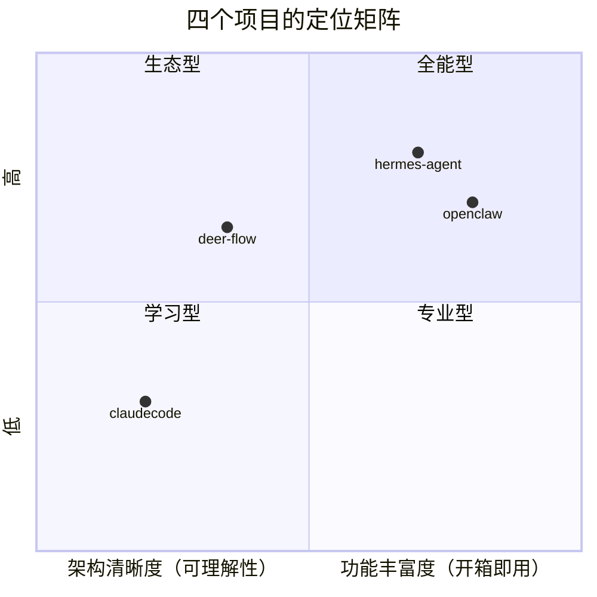
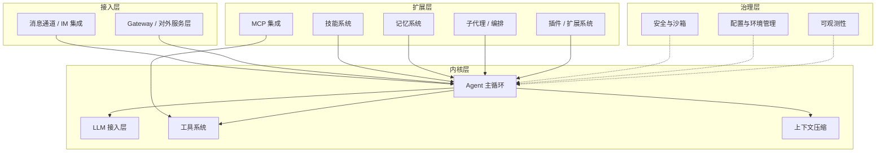

# 全景介绍

四个开源 Agent 项目的定位、背景与设计哲学。

---

## deer-flow

| 项目 | 值 |
|------|-----|
| **开发者** | ByteDance (Volcengine) |
| **版本** | v2.1.0 |
| **许可** | MIT |
| **语言** | Python 3.12+（后端）, Next.js 16 / React 19（前端） |
| **入口文件** | `backend/app/gateway/app.py`, `backend/packages/harness/deerflow/tui/__main__.py` |
| **核心依赖** | FastAPI, LangGraph, LangChain, SQLAlchemy |
| **代码规模** | ~200+ 后端源文件 + Next.js 前端 |

**一句话**：企业级 LangGraph 超级 Agent 框架，34+ 中间件链，专注生产环境的编排和安全性。

**设计哲学**：通过中间件链实现关注点分离。每个横切关注点（记忆、权限、技能、沙箱、token 预算）都是一个独立中间件，可插拔、可重排、可独立测试。

**适用场景**：需要稳定、安全、可审计的生产环境 Agent 部署。

---

## hermes-agent

| 项目 | 值 |
|------|-----|
| **开发者** | Nous Research |
| **版本** | v0.19.0 |
| **许可** | MIT |
| **语言** | Python（主体）+ TypeScript（TUI/Web） |
| **入口文件** | `run_agent.py`, `cli.py`, `hermes_cli/main.py` |
| **核心依赖** | uv, anthropic SDK, openai SDK (exact pinned) |
| **代码规模** | ~12K LOC 单核心文件 + 1000+ 扩展文件 |

**一句话**：自进化的个人 AI 助手，核心是自我改进的闭环（learning loop）。

**设计哲学**：个人生产力优先——覆盖 30+ 消息平台、100+ 工具、自创技能、全平台 CLI/TUI/Desktop。核心是 `run_agent.py` 的大循环。

**适用场景**：个人全场景 AI 助手，从终端到聊天到桌面。

---

## openclaw

| 项目 | 值 |
|------|-----|
| **开发者** | OpenClaw Foundation |
| **版本** | 2026.7.1（TS 版）+ 持续迭代（Python 版） |
| **许可** | MIT |
| **语言** | TypeScript/ESM（主） + Python（辅助实现） |
| **入口文件** | TS: `openclaw.mjs` -> `src/index.ts`, Python: `backend/src/openclaw/__main__.py` |
| **核心依赖** | pnpm workspace, tsdown, Anthropic SDK |
| **代码规模** | TS 版 ~2000+ 文件（含 150+ extensions）, Python 版 ~200+ 源文件 |

**一句话**：双实现（Python + TypeScript）的 AI 网关/个人助理，具备最丰富的扩展生态（150+ extensions, 52 skills）。

**设计哲学**：插件生态为王。150+ 扩展覆盖几乎所有 AI Provider 和消息平台，52 个技能覆盖日常所需。TypeScript 版是全功能旗舰，Python 版是精简参考实现。

**适用场景**：需要最多 AI Provider 和消息平台接入、看重生态丰富的场景。

---

## claudecode

| 项目 | 值 |
|------|-----|
| **开发者** | 社区（CC 重实现） |
| **版本** | 初始版本 |
| **许可** | MIT |
| **语言** | Python 3.12+ |
| **入口文件** | `__main__.py` -> `main.py` |
| **核心依赖** | Anthropic SDK, Rich, Click |
| **代码规模** | ~30 个源文件，498 测试 |

**一句话**：Claude Code 的 Python 重实现，最纯粹的 Agent 内核参考实现。

**设计哲学**：反向工程 CC TypeScript 源码（1884 文件/380K 行），提取出最小化 Agent 内核。没有插件系统、没有 IM 通道、没有技能系统——专注于 Agent 循环本身的实现。

**适用场景**：学习 Agent 内核工作原理的最佳起点，适合作为定制 Agent 的基础。

---

## 横向定位

- **claudecode**：最清晰简单，适合学习 Agent 内核
- **deer-flow**：最严谨，生产级中间件链，适合企业部署
- **hermes**：最全能个人助手，30+ 平台 + 自进化
- **openclaw**：最大生态，150+ 扩展 + 双语言实现

---

# 通用 Agent 模块全景

上文回答了"这四个项目分别是什么"，本节回答另一个问题：**一个 Agent 系统的设计到底覆盖哪些通用模块**。无论项目定位差异多大，它们最终都要回答同一组问题——模型怎么调、循环怎么转、工具怎么执行、超窗怎么办、第三方怎么扩展、进程怎么常驻、执行怎么不失控。这 14 个模块就是这组问题的完整清单，也是后续 14 篇横向对比文档的骨架。

## 通用模块分层架构

14 个模块按依赖方向可以分为四层：内核层回答"Agent 怎么运转"，扩展层回答"能力怎么生长"，接入层回答"用户从哪里进来"，治理层回答"怎么管得住、看得见"。

内核层是所有项目都绕不开的四个模块：LLM 接入层负责屏蔽提供商差异并处理调用失败；Agent 主循环负责驱动多轮推理与工具调度；工具系统负责让模型看到并安全执行工具；上下文压缩负责在对话超出窗口时缩小历史。扩展层回答"能力如何生长"：MCP 集成引入标准化的外部工具，技能系统注入按需激活的程序性知识，记忆系统沉淀跨会话事实，子代理与编排把任务拆给并行 Agent，插件与扩展系统向第三方开放扩展点。接入层是用户进入 Agent 的两个入口：消息通道对接各类 IM 平台，Gateway 把内核托管为常驻服务对外提供统一接入面。治理层则是贯穿所有层的横切关注点：安全与沙箱约束执行，配置与环境管理收敛行为来源，可观测性暴露运行状态。

## 14 个模块卡片

每个模块卡片给出三样东西：跨项目不变的职责定义、2-3 条通用设计哲学（核心权衡）、以及四个项目的形态差异一句话。详细展开见对应的横向对比文档。

### 内核层

| 模块 | 职责定义 | 通用设计哲学 | 四项目形态差异 |
|------|---------|-------------|---------------|
| LLM 接入层 | 提供统一的模型调用接口，并在调用失败时按成本递增顺序走恢复链：重试、换 key、换模型、换提供商 | 抽象深度由需要支持的提供商数量决定，两家和一百家的抽象长得完全不一样；非标准字段（如推理轨迹 thinking）在回放时的处理是所有项目都绕不开的脏活 | deer-flow 用修补子类加反射工厂；hermes 用传输策略加注册表覆盖 30+ 提供商；openclaw Python 侧靠鸭子类型、TS 侧靠插件注册覆盖 140+；claudecode 用闭包注入、仅支持两家 |
| Agent 主循环 | 可靠地驱动"推理 → 工具执行 → 结果回注"的多轮迭代，做到不丢状态、不陷入无限循环 | 复杂度放在中间件里分散还是放在一个大函数里集中，是首要分岔；死循环检测应先给模型自我纠正的机会，而不是直接打断 | deer-flow 是 LangGraph 状态图加 38 个中间件；hermes 是单函数大循环；openclaw Python 版三层嵌套、TS 版单循环加大量状态变量；claudecode 是纯函数 async generator 状态机 |
| 工具系统 | 让模型在正确的时机看到正确的工具，并安全地执行它们 | 注册表显式声明与反射自动发现是两种相反的组织方式；全量绑定费 token、按需搜索多一轮往返；并发执行时的读写冲突需要明确策略 | deer-flow 用延迟目录加按需搜索；hermes 自注册加 AST 扫描加预算分层；openclaw Python 版全量绑定、TS 版按需搜索；claudecode 用注册表加输出硬限制 |
| 上下文压缩 | 对话超出窗口时缩小历史，同时保证模型仍然记得当前任务 | 硬截断与 LLM 摘要是质量与成本的基本权衡；压缩改写前缀会击穿 prompt cache，省下的 token 要与损失的缓存命中对账；预检与响应式双触发互补 | claudecode 保尾全摘要；deer-flow 把摘要移出消息通道以保住缓存；hermes 用滚动摘要加多级降级；openclaw TS 版固定模板加检查点、Python 版质量评分加兜底 |

需要特别说明一个术语冲突：LLM 接入层中也会提到"LLM gateway"，那里指的是 LLM 网关这一类提供商（典型问题是 thinking 参数的处理分支），属于模型调用的抽象问题；本节第 14 个模块 Gateway 指的是把 Agent 内核托管为服务的对外网关，两者是完全不同的概念。

### 扩展层

| 模块 | 职责定义 | 通用设计哲学 | 四项目形态差异 |
|------|---------|-------------|---------------|
| MCP 集成 | 让外部 MCP 服务器提供的工具透明地接入 Agent，并管理连接的生命周期 | 透明化接入与显式管理连接是两种取向；远程工具特有的失败模式（断连、token 过期）决定重连策略是否必需；双向 MCP（Agent 同时做客户端和服务器）的复杂度远超单向 | deer-flow 用会话池；hermes 支持双向连接加退避重连；openclaw TS 版双向加 OAuth 与 mTLS、Python 版无此模块；claudecode 仅支持 stdio 传输且无重连 |
| 技能系统 | 按需激活以 Markdown 指令形式存在的程序性知识，控制上下文占用与安全边界 | 工具提供新的 action、技能提供新的 instruction，两者的加载时机是核心矛盾，解法是渐进披露；自然语言指令本身存在注入风险，需要双层扫描；技能需要完整的生命周期管理 | deer-flow 双重扫描加工具隔离；hermes 三层渐进披露且技能可自维护；openclaw 五来源加载加技能市场；claudecode 仅有斜杠命令形态 |
| 记忆系统 | 从对话中提取持久化事实，并在需要时跨会话检索注入 | 短期窗口管理归上下文压缩、长期持久化归本模块，两者在"压缩会删除尚未提取的事实"这一点上交汇；提取用规则还是用 LLM 是准确性与成本的权衡；冻结快照换缓存命中、实时查询换新鲜度 | deer-flow 用防抖队列加信号检测；hermes 用全文检索加冻结快照，另有实时工具查询；openclaw 三阶段整合；claudecode 后台 LLM 提取加索引文件 |
| 子代理 / 编排 | 安全地生成和管理并行子 Agent，包括任务委派与结果回收 | 上下文共享还是完全隔离决定了子代理的独立性；嵌套深度必须受限，否则递归失控；结果回传需要明确的状态合约 | deer-flow 用隔离事件循环加加法式状态合约；hermes 支持委派与多模型咨询；openclaw 有编排引擎且任务可转向；claudecode 通过上下文变量在同进程内隔离 |
| 插件 / 扩展系统 | 允许第三方在不修改核心代码的前提下扩展 Agent 能力 | 模块级插件、函数级工具、脚本级钩子三者的正式程度递进；第三方代码引入信任边界问题；声明式可审计与生态市场是两条路线 | deer-flow 用配置声明式注入；hermes 多源发现加多类插件；openclaw 用 manifest 加 SDK、140+ 扩展；claudecode 三个正交机制合计约 500 行 |

### 接入层

| 模块 | 职责定义 | 通用设计哲学 | 四项目形态差异 |
|------|---------|-------------|---------------|
| 消息通道 / IM 集成 | 让 Agent 核心与具体消息平台解耦，同一内核服务多种聊天入口 | 平台差异应在适配层消化，核心不感知具体 IM；连续快速消息的处理策略（合并、排队、打断）需要显式建模；流式输出能力按平台标志降级 | deer-flow 用通道加消息总线加四种处理策略；hermes 30+ 适配器加能力标志；openclaw Python 版 2 个通道、TS 版 15+；claudecode 无此模块（终端 REPL） |
| Gateway / 对外服务层 | 将 Agent 内核托管为常驻服务，提供统一接入面（HTTP/WS/RPC），管理会话持久化、鉴权限流、配置热重载与优雅关停 | 进程形态是分叉点——单进程 CLI 不需要它，多客户端、多通道、长期在线就需要；它是控制面与数据面的汇合点，天然最复杂；生命周期治理（请求排空、重启哨兵、关停取证、缩容至零）是常驻进程独有的负担 | hermes 是巨型守护进程；openclaw TS 版是中央控制面服务器、Python 版是精简 RPC 网关；deer-flow 的 harness 层是唯一 HTTP 门面；claudecode 无此模块。注意与消息通道的分工：平台适配归消息通道一篇，服务暴露与生命周期治理归本模块 |

### 治理层

| 模块 | 职责定义 | 通用设计哲学 | 四项目形态差异 |
|------|---------|-------------|---------------|
| 安全与沙箱 | 在强执行能力下防止误操作、注入与密钥泄露 | 执行前拦截与执行时隔离是两种互补手段；密钥应做到"能用但不可见"；工具返回的内容本身是注入攻击面，需要输出脱敏 | deer-flow 沙箱容器支持 4 种后端加路径掩码；hermes 审批拦截加 5 种执行后端；openclaw 四层纵深防御加密钥引用；claudecode 权限三级加 Hooks、无沙箱 |
| 配置与环境管理 | 合并多来源配置、确定优先级、支持热重载，并让配置变更可追踪 | 集中管理与分散自读影响可审计性；热重载需要划清"可热重载 vs 仅启动生效"的边界；敏感配置与功能配置必须分离 | deer-flow 用 Pydantic 集中管理加签名热重载；hermes 五层优先级链加 Profile；openclaw 模块化 include 加原子写入；claudecode 完全分散 |
| 可观测性 | 理解 Agent 的运行状态（token 用量、延迟、错误、决策路径），且不引入显著开销 | Agent 的错误包含决策质量问题，因此需要轨迹级追踪而非仅日志；多提供商的用量格式统一是必修课；可观测设施自身应可静默降级 | deer-flow 回调与 OpenTelemetry 双轨；hermes 分级日志加会话库加计费统计；openclaw 全链路事件广播加格式规范化加诊断包；claudecode 事件流内嵌、零基础设施 |

## 模块 × 项目覆盖矩阵

这张表的价值不止于标注"谁有什么"，**缺失同样是信息**：claudecode 刻意不做 Gateway、消息通道与插件系统，印证了它"最小内核"的定位；openclaw Python 版没有 MCP，说明精简实现把外部工具接入整个让位给了生态规模；配置管理上只有 claudecode 完全分散，其余三家都选择了集中式方案。

| 模块 | deer-flow | hermes | openclaw-TS | openclaw-Python | claudecode |
|------|:---:|:---:|:---:|:---:|:---:|
| 01 LLM 接入层 | ✓ | ✓ | ✓ | ✓ | ✓ |
| 02 Agent 主循环 | ✓ | ✓ | ✓ | ✓ | ✓ |
| 03 工具系统 | ✓ | ✓ | ✓ | ✓ | ✓ |
| 13 上下文压缩 | ✓ | ✓ | ✓ | ✓ | ✓ |
| 04 MCP 集成 | ✓ | ✓ | ✓ | — | 简（仅 stdio） |
| 05 技能系统 | ✓ | ✓ | ✓ | ✓ | 简（仅斜杠命令） |
| 06 记忆系统 | ✓ | ✓ | ✓ | ✓ | ✓ |
| 07 子代理 / 编排 | ✓ | ✓ | ✓ | ✓ | ✓ |
| 08 插件 / 扩展系统 | ✓ | ✓ | ✓ | ✓ | —（三正交机制，不构成插件系统） |
| 09 消息通道 / IM | ✓ | ✓ | ✓ | 简（2 通道） | —（终端 REPL） |
| 14 Gateway / 对外服务层 | ✓ | ✓ | ✓ | 简（RPC 网关） | — |
| 10 安全与沙箱 | ✓ | ✓ | ✓ | ✓ | 简（权限分级、无沙箱） |
| 11 配置与环境管理 | ✓ | ✓ | ✓ | ✓ | 简（完全分散） |
| 12 可观测性 | ✓ | ✓ | ✓ | ✓ | ✓（事件流内嵌） |

四个项目的共同点集中在内核层——14 个模块中没有任何一家缺失内核四件套，说明这是 Agent 系统的必要组成部分；分歧全部发生在扩展层、接入层和治理层，而这些分歧恰恰由项目定位决定：面向个人全场景的项目（hermes、openclaw-TS）几乎全线覆盖，面向企业编排的项目（deer-flow）补齐治理层但生态收敛，面向内核学习的项目（claudecode）只保留必要项。

## 阅读导航

### 横向对比文档（docs/comparisons/）

14 篇横向对比文档按模块编号排列，建议按编号顺序阅读——内核层打基础，扩展层看生长，接入层看形态，治理层看约束。其中第 14 篇 Gateway 为新增模块。

| 编号 | 模块 | 文档 |
|------|------|------|
| 01 | LLM 接入层 | [01-llm.md](comparisons/01-llm.md) |
| 02 | Agent 主循环 | [02-agent-loop.md](comparisons/02-agent-loop.md) |
| 03 | 工具系统 | [03-tools.md](comparisons/03-tools.md) |
| 04 | MCP 集成 | [04-mcp.md](comparisons/04-mcp.md) |
| 05 | 技能系统 | [05-skills.md](comparisons/05-skills.md) |
| 06 | 记忆系统 | [06-memory.md](comparisons/06-memory.md) |
| 07 | 子代理 / 编排 | [07-subagents.md](comparisons/07-subagents.md) |
| 08 | 插件 / 扩展系统 | [08-plugins.md](comparisons/08-plugins.md) |
| 09 | 消息通道 / IM 集成 | [09-channels.md](comparisons/09-channels.md) |
| 10 | 安全与沙箱 | [10-security.md](comparisons/10-security.md) |
| 11 | 配置与环境管理 | [11-config.md](comparisons/11-config.md) |
| 12 | 可观测性 | [12-observability.md](comparisons/12-observability.md) |
| 13 | 上下文压缩 | [13-context-compaction.md](comparisons/13-context-compaction.md) |
| 14 | Gateway / 对外服务层（新增） | [14-gateway.md](comparisons/14-gateway.md) |

### 项目深入文档（docs/{project}/）

每个项目按同一套模块编号组织深入文档，可与横向对比文档按编号对照阅读。deer-flow、hermes-agent、openclaw 各 12 篇已完成，第 14 篇 Gateway 为新增（三个项目均有常驻服务形态，各有独立实现值得展开）；claudecode 保持 12 篇，因其定位不含 Gateway 与消息通道对应的常驻服务形态。

| 模块 | deer-flow | hermes-agent | openclaw | claudecode |
|------|-----------|--------------|----------|------------|
| 01 LLM 接入层 | [01](deer-flow/01-llm.md) | [01](hermes-agent/01-llm.md) | [01](openclaw/01-llm.md) | [01](claudecode/01-llm.md) |
| 02 Agent 主循环 | [02](deer-flow/02-agent-loop.md) | [02](hermes-agent/02-agent-loop.md) | [02](openclaw/02-agent-loop.md) | [02](claudecode/02-agent-loop.md) |
| 03 工具系统 | [03](deer-flow/03-tools.md) | [03](hermes-agent/03-tools.md) | [03](openclaw/03-tools.md) | [03](claudecode/03-tools.md) |
| 04 MCP 集成 | [04](deer-flow/04-mcp.md) | [04](hermes-agent/04-mcp.md) | [04](openclaw/04-mcp.md) | [04](claudecode/04-mcp.md) |
| 05 技能系统 | [05](deer-flow/05-skills.md) | [05](hermes-agent/05-skills.md) | [05](openclaw/05-skills.md) | [05](claudecode/05-skills.md) |
| 06 记忆系统 | [06](deer-flow/06-memory.md) | [06](hermes-agent/06-memory.md) | [06](openclaw/06-memory.md) | [06](claudecode/06-memory.md) |
| 07 子代理 / 编排 | [07](deer-flow/07-subagents.md) | [07](hermes-agent/07-subagents.md) | [07](openclaw/07-subagents.md) | [07](claudecode/07-subagents.md) |
| 08 插件 / 扩展系统 | [08](deer-flow/08-plugins.md) | [08](hermes-agent/08-plugins.md) | [08](openclaw/08-plugins.md) | [08](claudecode/08-plugins.md) |
| 09 消息通道 / IM | [09](deer-flow/09-channels.md) | [09](hermes-agent/09-channels.md) | [09](openclaw/09-channels.md) | [09](claudecode/09-channels.md) |
| 10 安全与沙箱 | [10](deer-flow/10-security.md) | [10](hermes-agent/10-security.md) | [10](openclaw/10-security.md) | [10](claudecode/10-security.md) |
| 11 配置与环境管理 | [11](deer-flow/11-config.md) | [11](hermes-agent/11-config.md) | [11](openclaw/11-config.md) | [11](claudecode/11-config.md) |
| 12 可观测性 | [12](deer-flow/12-observability.md) | [12](hermes-agent/12-observability.md) | [12](openclaw/12-observability.md) | [12](claudecode/12-observability.md) |
| 14 Gateway / 对外服务层（新增） | 待补 | 待补 | 待补 | —（无此模块） |

若已对某个项目有整体印象，也可直接阅读 [summary.md](summary.md) 获取各项目的适用场景与设计哲学总结。
