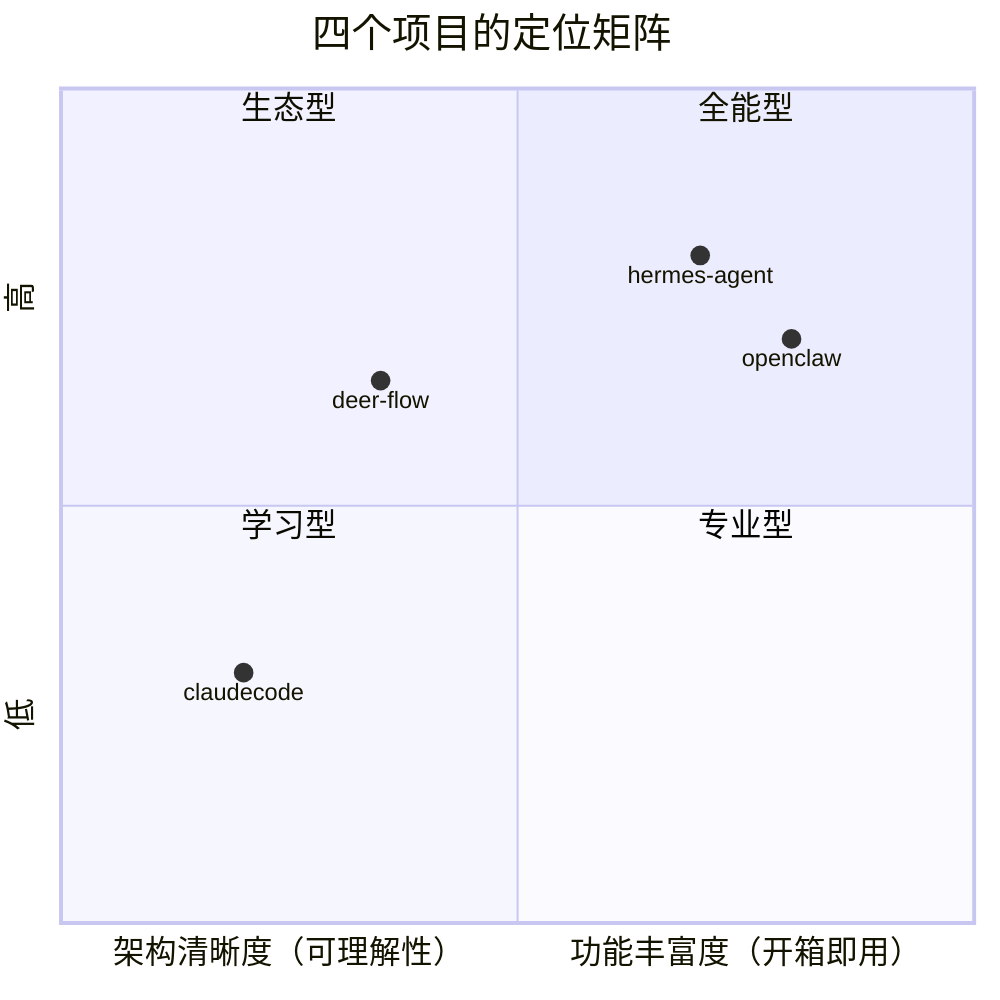

# 全景介绍

四个开源 Agent 项目的定位、背景与设计哲学。

---

## deer-flow

| 项目 | 值 |
|------|-----|
| **开发者** | ByteDance (Volcengine) |
| **版本** | v2.1.0 |
| **许可** | MIT |
| **语言** | Python 3.12+（后端）, Next.js 16 / React 19（前端） |
| **入口文件** | `backend/app/gateway/app.py`, `backend/packages/harness/deerflow/tui/__main__.py` |
| **核心依赖** | FastAPI, LangGraph, LangChain, SQLAlchemy |
| **代码规模** | ~200+ 后端源文件 + Next.js 前端 |

**一句话**：企业级 LangGraph 超级 Agent 框架，34+ 中间件链，专注生产环境的编排和安全性。

**设计哲学**：通过中间件链实现关注点分离。每个横切关注点（记忆、权限、技能、沙箱、token 预算）都是一个独立中间件，可插拔、可重排、可独立测试。

**适用场景**：需要稳定、安全、可审计的生产环境 Agent 部署。

---

## hermes-agent

| 项目 | 值 |
|------|-----|
| **开发者** | Nous Research |
| **版本** | v0.19.0 |
| **许可** | MIT |
| **语言** | Python（主体）+ TypeScript（TUI/Web） |
| **入口文件** | `run_agent.py`, `cli.py`, `hermes_cli/main.py` |
| **核心依赖** | uv, anthropic SDK, openai SDK (exact pinned) |
| **代码规模** | ~12K LOC 单核心文件 + 1000+ 扩展文件 |

**一句话**：自进化的个人 AI 助手，核心是自我改进的闭环（learning loop）。

**设计哲学**：个人生产力优先——覆盖 30+ 消息平台、100+ 工具、自创技能、全平台 CLI/TUI/Desktop。核心是 `run_agent.py` 的大循环。

**适用场景**：个人全场景 AI 助手，从终端到聊天到桌面。

---

## openclaw

| 项目 | 值 |
|------|-----|
| **开发者** | OpenClaw Foundation |
| **版本** | 2026.7.1（TS 版）+ 持续迭代（Python 版） |
| **许可** | MIT |
| **语言** | TypeScript/ESM（主） + Python（辅助实现） |
| **入口文件** | TS: `openclaw.mjs` -> `src/index.ts`, Python: `backend/src/openclaw/__main__.py` |
| **核心依赖** | pnpm workspace, tsdown, Anthropic SDK |
| **代码规模** | TS 版 ~2000+ 文件（含 150+ extensions）, Python 版 ~200+ 源文件 |

**一句话**：双实现（Python + TypeScript）的 AI 网关/个人助理，具备最丰富的扩展生态（150+ extensions, 52 skills）。

**设计哲学**：插件生态为王。150+ 扩展覆盖几乎所有 AI Provider 和消息平台，52 个技能覆盖日常所需。TypeScript 版是全功能旗舰，Python 版是精简参考实现。

**适用场景**：需要最多 AI Provider 和消息平台接入、看重生态丰富的场景。

---

## claudecode

| 项目 | 值 |
|------|-----|
| **开发者** | 社区（CC 重实现） |
| **版本** | 初始版本 |
| **许可** | MIT |
| **语言** | Python 3.12+ |
| **入口文件** | `__main__.py` -> `main.py` |
| **核心依赖** | Anthropic SDK, Rich, Click |
| **代码规模** | ~30 个源文件，498 测试 |

**一句话**：Claude Code 的 Python 重实现，最纯粹的 Agent 内核参考实现。

**设计哲学**：反向工程 CC TypeScript 源码（1884 文件/380K 行），提取出最小化 Agent 内核。没有插件系统、没有 IM 通道、没有技能系统——专注于 Agent 循环本身的实现。

**适用场景**：学习 Agent 内核工作原理的最佳起点，适合作为定制 Agent 的基础。

---

## 横向定位

- **claudecode**：最清晰简单，适合学习 Agent 内核
- **deer-flow**：最严谨，生产级中间件链，适合企业部署
- **hermes**：最全能个人助手，30+ 平台 + 自进化
- **openclaw**：最大生态，150+ 扩展 + 双语言实现
