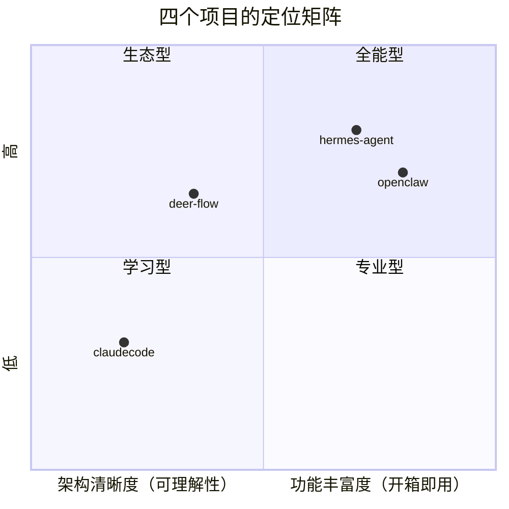
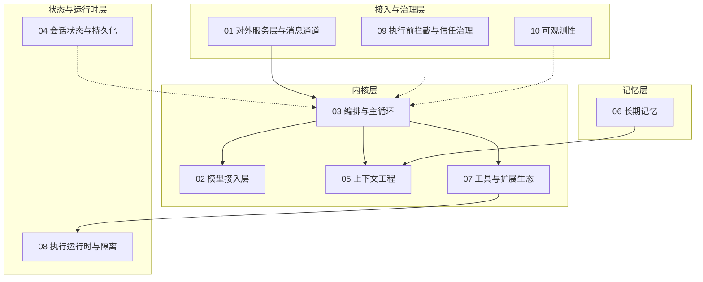

# 全景介绍

四个开源 Agent 项目的定位、背景与设计哲学。

---

## deer-flow

| 项目 | 值 |
|------|-----|
| **开发者** | ByteDance (Volcengine) |
| **版本** | v2.1.0 |
| **许可** | MIT |
| **语言** | Python 3.12+（后端）, Next.js 16 / React 19（前端） |
| **入口文件** | `backend/app/gateway/app.py`, `backend/packages/harness/deerflow/tui/__main__.py` |
| **核心依赖** | FastAPI, LangGraph, LangChain, SQLAlchemy |
| **代码规模** | ~200+ 后端源文件 + Next.js 前端 |

**一句话**：企业级 LangGraph 超级 Agent 框架，34+ 中间件链，专注生产环境的编排和安全性。

**设计哲学**：通过中间件链实现关注点分离。每个横切关注点（记忆、权限、技能、沙箱、token 预算）都是一个独立中间件，可插拔、可重排、可独立测试。

**适用场景**：需要稳定、安全、可审计的生产环境 Agent 部署。

---

## hermes-agent

| 项目 | 值 |
|------|-----|
| **开发者** | Nous Research |
| **版本** | v0.19.0 |
| **许可** | MIT |
| **语言** | Python（主体）+ TypeScript（TUI/Web） |
| **入口文件** | `run_agent.py`, `cli.py`, `hermes_cli/main.py` |
| **核心依赖** | uv, anthropic SDK, openai SDK (exact pinned) |
| **代码规模** | ~12K LOC 单核心文件 + 1000+ 扩展文件 |

**一句话**：自进化的个人 AI 助手，核心是自我改进的闭环（learning loop）。

**设计哲学**：个人生产力优先——覆盖 30+ 消息平台、100+ 工具、自创技能、全平台 CLI/TUI/Desktop。核心是 `run_agent.py` 的大循环。

**适用场景**：个人全场景 AI 助手，从终端到聊天到桌面。

---

## openclaw

| 项目 | 值 |
|------|-----|
| **开发者** | OpenClaw Foundation |
| **版本** | 2026.7.1（TS 版）+ 持续迭代（Python 版） |
| **许可** | MIT |
| **语言** | TypeScript/ESM（主） + Python（辅助实现） |
| **入口文件** | TS: `openclaw.mjs` -> `src/index.ts`, Python: `backend/src/openclaw/__main__.py` |
| **核心依赖** | pnpm workspace, tsdown, Anthropic SDK |
| **代码规模** | TS 版 ~2000+ 文件（含 150+ extensions）, Python 版 ~200+ 源文件 |

**一句话**：双实现（Python + TypeScript）的 AI 网关/个人助理，具备最丰富的扩展生态（150+ extensions, 52 skills）。

**设计哲学**：插件生态为王。150+ 扩展覆盖几乎所有 AI Provider 和消息平台，52 个技能覆盖日常所需。TypeScript 版是全功能旗舰，Python 版是精简参考实现。

**适用场景**：需要最多 AI Provider 和消息平台接入、看重生态丰富的场景。

---

## claudecode

| 项目 | 值 |
|------|-----|
| **开发者** | 社区（CC 重实现） |
| **版本** | 初始版本 |
| **许可** | MIT |
| **语言** | Python 3.12+ |
| **入口文件** | `__main__.py` -> `main.py` |
| **核心依赖** | Anthropic SDK, Rich, Click |
| **代码规模** | ~30 个源文件，498 测试 |

**一句话**：Claude Code 的 Python 重实现，最纯粹的 Agent 内核参考实现。

**设计哲学**：反向工程 CC TypeScript 源码（1884 文件/380K 行），提取出最小化 Agent 内核。没有插件系统、没有 IM 通道、没有技能系统——专注于 Agent 循环本身的实现。

**适用场景**：学习 Agent 内核工作原理的最佳起点，适合作为定制 Agent 的基础。

---

## 横向定位

- **claudecode**：最清晰简单，适合学习 Agent 内核
- **deer-flow**：最严谨，生产级中间件链，适合企业部署
- **hermes**：最全能个人助手，30+ 平台 + 自进化
- **openclaw**：最大生态，150+ 扩展 + 双语言实现

---

# 通用 Agent 模块全景

上文回答了"这四个项目分别是什么"，本节回答另一个问题：**一个 Agent 系统的设计到底覆盖哪些通用主题**。无论项目定位差异多大，它们最终都要回答同一组问题——用户从哪里进来、模型怎么调、循环怎么转、状态怎么存、窗口怎么装、记忆怎么留、工具怎么执行、执行在哪跑、权限怎么管、运行怎么看得见。这 10 个主题就是这组问题的完整清单，也是后续 10 篇横向对比文档的骨架。

## 通用模块分层架构

10 个主题按依赖方向可以分为四层：内核层回答"Agent 怎么运转"，记忆层回答"跨会话怎么不忘"，状态与运行时层回答"过程怎么不丢、执行怎么不失控"，接入与治理层回答"谁从哪进来、怎么管得住、看得见"。

内核层是所有项目都绕不开的四个主题：模型接入层负责屏蔽提供商差异并处理调用失败；编排与主循环负责驱动多轮推理与工具调度，并承担子代理委派；上下文工程负责决定窗口里装什么、何时装、装满之后怎么缩小；工具与扩展生态负责让模型在正确的时机看到正确的能力，并统一承接 MCP、技能、插件三类扩展的注册与调度。记忆层独立成层：长期记忆从对话中提取跨会话事实，只在上下文组装时通过一条注入边与内核相连。状态与运行时层支撑内核的持久与安全：会话状态与持久化承载跨请求的进度、检查点与防重入纪律，执行运行时与隔离决定命令放行之后在哪个环境里跑。接入与治理层则是贯穿所有层的横切关注点：对外服务层暴露接入面并承担平台适配与配置治理，执行前拦截与信任治理约束每个动作的放行，可观测性暴露运行状态。

## 10 个主题卡片

每个主题卡片给出三样东西：跨项目不变的职责定义、2-3 条通用设计哲学（核心权衡）、以及四个项目的形态差异一句话。详细展开见对应的横向对比文档。

需要特别说明一个术语冲突：模型接入层中也会提到"LLM gateway"，那里指的是 LLM 网关这一类提供商（典型问题是 thinking 参数的处理分支），属于模型调用的抽象问题；而 01-gateway 主题指的是把 Agent 内核托管为服务的对外网关，两者是完全不同的概念。

### 内核层

| 主题 | 职责定义 | 通用设计哲学 | 四项目形态差异 |
|------|---------|-------------|---------------|
| 模型接入层 | 为上层循环提供统一的模型调用接口，屏蔽提供商协议差异，并在调用失败时按成本递增顺序走恢复链：重试、换 key、换模型、换提供商 | 抽象深度由需要支持的提供商数量决定，两家和一百四十家的抽象长得完全不一样；非标准字段（thinking）的回放处理是所有项目都绕不开的脏活；结构化输出与运行时模型切换是新增的必修项 | deer-flow 用补丁子类加配置驱动工厂（约 10 家）；hermes 用传输策略加注册表覆盖 30+；openclaw Python 靠鸭子类型协议（4 家）、TS 靠插件注册覆盖 140+；claudecode 用闭包注入、仅支持两家 |
| 编排与主循环 | 可靠地驱动"推理 → 工具执行 → 结果回注"的多轮迭代，明确终止条件，在错误下恢复而不泄漏资源，并把可并行的子任务安全地拆分委派 | 复杂度放在中间件链里分散还是放在一个大函数里集中，是首要分岔；死循环检测应先给模型自我纠正的机会而不是直接打断；子代理的上下文共享度与嵌套深度必须显式建模 | deer-flow 是 LangGraph 状态图加 38 个中间件；hermes 是单函数大循环加委派与咨询双模式；openclaw Python 版三层嵌套、TS 版单循环加状态变量与持久化编排引擎；claudecode 是纯函数异步生成器四阶段状态机 |
| 上下文工程 | 在有限的上下文窗口里决定"装什么进去、何时装进去、装满之后怎么缩小"：系统提示词分层、规则文件注入时机、压缩的触发阈值与保留策略 | 静态冻结与动态重载的分界决定 prompt cache 命中率；压缩改写前缀会击穿缓存，省下的 token 要与损失的缓存命中对账；预检与响应式双触发互补，摘要失败要有兜底 | claudecode 一次组装、保尾四轮其余全摘要；deer-flow 全静态模板加隐藏动态消息、摘要移出消息通道保 cache；hermes 三层稳定性分级加滚动摘要多级降级；openclaw 五段拼装（Python）加多源编译（TS） |
| 工具与扩展生态 | 在注册、发现、执行、扩展四个环节上让模型看到并安全使用能力，并统一容纳 MCP 协议接入、技能指令、插件模块三类扩展 | 注册表显式声明与反射自动发现是两种相反的组织方式；工具、技能、插件共用一套注册调度还是各建一套，决定生态的复杂度；结果预算与截断是上下文窗口的最后防线 | deer-flow 用延迟目录加按需搜索、MCP 会话池、config 声明式插件；hermes 自注册加 AST 扫描加三层预算、MCP 双向；openclaw 全量注册（Python）加表达式声明（TS）、MCP 双向加 Bridge、Manifest 加 SDK 生态；claudecode 用 ABC 注册表加 MCP 仅 stdio 加三个正交极简机制 |

### 记忆层

| 主题 | 职责定义 | 通用设计哲学 | 四项目形态差异 |
|------|---------|-------------|---------------|
| 长期记忆 | 从对话中提取跨会话持久化事实，在需要时检索并注入上下文，处理去重、冲突、过期与容量管理 | 短期窗口管理归上下文工程、长期持久化归本篇，两者在"压缩可能删掉尚未提取的事实"这一点上交汇；提取用规则还是 LLM 是准确性与成本的权衡；冻结快照换缓存命中、实时查询换新鲜度 | deer-flow 用防抖队列加信号检测、全量加载加预算截断；hermes 用全文检索加冻结快照、另有实时工具查询；openclaw 对话中产生加三阶段定期整合、全文向量混合检索；claudecode 每轮后台提取加四类分类、索引注入加按需读全文 |

### 状态与运行时层

| 主题 | 职责定义 | 通用设计哲学 | 四项目形态差异 |
|------|---------|-------------|---------------|
| 会话状态与持久化 | 为跨请求、跨进程、跨崩溃存活的会话建模状态：检查点形态、持久化与恢复、会话树、超时回收、多实例隔离、防重入 | 存"模型看到的全部消息"还是"能重放执行痕迹的记录"，决定崩溃恢复的能力上限；同一会话的并发纪律放在哪一层是关键决策；检查点与恢复动作决定服务重启的代价 | deer-flow 用图状态检查点加运行账本（SQLite/Postgres）；hermes 用确定性路由键加 SQLite WAL 单行增量；openclaw 用会话树元数据加转录文件；claudecode 用内存消息列表加 JSONL 全量覆盖写 |
| 执行运行时与隔离 | 决定命令被放行之后在哪个环境里执行：沙箱后端选择、按 owner 的执行路由、路径掩码、workspace 边界、输出脱敏 | 后端数量不是安全性的直接度量，一个后端做到极致硬化可能比六个可选的更安全；拦截与隔离互补，本篇只管"放行之后"；默认姿态（本地零隔离还是默认询问）由信任模型决定 | deer-flow 用双层抽象加 4 种后端（本地/AIO/E2B/微虚拟机）加路径掩码；hermes 用环境工厂驱动 6 种后端；openclaw 仅 TS 版有 Docker 沙箱且激进硬化、Python 版组件未接线；claudecode 无沙箱、宿主直跑加默认询问 |

### 接入与治理层

| 主题 | 职责定义 | 通用设计哲学 | 四项目形态差异 |
|------|---------|-------------|---------------|
| 对外服务层与消息通道 | 以什么形态、什么协议、什么信任假设把 Agent 暴露给进程外（或进程内多平台）的调用方：平台适配、连接级认证、事件扇出、配置治理、生命周期治理 | 进程形态是分叉点——单进程 CLI 不需要它，多客户端、多通道、长期在线就需要；连接级认证回答"你是谁"，动作级审批让位给权限治理；配置热重载要划清"可热重载 vs 仅启动生效"的边界 | deer-flow 是唯一 HTTP/SSE 门面，连自家进程内渠道也走同一 API；hermes 是进程内巨型消息运行时，单体控制器管理 30+ 平台适配器；openclaw TS 版是长连接控制面服务器、Python 版是握手即信任的精简 RPC 网关；claudecode 无服务层、纯终端 REPL |
| 执行前拦截与信任治理 | 在动作执行之前通过权限模型、危险命令审批、Hooks 拦截、密钥管理、凭证脱敏、安装时扫描，防止误操作与注入 | 执行前拦截与执行时隔离是两种互补手段；密钥应做到"能用但不可见"；工具返回的内容本身是注入攻击面，需要输出脱敏；扫描发生在安装时最便宜 | deer-flow 用 RBAC 按角色过滤工具面加环境变量双层黑名单清洗；hermes 用危险命令黑名单审批加多源密钥作用域隔离加 YOLO 冻结；openclaw 用策略管道加五阶段准入门控加 SecretRef 引用系统加安装扫描；claudecode 用白名单加三级权限模式、无安装扫描 |
| 可观测性 | 让开发者与运维理解 Agent 的运行状态：token 用量、错误模式、决策路径、输出质量，同时不显著增加开销、不泄露敏感信息 | Agent 的错误包含决策质量问题，因此需要轨迹级追踪而非仅日志；多提供商的用量格式统一是必修课；可观测设施自身应可静默降级；脱敏手段与观测价值需要显式权衡 | deer-flow 用回调加 OpenTelemetry 双轨、对接企业 APM；hermes 用分级日志加本地数据库、零依赖；openclaw 用全链路事件广播加诊断遥测、带自愈能力；claudecode 事件流内嵌用量、零基础设施 |

## 模块 × 项目覆盖矩阵

这张表的价值不止于标注"谁有什么"，**缺失同样是信息**：claudecode 刻意不做对外服务层与沙箱，印证了它"最小内核"的定位；openclaw Python 版作为精简参考实现，把远程工具接入（MCP）与沙箱整个让位给 TS 旗舰与生态规模。全表 10 个主题中 8 个被四个项目完整覆盖，说明内核、记忆、状态与治理是 Agent 系统的必要组成部分；分歧全部集中在两个地方——以什么形态暴露（gateway）与放行之后在哪跑（runtime），而这恰恰由部署形态与信任模型决定。

| 主题 | deer-flow | hermes | openclaw-TS | openclaw-Python | claudecode |
|------|:---:|:---:|:---:|:---:|:---:|
| 01 对外服务层与消息通道 | ✓ | ✓ | ✓ | 简（RPC 网关） | —（纯终端 REPL） |
| 02 模型接入层 | ✓ | ✓ | ✓ | ✓ | ✓ |
| 03 编排与主循环 | ✓ | ✓ | ✓ | ✓ | ✓ |
| 04 会话状态与持久化 | ✓ | ✓ | ✓ | ✓ | ✓ |
| 05 上下文工程 | ✓ | ✓ | ✓ | ✓ | ✓ |
| 06 长期记忆 | ✓ | ✓ | ✓ | ✓ | ✓ |
| 07 工具与扩展生态 | ✓ | ✓ | ✓ | 简（无 MCP） | 简（三个正交极简机制） |
| 08 执行运行时与隔离 | ✓ | ✓ | ✓ | 简（组件未接线） | —（无沙箱，宿主直跑） |
| 09 执行前拦截与信任治理 | ✓ | ✓ | ✓ | ✓ | ✓ |
| 10 可观测性 | ✓ | ✓ | ✓ | ✓ | ✓ |

四个项目的共同点集中在内核与治理——10 个主题中 8 个四项目全覆盖，说明这些是 Agent 系统的必要组成部分；分歧全部集中在接入形态与执行隔离强度，而这些分歧恰恰由项目定位决定：面向个人全场景的项目（hermes、openclaw-TS）几乎全线覆盖，面向企业编排的项目（deer-flow）补齐治理层但生态收敛，面向内核学习的项目（claudecode）只保留必要项。

## 旧主题去哪了

本节文档体系刚经历一次重组：旧的 14 模块拆并成了新的 10 主题，编号与命名全部重排，旧编号（01-14）与新编号（01-10）之间没有对应关系，阅读时一律以新编号为准。映射关系如下：

| 新主题 | 旧模块来源 | 性质 |
|--------|-----------|------|
| 01-gateway | 旧 14-gateway + 09-channels | 合并 |
| 02-model | 旧 01-llm | 1:1 迁移 |
| 03-orchestrator | 旧 02-agent-loop + 07-subagents | 合并 |
| 04-state | 存量仅碎片 | 全新补写 |
| 05-context | 旧 13-context-compaction + 各项目旧 02 篇的"系统提示词结构"节 | 合并 + 补写 |
| 06-memory | 旧 06-memory | 1:1 迁移（改写边界互引） |
| 07-tools | 旧 03-tools + 04-mcp + 05-skills + 08-plugins | 四合一 |
| 08-runtime | 旧 10-security 的沙箱半部 | 拆分 + 补写 |
| 09-guardrails | 旧 10-security 的拦截半部 + 散落各篇的扫描/防护 | 拆分重组 |
| 10-observability | 旧 12-observability | 1:1 迁移（补评估） |

三次大的结构变化值得说明。第一是旧 10-security 一拆为二：沙箱、执行路由、路径掩码这些"放行之后在哪跑"的机制归 08-runtime，权限模型、审批、Hooks、密钥管理这些"放行之前拦不拦"的机制归 09-guardrails，两者以"执行前拦截 vs 执行时隔离"为分界。第二是旧 11-config 化整为零，没有主场：配置层级与热重载治理并入 01-gateway（它本来就是服务层的工作）；多 Profile 与多实例隔离并入 04-state；敏感配置分离与环境变量引用保留并入 09-guardrails；CLAUDE.md 层级发现与注入并入 05-context；技能的多个加载来源并入 07-tools。第三是扩展类模块全部收敛到 07-tools：MCP 集成、技能系统、插件系统不再是并列模块，而是"工具与扩展生态"主题下的三个环节——它们共享注册、发现与调度的组织问题，分开写反而割裂了对比。

## 阅读导航

### 横向对比文档（docs/comparisons/）

10 篇横向对比文档按主题编号排列，建议按编号顺序阅读——内核层打基础，记忆与状态看支撑，接入与治理看约束。

| 编号 | 主题 | 文档 |
|------|------|------|
| 01 | Gateway（对外服务层与消息通道） | [01-gateway.md](comparisons/01-gateway.md) |
| 02 | 模型接入 | [02-model.md](comparisons/02-model.md) |
| 03 | 编排 | [03-orchestrator.md](comparisons/03-orchestrator.md) |
| 04 | 会话状态 | [04-state.md](comparisons/04-state.md) |
| 05 | 上下文 | [05-context.md](comparisons/05-context.md) |
| 06 | 记忆 | [06-memory.md](comparisons/06-memory.md) |
| 07 | 工具 | [07-tools.md](comparisons/07-tools.md) |
| 08 | 执行运行时 | [08-runtime.md](comparisons/08-runtime.md) |
| 09 | 权限治理 | [09-guardrails.md](comparisons/09-guardrails.md) |
| 10 | 可观测性 | [10-observability.md](comparisons/10-observability.md) |

### 项目深入文档（docs/{project}/）

每个项目按同一套 10 主题编号组织深入文档，可与横向对比文档按编号对照阅读。四个项目各 10 篇已全部完成：openclaw 的 10 篇同时覆盖 TS 与 Python 双实现；claudecode 的 gateway 与 runtime 两篇是"无此形态"的立场论证——进程形态与信任模型决定它不需要服务层和沙箱，这两篇的价值在于讲清楚"为什么不需要"，同样值得一读。

| 主题 | deer-flow | hermes-agent | openclaw | claudecode |
|------|-----------|--------------|----------|------------|
| Gateway | [01](deer-flow/01-gateway.md) | [01](hermes-agent/01-gateway.md) | [01](openclaw/01-gateway.md) | [01](claudecode/01-gateway.md) |
| 模型接入 | [02](deer-flow/02-model.md) | [02](hermes-agent/02-model.md) | [02](openclaw/02-model.md) | [02](claudecode/02-model.md) |
| 编排 | [03](deer-flow/03-orchestrator.md) | [03](hermes-agent/03-orchestrator.md) | [03](openclaw/03-orchestrator.md) | [03](claudecode/03-orchestrator.md) |
| 会话状态 | [04](deer-flow/04-state.md) | [04](hermes-agent/04-state.md) | [04](openclaw/04-state.md) | [04](claudecode/04-state.md) |
| 上下文 | [05](deer-flow/05-context.md) | [05](hermes-agent/05-context.md) | [05](openclaw/05-context.md) | [05](claudecode/05-context.md) |
| 记忆 | [06](deer-flow/06-memory.md) | [06](hermes-agent/06-memory.md) | [06](openclaw/06-memory.md) | [06](claudecode/06-memory.md) |
| 工具 | [07](deer-flow/07-tools.md) | [07](hermes-agent/07-tools.md) | [07](openclaw/07-tools.md) | [07](claudecode/07-tools.md) |
| 执行运行时 | [08](deer-flow/08-runtime.md) | [08](hermes-agent/08-runtime.md) | [08](openclaw/08-runtime.md) | [08](claudecode/08-runtime.md) |
| 权限治理 | [09](deer-flow/09-guardrails.md) | [09](hermes-agent/09-guardrails.md) | [09](openclaw/09-guardrails.md) | [09](claudecode/09-guardrails.md) |
| 可观测性 | [10](deer-flow/10-observability.md) | [10](hermes-agent/10-observability.md) | [10](openclaw/10-observability.md) | [10](claudecode/10-observability.md) |

若已对某个项目有整体印象，也可直接阅读 [summary.md](summary.md) 获取各项目的适用场景与设计哲学总结。
